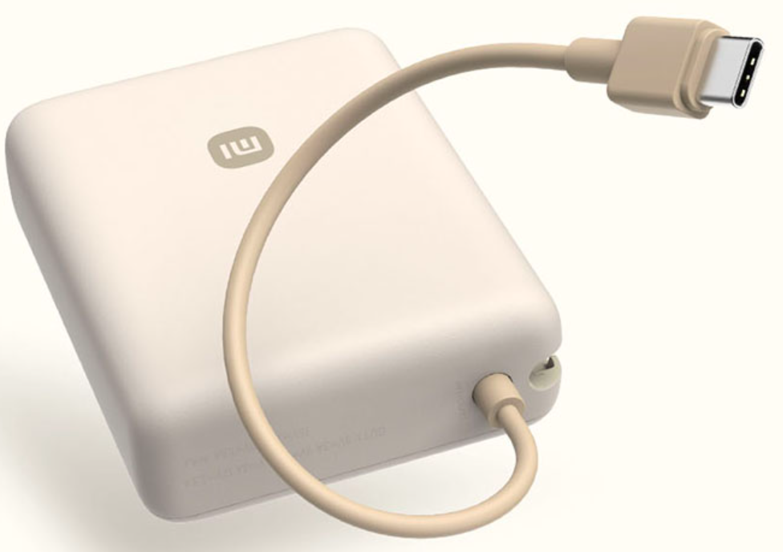
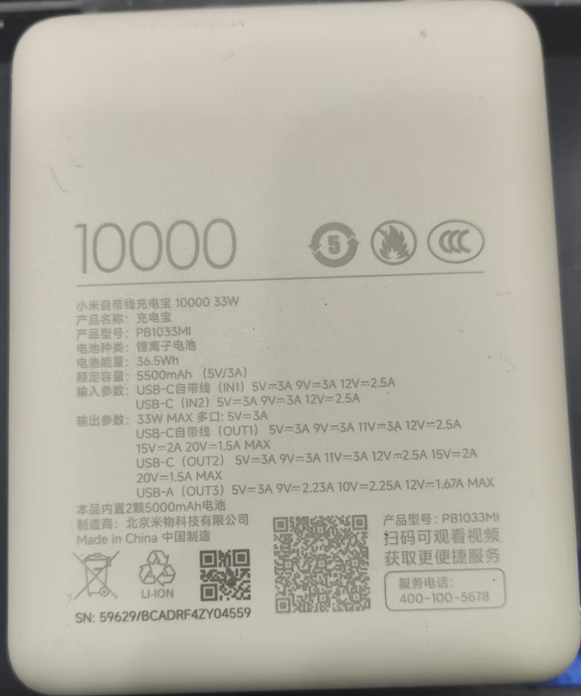

# **Resources Link**

## **Open-source software**

### **SD card mirroring**

OriginBot SD card image, which includes the new version system, all application functions and source code:
    
|  Release date   | Download link                                                     | Software version included                     |
| ---------- | ------------------------------------------------------------ | -------------------------------- |
| 2025.3.1 | [originbot_sd_image_v3.0.1](https://drive.google.com/drive/folders/1RaEA9IfGLUg54k5W0NqdY5vwYPDGEHww){:target="_blank"} | ros：humble TogetheROS：2.3.2 |

### **Application source code**

OriginBot application functions are implemented based on ROS2 and TogetheROS. The source code repository is as follows:

| Code repositories                                                     | Mostly dependent libraries                 | illustrate                                 |
| ------------------------------------------------------------ | -------------------------- | ------------------------------------ |
| [originbot](https://github.com/guyuehome/originbot){:target="_blank"} | ros：humble TogetheROS | The robot application function package runs on the **robot side** |
| [originbot_desktop](https://github.com/guyuehome/originbot_desktop){:target="_blank"} | ros：humble                  | The robot application function package, running on the **PC side**     |

???+ hint
	The robot code has been built into the SD card image and has been compiled and configured. The path in the image system is:
    /userdata/dev_ws/src/originbot

### **Controller firmware**

The controller firmware needs to be burned into the STM32 system. There are several different versions provided below. Please select one of them to download and burn as needed:
=== ":octicons-cpu-16: Standard Firmware Version（Recommended）"

    | version   | Release date	  | Download link                                                     | MCU       |
    | ------ | --------- | ------------------------------------------------------------ | --------- |
    | v1.0.6 | 2024.9.23 | [originbot_controller_firmware_v1.0.6_5V.hex](https://drive.google.com/drive/folders/1gljgcJTUWTWHnm4A5TQ1s3KrYGyiLwfx?usp=drive_link){:target="_blank"} | STM32F103 |

### **Controller firmware source code**

The source code repositories corresponding to the above firmware are as follows:

| Code repositories                                                     | illustrate                                                   |
| ------------------------------------------------------------ | ------------------------------------------------------ |
| [originbot_controller](https://github.com/guyuehome/originbot_controller){:target="_blank"} | Robot controller embedded source code, development platform is Keil, MCU is STM32F103|

## **Open-source hardware**

### **3D model**

| name                    | Download link                                                     | illustrate                    |
| ----------------------- | ------------------------------------------------------------ | ----------------------- |
| 3D model of the OriginBot robot | [OriginBot 3D model](https://drive.google.com/file/d/1KVJxidAvfNH4s3EMu-RJmlnj8CycdBDC/view?usp=sharing){:target="_blank"} | 3D model of the robot, stp format |

### **Electrical drawings**

| name                   | Download link                                                     | illustrate                                                         |
| ---------------------- | ------------------------------------------------------------ | ------------------------------------------------------------ |
| Schematic diagram of the OriginBot controller  | [Click View/Download](https://github.com/guyuehome/originbot_controller/tree/master/material/ElectricalDrawing){:target="_blank"} | Schematic diagram of OriginBot Controller，pdf version                          |
| OriginBot Controller PCB Engineering | [Click View/Download](https://github.com/guyuehome/originbot_controller/tree/master/material/ElectricalDrawing){:target="_blank"} | The originbot controller PCB project file, which contains the schematic source file, is recommended to be opened using the Altium Designer software |

???+ hint
	More RDK X5 references can be found [here](https://developer.d-robotics.cc/rdk_doc/en/RDK){:target="_blank"}

## **Other information**

| name             | Download link                                                     | illustrate                                                         |
| ---------------- | ------------------------------------------------------------ | ------------------------------------------------------------ |
| RDK X5 Data Pack   | [Click here to view](https://developer.d-robotics.cc/rdk_doc/en/Quick_start/hardware_introduction/rdk_x5){:target="_blank"} | The RDK X5 package contains hardware interface manuals, schematics, user manuals, and more |
| Lidar data manual | [Click Download](https://github.com/guyuehome/originbot_controller/tree/master/material/DataSheet){:target="_blank"} | VP100L data manual                                          |
| Motor data manual     | [Click Download](https://github.com/guyuehome/originbot_controller/tree/master/material/DataSheet){:target="_blank"} | Code disc TT motor                                                   |

## **Power bank**

You need a 5V constant voltage power supply

[xiaomi power bank](https://amzn.asia/d/68F4DuK)

|  |  |
| ---------------------------------- | ---------------------------------- |
| xiaoimi power bank | 5V/3A 80.9x65.9x26mm 5500mAh |

???+ warning
    If your power supply is not a constant voltage power supply, such as a battery pack, it is recommended to use a 12V/6A battery pack, and the minimum voltage should be kept above 8V.
{:target="_blank"}