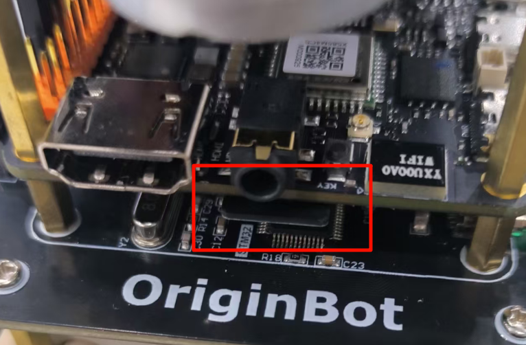

# **Frequently asked questions**

## <font color="green">**Robot hardware related**</font>


### **The battery interface is tight, and it is not easy to insert**

In order to ensure the stability of the system power supply and meet the instantaneous high power output of the total power supply, OriginBot adopts a T-type interface in the selection of power interfaces. The connection of the interface is tight in the new state, please use skillful force and operate cautiously when installing.


### **How to install the heatsink for the processor ?**

Tear off the blue plastic sheet on the back of the heat sink, the white one is the thermal pad, try to keep the core SoC on the RDK X5 in the middle of the thermal pad, and then press and paste.

{.img-fluid tag=1}


### **The lidar keeps spinning after the robot is powered on**

Due to the characteristics of the lidar itself, it will rotate all the time after powering on, If you do not use it for the time being, you can unplug the radar USB cable first, and then connect it when you use it.


### **Where is the robot's SD card inserted ?**

After the SD card is burned to the image, insert it into the card slot on the front of the robot and the back of the RDK X5 board.

{.img-fluid tag=1}


### **The motor of the machine is not moving properly**

When the robot is controlled by the keyboard, if you find that the motor on one side of the robot does not rotate, or sometimes does not rotate, please check in the following ways:

（1）Check whether the wiring of the robot motor is correct and firm, including the motor end and the drive board end;

（2） The robot is in differential motion, and when turning in situ, if the speed is too slow, the inner wheel may not turn, which is a normal phenomenon;

（3） If the wheel on one side does not rotate during the forward movement of the robot, or sometimes does not rotate, please refer to the [controller firmware to install](../guide/firmware_install.md){:target="_blank"} and re-burn the firmware before trying;

If the problem persists, Please contact after-sales service for technical support


### **Is the controller board sold separately?**

The OriginBot controller board is not sold separately for the time being, but the schematic and PCB are open source, and developers can make their own boards.


### **What to do if the robot is out of control?**

In the secondary development process, if the ROS application is not properly developed, it may cause the robot to get out of control, such as the movement has been moving without stopping, etc., at this time, you can pick up the robot, press the reset button "RESET" on the controller board, the underlying motion function of the robot can be reset, and then close the ROS application node of the host computer as soon as possible.

## <font color="green">**Image/firmware burning and startup**</font>

### **The controller firmware failed to be burned**

When downloading firmware to the extension board through the "Burning" port, if the burning fails, check the following issues:

（1）You need to disconnect the serial port connection between the expansion board and the Sunrise pi, otherwise you will not be able to connect to download;

{.img-fluid tag=1}

（2）Check the configuration in the FlyMcu software:

- The firmware file is selected correctly;
- The port where the firmware is downloaded is correct;
- The reset option in the lower left corner is selected correctly;

{.img-fluid tag=1}


### **The login page cannot be entered after power-on**

After burning the SD card image, when the Sunrise Pi is started:

1. If the serial port interface continuously outputs uboot information and cannot enter the login interface of the ubuntu system, it may be because the power supply of the board is insufficient, please check the power input of the RDK X5 and make sure that the controller board is powered through the typec adapter board, or use an external power supply of 5V 2A or above to supply power to the typec port of RDK X5
2. If you stop at the uboot interface as shown below, the card has been started but the SD image has not been loaded. Please make sure that the SD card has been inserted into the card slot of the RDK X5 correctly, and that there is no keyboard input during the boot process.

{.img-fluid tag=1}


### **The serial port device could not be found in the serial port software**

After connecting the serial port module, if you can't find the device in the device selection drop-down box of the serial port software, right-click in "My Computer" to open "Device Manager" and confirm whether the driver of the serial port module has been installed on the system.

If the following message is displayed, the serial module driver is not installed,[click here](https://www.originbot.org/material/common_software.md){:target="_blank"} to download the serial driver, decompress it, double-click the dpinst64.exe to install it, and then try to communicate again after the driver is installed.

{.img-fluid tag=1}


### **Does the RDK X have a user manual ?**

For the basic use of RDK X5, please refer to [ the RDK X5 user manual](https://developer.horizon.cc/documents_rdk){:target="_blank"}。


### **Where to download the FlyMcu software ?**

Please refer to [the common software download](../material/common_software.md){:target="_blank"} page.


### **Where can I download the SD card image burning software ?**

Please refer to [the common software download](../material/common_software.md){:target="_blank"} page.


### **Where can I download the serial driver ?**

Please refer to [the common software download](../material/common_software.md){:target="_blank"} page.


### **How to debug firmware code online ?**

You need to use the stlink simulator, connect to the SWD interface on the controller side, and refer to the [source code for debugging and downloading](../guide/firmware_install.md#_4){:target="_blank"}.


### **The HDMI connection display has no image**

The OriginBot system image uses Ubuntu 22.04 Server version, and does not have a system desktop, and it is normal to display the default horizon logo information after connecting to the monitor through HDMI.

{.img-fluid tag=1}


### **The SD card is running out of space**

The SD card in the OriginBot suite is 32GB, the space can be fully satisfied under normal use, if you find that the space does not match the 32GB, please confirm:

（1）To reduce the size of the system image file, the free space in the system image file of the SD card has been compressed. After the system image file is burned, perform operations by referring to [Expanding SD Card Space](../guide/image_install.md#4-sd)；

（2）The file format in the SD card image is EXT4, which cannot be fully read in windows, which will cause the disk space to be seen only a few hundred megabytes, which is a normal phenomenon, and can be read by installing the corresponding software, or read under the Ubuntu system.

### **The SD card cannot be read or written**

Some SD cards will be corrupted after operation, resulting in the inability to read and write the SD card, you need to format it, the specific steps are as follows:
（1）Right-click on the "This Computer" icon on the desktop, Manage, Disk Management, and select the disk corresponding to the SD card.
（2）Delete all partitions on the SD card disk, right-click in the corresponding position of the partition, and you can see the delete option. 
（3）Create a new partition, right-click in the deleted unallocated part, create a new simple volume, and then go directly to the next step, and confirm.
（4）Finally, it is normal to be able to see the partition of the SD card correctly and read and write it in the file management.


## <font color="green">**Use of basic functions**</font>

### **The device number cannot be displayed after the handle is connected**

Due to the fact that the underlying driver of different brands of controllers may be different, some controllers cannot be driven when connected to the RDK X3 (Sunrise X3 Pi). If you cannot see the devices marked with "js + numbers" after using the ls /dev/input/ command, the controller cannot be driven by the Ubuntu system of RDK X3.

At present, the handle models that have passed the test are:

- [Logitech F710](https://item.jd.com/10023101913682.html){:target="_blank"}

(More models to be added)

If it cannot be driven, the handle can be plugged into the PC and the robot movement can be controlled through ROS2 distributed communication.


### **How to compile the code of the host computer on the PC side ?**

Please refer to the steps to [download/compile the PC function pack](../guide/pc_config.md#3-pc){:target="_blank"}.


### **VSCode is unable to connect to the bot**

Troubleshoot the following possible issues:

（1）Whether the PC running VSCode is under the same LAN as the robot, that is, connected to the same router;

（2）Whether the PC and the robot can be successfully connected through "ping + the IP address of the other party";

（3）Whether the IP address, user name, password, command line characters, etc. filled in when connecting to the robot through VSCode are incorrect.


### **How to install VSCode under Ubuntu ?**

Please refer to [Installing VSCode](../manual/ide_setup.md#1-vscode){:target="_blank"}进行操作。


### **Can the robot be connected to a USB camera ?**

Yes, for specific usage methods, please refer to the Horizon Robotics Development Platform User Manual: [USB Image Acquisition](https://developer.horizon.cc/documents_tros/quick_demo/demo_sensor){:target="_blank"}


### **The IP address of the bot changes**

（1）Wired network: The static IP address has been set in the OriginBot image, which is 192.168.1.10, and it is configured by referring to the video instructions for [SSH remote login](../guide/image_install.md#6-ssh){:target="_blank"}.

（2）Wireless network: If the connected router has DHCP (Dynamic Host Configuration Protocol) turned on, the IP address of the robot may change after each connection, if you need a fixed IP, please search for "Linux wireless network static IP settings" on the Internet, refer to the configuration.


## <font color="green">**ROS2 and TogetheROS**</font>

### **ROS2 is soft-linked to TogetheROS**

The system image has been installed with the common ROS2 function package. If you have a newly installed ROS2 package, you need to complete the soft link with the tros after installation.

```bash
cd /opt/tros 
## Create a soft link from ROS package to TogetheROS using create_soft_link.py in /opt/tros 
python3 create_soft_link.py --foxy /opt/ros/foxy/ --tros /opt/tros 
```


### **The system update overwrites the profile**

If you manually use Upgrade to update the system, the TROS system may be updated and the camera-related configurations in the original image will be overwritten:

- Confirm that the camera model and calibration file in the "/opt/tros/share/websocket/launch/hobot_websocket.launch.py" path are "GC4663", if not, modify:

  {.img-fluid tag=1}

- Confirm that the camera model and calibration file in the "/opt/tros/share/mipi_cam/launch/mipi_cam.launch.py" path are "GC4663", if not, modify:

  {.img-fluid tag=1}


### **ROS2 key acquisition fails or becomes unresponsive**

Since the official ROS software source often fails to be accessed in China, ROS/ROS2 often encounters problems such as key acquisition failure and slow download speed when installing or updating ROS/ROS2,you can use the following domestic software sources to install or update.

["Encounter ROS download or update is not smooth? Why don't you try a domestic HUAWEI CLOUD image! "](https://mp.weixin.qq.com/s/cI9HhFs7ai6eQsUuhdb69A){:target="_blank"}


### **How to install ROS2 on a PC ?**

For details, please refer to [the ROS2 installation](../guide/pc_config.md#2-ros2){:target="_blank"}procedure


### **OriginBot code does not compile on PC**

Some of the function packages in the [OriginBot code repository](https://github.com/guyuehome/originbot){:target="_blank"}need to call the software resources in RDK X5, so they cannot be fully compiled on the PC side.If necessary, you can copy the required files or separate function packages to the PC for compilation and use.


### **Is TogetheROS open source ?**

Open source, you can refer to the [user manual of the Horizon Robotics platform](https://developer.horizon.cc/documents_tros/){:target="_blank"}.


### **Can ROS1 and ROS2 coexist ?**

Yes, you only need to call the ROS version you want by setting the environment variables.


## <font color="green">**App features**</font>

### **The Rviz host computer cannot visualize the information**

When running the application function, the visualization information such as TF and map cannot be displayed in the host computer Rviz, please check and confirm:

（1）Whether the robot and PC are on the same LAN and can ping each other through their IP addresses;

（2）If you are using a virtual machine to run Ubuntu, please confirm that the network configuration of the virtual machine is set to bridge mode;

{.img-fluid tag=1}

（3）Test whether you can communicate

ros2 provides a network check CLI (command line interface) tool, multicast, which we can use to perform tests on two ros2 terminals.

First of all, on the computer, we start receiving multicast commands

```bash 
ros2 multicast receive
```

On OriginBot, we send a multicast,
```bash
ros2 multicast send
```
If a message is received, it can be communicated by multiple machines

When the ROS_DOMAIN_ID of the computer and OriginBot are the same (both are 0 by default), they can communicate with each other through topics, etc.

Reference link: 
[Do not set the master/slave machine, see how ROS2 communicates with multiple machines](https://blog.csdn.net/qq_27865227/article/details/120257395)

###  **The navigation app doesn't see the information in Rviz**

After running the OriginBot navigation app, I can't see the map and bot information in the launched Rviz.

{.img-fluid tag=1}

At this time, please use Ctrl+C to turn off the Rviz host computer on the PC side, as well as the navigation function on the robot side, and then run the Rviz host computer command on the PC side first, and then start the navigation function on the robot side, at this time, the map and TF information can be displayed in Rviz.

If it doesn't show up yet, repeat the operation 2~3 times.


### **The camera image transmission is severely stuck**

ROS2 humble uses fastdds by default, which will be limited in the image transmission scenario, and we can switch to cyclonedds.

Note that DDS needs to be configured as cyclonedds for both the nodes sending and receiving images.Please refer to the [Launching the ROS Camera Driver](../manual/camera_visualization.md#ros_1)and [Viewing Visualization](../manual/camera_visualization.md#_6) Images section, and run the following command to switch the DDS used by the current terminal before starting the node:

```bash
export RMW_IMPLEMENTATION=rmw_cyclonedds_cpp
export CYCLONEDDS_URI='<CycloneDDS><Domain><General><NetworkInterfaceAddress>wlan0</NetworkInterfaceAddress></General></Domain></CycloneDDS>'
```


[](https://www.guyuehome.com/){:target="_blank"}

