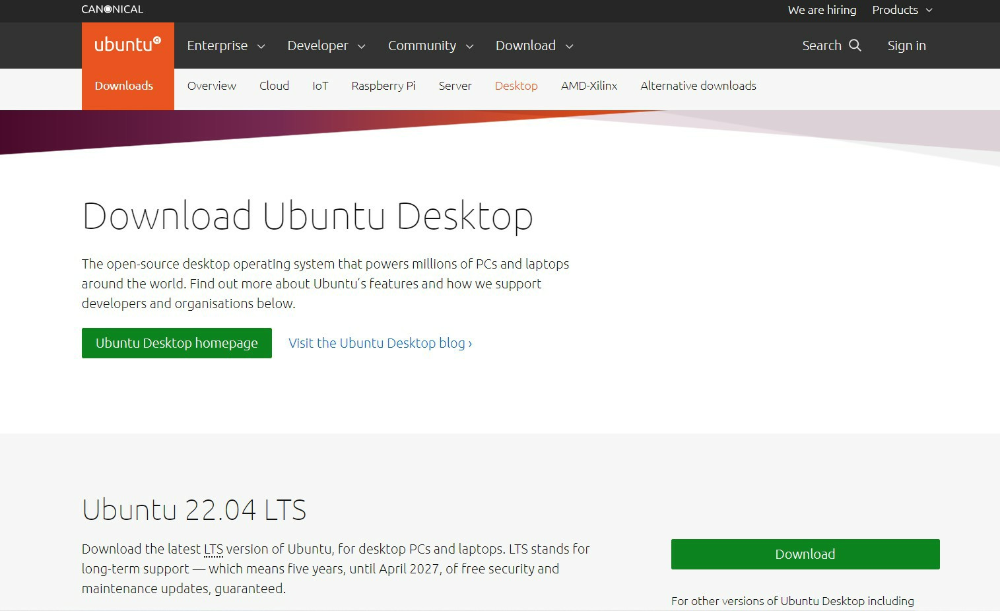
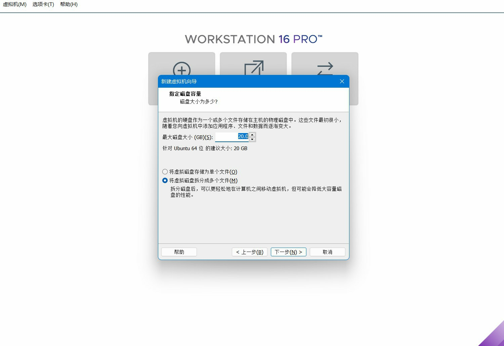
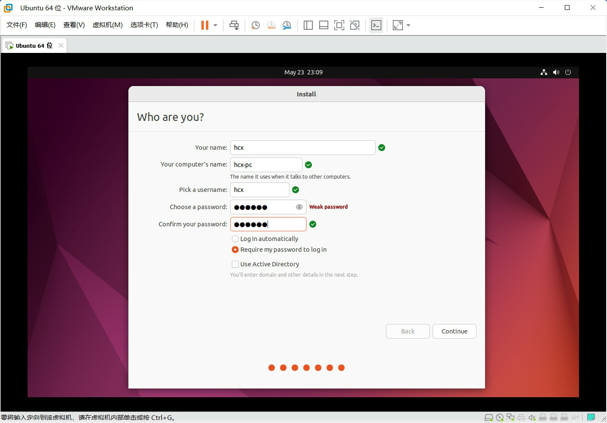
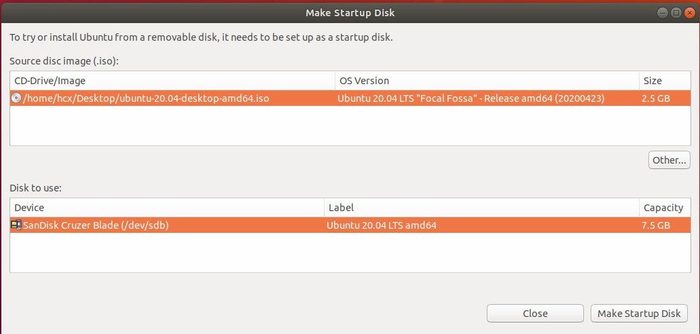
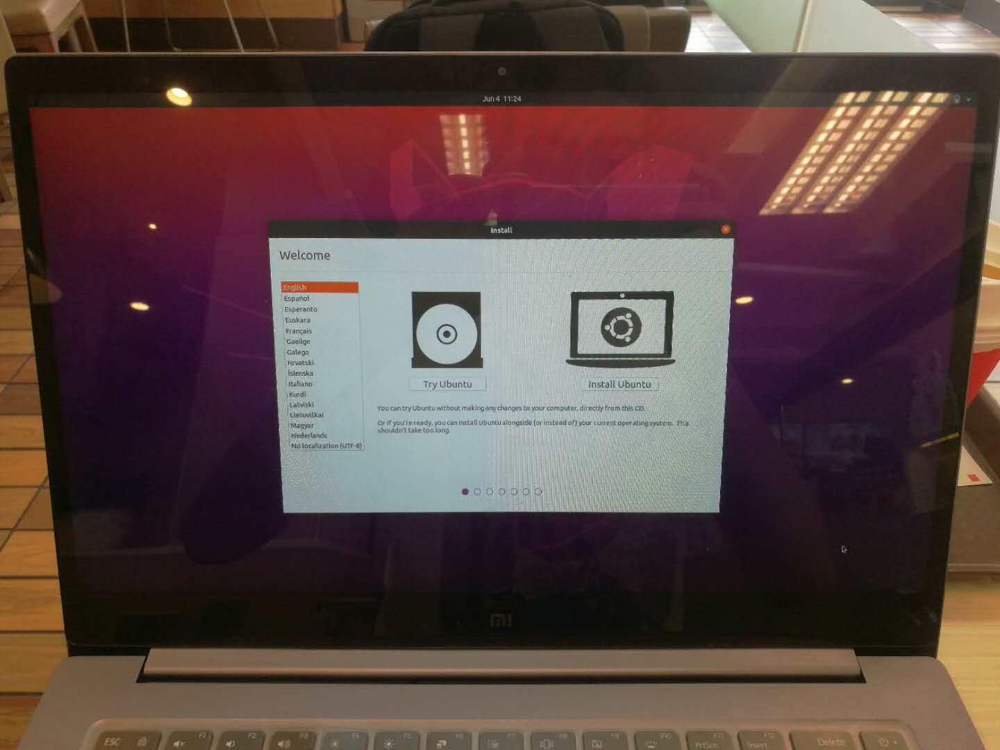
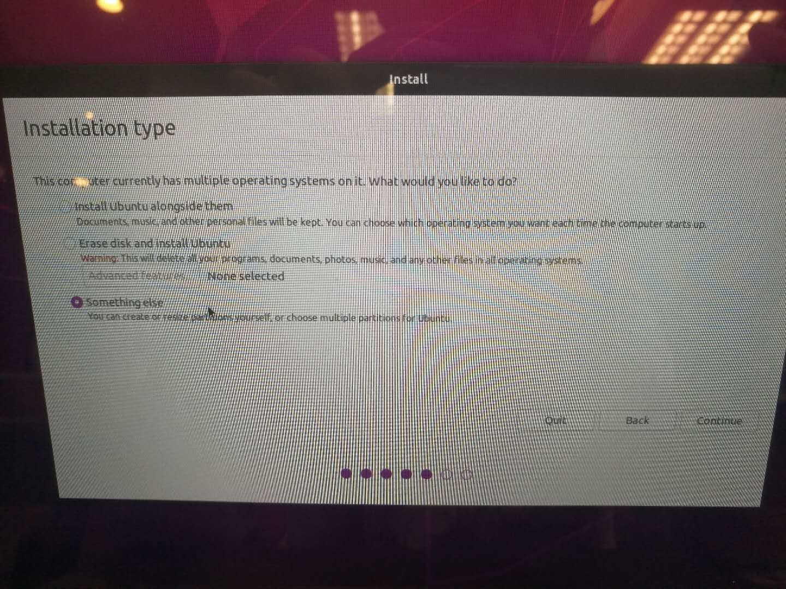
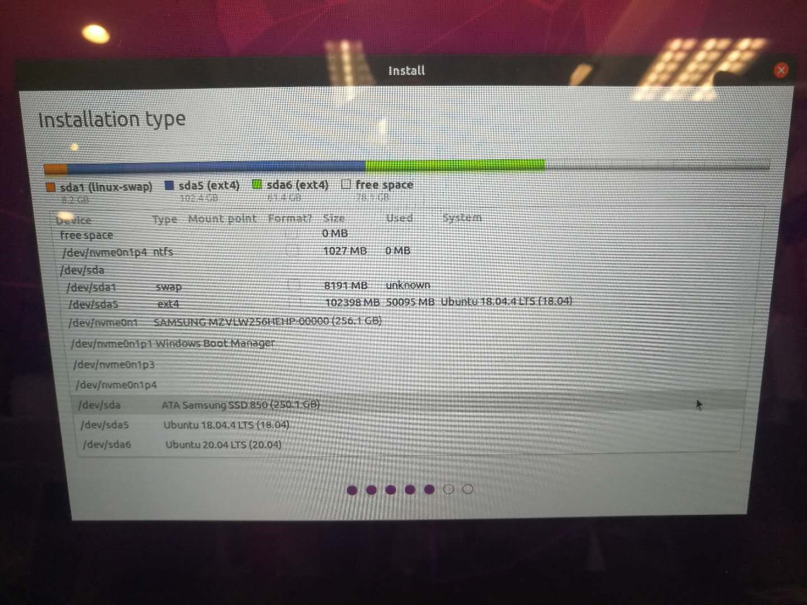

# **电脑端环境配置**


## **<span id="ubuntu_install">Ubuntu系统安装</span>**

### **方法一：虚拟机安装Ubuntu**

虚拟机是一个软件，可以在已有系统之上，构建另外一个虚拟的系统，让多个操作环境同时运行。


这里我们采用的虚拟机软件叫做vmware，下载地址如下，安装步骤和其他软件相同，请大家自行下载并安装：

[点击下载vmware虚拟机](https://www.vmware.com/products/workstation-pro/workstation-pro-evaluation.html ){:target="_blank"} 


准备工作完成后，就可以开始系统安装啦，安装步骤如下：

#### (1) 下载系统镜像

[点击下载Ubutnu系统镜像](https://ubuntu.com/download/desktop ){:target="_blank"} 



???+ attention
    此处推荐选择Ubuntu20.04或者Ubuntu22.04，版本选择的不同，决定着下一步ROS2版本安装的不同，Ubuntu20.04推荐安装ROS2 Foxy，Ubuntu22.04推荐安装 ROS2 Humble。


#### (2) 在虚拟机中创建系统


#### (3) 设置虚拟机硬盘大小



???+ attention
    这里硬盘大小可以稍微大一些，建议不小于60G，避免后续出现磁盘空间不足的情况。


#### (4) 设置Ubuntu镜像路径


#### (5) 启动虚拟机


#### (6) 设置用户名和密码



#### (7) 等待系统安装


#### (8) 完成安装


虚拟机中的Ubuntu系统安装好后，大家可以先随意使用熟悉一下。


### **方法二：Ubuntu双系统安装**

???+ attention
    双系统安装有一定风险，可能会导致电脑无法启动，推荐有经验的开发者操作。以下安装步骤使用的电脑配置如下，也可以参考网上的资料操作：
    

     - 笔记本型号：小米15.6 Pro
    
     - 电脑配置：两块硬盘，一个装Windows，另外一个装了两个Ubuntu系统，启动项设置在Ubuntu硬盘上，这样会比较稳定，不会因为鼓捣Ubuntu导致windows崩溃。


#### (1) 下载系统镜像
[点击下载Ubutnu系统镜像](https://ubuntu.com/download/desktop ){:target="_blank"}


#### (2) 制作USB安装镜像
接下来将一个U盘制作成启动盘，只要大于4G的都可以。

可以使用Ubuntu自带的工具，或者UltraISO等启动盘制作工具，启动软件后，选择ISO镜像路径和U盘位置，点击开始后，大概10分钟制作完成。




#### (3) 硬盘安装
硬盘安装是关键步骤，一定要选择好分区和启动项的位置，不然可能装完之后电脑会变砖。

插入制作好的启动U盘后，开机从U盘启动，本电脑按F12，很快就会进入启动盘，前边的几个步骤按照说明操作即可。




关键的设置在分区这一步，因为电脑有多个系统，不能自动安装，有可能会覆盖原本系统的启动项，选择“something else”，自己设置分区。




这里我们只划分成“/”、“swap”两个分区，这样所有文件共用一个空间大小，非常灵活。


分区设置好之后，还须要注意设置bootlodaer的位置，这里选择的是ubuntu所在的硬盘，避免和windows冲突。




设置完成后就可以安装啦，10分钟所有就安装完成。


#### (4) 启动新系统
重启电脑，顺利看到grub界面。


选择Ubuntu，第一次启动稍微有点慢。


至此，Ubuntu双系统安装完成。


## **<span id="ros2_install">ROS2系统安装</span>**

接下来，我们就可以把ROS2安装到Ubuntu系统中了。安装步骤如下：


### (1) 设置编码

```bash
sudo apt update && sudo apt install locales
sudo locale-gen en_US en_US.UTF-8
sudo update-locale LC_ALL=en_US.UTF-8 LANG=en_US.UTF-8 
export LANG=en_US.UTF-8
```


### (2) 添加源

```bash
sudo apt update && sudo apt install curl gnupg lsb-release 
sudo curl -sSL https://raw.githubusercontent.com/ros/rosdistro/master/ros.key -o /usr/share/keyrings/ros-archive-keyring.gpg 
echo "deb [arch=$(dpkg --print-architecture) signed-by=/usr/share/keyrings/ros-archive-keyring.gpg] http://packages.ros.org/ros2/ubuntu $(source /etc/os-release && echo $UBUNTU_CODENAME) main" | sudo tee /etc/apt/sources.list.d/ros2.list > /dev/null
```

???+ hint
    大部分国内开发者在这都会遇到同一个问题：网址无法连接。解决方案可以参考古月居官网上的这篇帖子：[《解决”Failed to connect to raw.githubusercontent.com“报错》](https://guyuehome.com/37844)


### (3) 安装ROS2

```bash
sudo apt update
sudo apt upgrade
sudo apt install ros-humble-desktop
```

???+ attention
    此处以Ubuntu22.04下安装ROS2 Humble为例，如使用Ubuntu 20.04，请将“humble”改为“foxy。


### (4) 设置环境变量

```bash
source /opt/ros/humble/setup.bash
echo " source /opt/ros/humble/setup.bash" >> ~/.bashrc 
```

   

### (5) ROS2示例测试

为了验证ROS2安装成功，我们可以通过以下示例进行测试。


#### **命令行操作**

先来试试ROS2最为重要的底层通信系统DDS是否正常吧。


启动第一个终端，通过以下命令启动一个数据的发布者节点：

```bash
ros2 run demo_nodes_cpp talker
```


启动第二个终端，通过以下命令启动一个数据的订阅者节点：

```bash
ros2 run demo_nodes_py listener
```


如果“Hello World”字符串在两个终端中正常传输，说明通信系统没有问题。


#### **小海龟仿真**

再来试一试ROS中的经典示例——小海龟仿真器。


启动两个终端，分别运行如下指令：

```bash
ros2 run turtlesim turtlesim_node
ros2 run turtlesim turtle_teleop_key
```


第一句指令将启动一个蓝色背景的海龟仿真器，第二句指令将启动一个键盘控制节点，在该终端中点击键盘上的“上下左右”按键，就可以控制小海龟运动啦。


关于小海龟中蕴藏的ROS奥义，我们在后续教程中将持续探索。


至此，ROS2安装成功。


## **<span id="package_install">下载/编译PC端功能包</span>**

OriginBot使用与开发过程主要在PC端完成，完成以上Ubuntu和ROS2的环境配置后，还需要将OriginBot的PC端功能包下载到电脑上，并且完成编译，便于后续操作使用。


###  **(1) 创建PC端工作空间**

使用如下命令，在电脑端创建工作空间：

```bash
mkdir -p ~/dev_ws/src
```


### **(2) 下载originbot_desktop和依赖包**

OriginBot电脑端的功能包都放置在originbot_desktop代码仓库中：

```bash
cd ~/dev_ws/src
git clone https://gitee.com/guyuehome/originbot_desktop.git 
```


### **(3) 安装功能包和依赖**

为满足后续机器人开发的使用，还需要安装一系列功能包与依赖库：

```bash
sudo apt install python3-colcon-ros
sudo apt install python3-colcon-common-extensions              # ROS2编译器
sudo apt install git                                           # 安装git工具
sudo apt install ros-${ROS_DISTRO}-nav2*                       # 安装导航功能包
sudo apt install ros-${ROS_DISTRO}-xacro                       # 安装模型解析功能包
sudo apt install ros-${ROS_DISTRO}-teleop-twist-keyboard       # 安装键盘控制节点
sudo apt install ros-${ROS_DISTRO}-rmw-cyclonedds-cpp          # 安装Cyclone DDS
sudo apt install ros-${ROS_DISTRO}-cv-bridge                   # 安装图像处理包
sudo apt install ros-${ROS_DISTRO}-robot-state-publisher       # 安装机器人状态发布者包
sudo apt install ros-${ROS_DISTRO}-joint-state-publisher       # 安装关节状态发布者包
sudo apt install ros-${ROS_DISTRO}-joint-state-publisher-gui   # 安装关节状态发布者包
sudo apt install ros-${ROS_DISTRO}-image-transport             # 安装图像压缩包
sudo apt install ros-${ROS_DISTRO}-image-transport-plugins     # 安装图像压缩包
```

???+ attention
    除了依次下载外，也可以使用一条命令下载所有依赖库：
    ```bash
    cd ~/dev_ws/src/originbot_desktop/
    ./install_prereq.sh
    ```


### **(4) 编译工作空间**

回到工作空间的根目录下，编译整个工作空间：

```bash
cd ~/dev_ws
colcon build
```


### **(5) 设置环境变量**

为方便后续使用，我们需要配置环境变量，让系统知道工作空间的位置：

```bash
gedit ~/.bashrc
```


在脚本最后边加上：

```bash
source ~/dev_ws/install/setup.sh
```


至此，OriginBot电脑端的功能包配置完毕。

[](https://www.guyuehome.com/){:target="_blank"}

