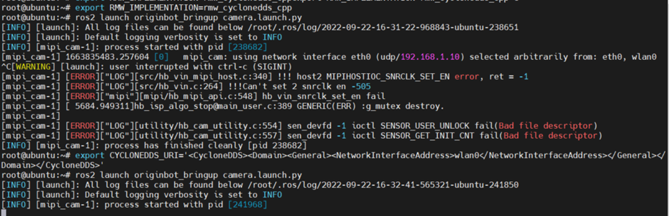

# **相机驱动与图像可视化**

???+ hint
    操作环境及软硬件配置如下：
    

     - OriginBot机器人（Lite版/标准版/Pro版）
     - PC：Ubuntu (≥22.04) + ROS2 (≥humble)


<iframe
  src="//player.bilibili.com/player.html?aid=516658213&bvid=BV1eg411a7A9&cid=866105646&page=12&autoplay=0"
  scrolling="no"
  border="0"
  width="800px"
  height="460px"
  frameborder="no"
  framespacing="0"
  allowfullscreen="true"
>
</iframe>


## **相机驱动例程**

在OriginBot的系统镜像中，已经内置了相机的驱动程序，为了确定相机连接正确并且被系统识别，我们先来运行系统自带的相机例程。


### **启动相机例程**

SSH连接OriginBot成功后，在终端中输入如下指令：

=== ":fontawesome-solid-car: v2.x版本镜像"

    ``` bash
    cd /userdata/dev_ws
    ros2 launch originbot_bringup camera_websoket_display.launch.py
    ```
    {.img-fluid tag=1 title="启动相机例程"}
    
    ???+ Info
        在2.x版本中，已实现系统通过I2C自动识别相机型号，可自由在F37、GC4663等型号切换设备。


=== ":material-car: v1.x版本镜像"

    ``` bash
    ros2 launch websocket hobot_websocket.launch.py
    ```
    {.img-fluid tag=1 title="启动相机例程"}
    
    ???+ Info
        如果运行失败，请确认“/opt/tros/share/websocket/launch/hobot_websocket.launch.py”路径中的相机型号是“GC4663”，如果不是（可能由于系统更新被覆盖），请修改后重新运行。    


### **上位机查看例程效果**

运行成功后，在同一网络的PC端，打开浏览器，输入 http://IP:8000，选择“web展示端”，即可查看图像和算法效果，IP为OriginBot的IP地址。


如相机被顺利驱动，我们不仅可以看到实时图像，还可以看到一个人体骨骼点识别的示例，说明相机运行正常。

{.img-fluid tag=1 title="相机例程可视化效果"}


### **关闭例程**

该例程运行完毕后，请使用Ctrl+C关闭终端中运行的launch文件，释放摄像头硬件资源，便于后续例程使用，否则可能会出现相机设备无法找到的问题：

{.img-fluid tag=1 title="之前例程没有释放相机硬件资源"}
## **ROS图像传输**

确认之前的相机例程已经关闭，接下来可以测试ROS2环境下的图像订阅与发布。


### **启动ROS相机驱动**

SSH连接OriginBot成功后，在终端中输入如下指令：

```bash
export RMW_IMPLEMENTATION=rmw_cyclonedds_cpp
export CYCLONEDDS_URI='<CycloneDDS><Domain><General><NetworkInterfaceAddress>wlan0</NetworkInterfaceAddress></General></Domain></CycloneDDS>'
ros2 launch originbot_bringup camera.launch.py
```

{.img-fluid tag=2 title="配置cyclonedds"}


???+ info
    为了保证图像的实时性，这里我们将使用的DDS切换为cyclonedds，避免因为DDS的切片，导致图像延迟。cyclonedds默认会绑定某一网卡进行数据传输，此处我们使用第二句命令指定无线网卡wlan0作为绑定官网卡，大家可以根据实际情况，进行切换。更多信息，也可以参考[DDS的配置](#DDS的配置)。


### **查看相机话题**

运行成功后，可在机器人端或同网络下的PC端使用如下命令，确认图像话题已经正常发布。

```bash
ros2 topic list
```


### **查看可视化图像**

在同一网络中的PC端，同样配置好使用的DDS，再使用rqt_image_view工具，就可以看到机器人的实时相机图像了。
```bash
export RMW_IMPLEMENTATION=rmw_cyclonedds_cpp
export CYCLONEDDS_URI='<CycloneDDS><Domain><General><NetworkInterfaceAddress>ens33</NetworkInterfaceAddress></General></Domain></CycloneDDS>'
ros2 run rqt_image_view rqt_image_view
```

{.img-fluid tag=3 title="配置cyclonedds"}

???+ info
    此处我们使用第二句命令指定无线网卡ens33作为绑定官网卡，该名称和电脑系统相关，可以使用ifconfig查询，大家可以根据实际情况，进行切换。更多信息，也可以参考[DDS的配置](#DDS的配置)。

{.img-fluid tag=3 title="可视化图像"}

## <span id="DDS的配置">**附：DDS的配置**</span >

ROS2 Foxy默认使用的是fastdds，在图像传输的场景下，会受到限制，此时我们可以切换为cyclonedds。


### **DDS的安装**

cyclonedds在OriginBot的镜像中已经配置好，如果想在电脑端配置的话，可以使用如下命令安装：

```bash
sudo apt install ros-${ROS_DISTRO}-rmw-cyclonedds-cpp
```


### **DDS的切换**

在运行指令的终端中，使用如下指令设置DDS的环境变量，即可切换当前终端所使用的DDS：

```bash
export RMW_IMPLEMENTATION=rmw_cyclonedds_cpp
```


cyclonedds默认会绑定某一网卡进行数据传输，如果需要切换绑定的网卡，可以继续在该终端中输入：

```bash
export CYCLONEDDS_URI='<CycloneDDS><Domain><General><NetworkInterfaceAddress>wlan0</NetworkInterfaceAddress></General></Domain></CycloneDDS>'
```

???+ hint
    中间的参数就是绑定网卡的名字，按照实际需要，修改为eth0、wlan0，或者实际的网卡设备号。参考链接：http://www.robotandchisel.com/2020/08/12/cyclonedds/


使用如下指令，可以查看当前终端的所使用的DDS是否切换成功：

```bash
ros2 doctor --report | grep middleware
```

{.img-fluid tag=4 title="查看dds"}


确定切换成功后，即可在当前终端中运行发布数据的节点了，比如相机发布者节点：

```bash
ros2 launch originbot_bringup camera.launch.py
```


在运行的终端中，可以看到当前fastdds所绑定发布数据的网卡。

{.img-fluid tag=4 title="运行数据通信节点"}


[](https://www.guyuehome.com/){:target="_blank"}