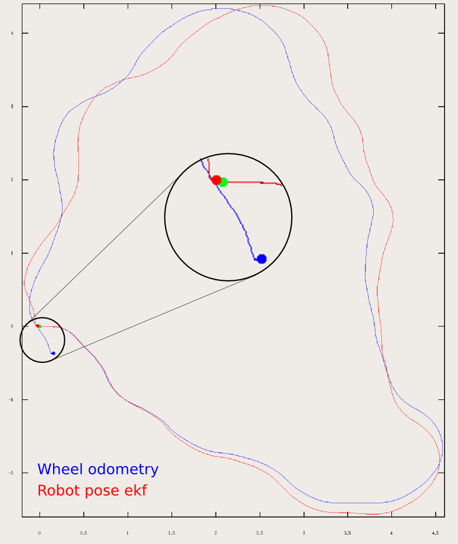

# **EKF多传感器融合定位**

???+ hint
    操作环境及软硬件配置如下：
    

     - OriginBot机器人（标准版/Pro 版）
     - PC：Ubuntu (≥22.04) + ROS2 (≥humble)

## **EKF简介**

EKF全称ExtendedKalmanFilter，即扩展卡尔曼滤波器，是一种高效率的递归滤波器(自回归滤波器)。

ROS中可以利用这种方式根据来自不同来源的（部分）姿态测量值来估计机器人的 3D 姿态。它可以使用具有 6D 模型（3D 位置和 3D 方向）的扩展卡尔曼滤波器来结合车轮里程计、IMU 传感器和视觉里程计的测量值。

{.img-fluid title="EKF"}

其具有以下特征：

1. 可以融合任意数量的传感器。EKF节点不限制传感器的数量，如果机器人有多个 IMU 或多个里程计，则 robot_localization 中的状态估计节点可以将所有的传感器的数据进行融合。
2. 支持多种 ROS 消息类型。 robot_localization 中的状态估计节点可以接收多种常见的位姿相关的消息类型，比如： nav_msgs/Odometry、sensor_msgs/Imu、geometry_msgs/PoseWithCovarianceStamped 或 geometry_msgs/TwistWithCovarianceStamped 。
3. 可以设置每个传感器的输入数据。如果订阅的传感器消息包含不想融合到状态估计中的数据，则 robot_localization 中的状态估计节点可以设置每个传感器的输入数据。
4. 连续预估。 robot_localization 中的每个状态估计节点在接收到单个测量值后就会立即开始估计车辆的状态。如果传感器数据出现丢失，长时间未接收到数据，ekf节点将通过内部的运动模型来估计机器人的状态。

## **参数配置**

通过上文可知，如果要使用ekf来对机器人的位姿进行处理的话，需要至少两个参数才有意义，这里就以融合odom和IMU的数据为例，配置文件目录为`/originbot_navigation/config/ekf.yaml`，下面就是IMU部分的配置参数：

```yaml
# The filter accepts an arbitrary number of inputs from each input message type (nav_msgs/Odometry,
# geometry_msgs/PoseWithCovarianceStamped, geometry_msgs/TwistWithCovarianceStamped,
# sensor_msgs/Imu). To add an input, simply append the next number in the sequence to its "base" name, e.g., odom0,
# odom1, twist0, twist1, imu0, imu1, imu2, etc. The value should be the topic name. These parameters obviously have no
# default values, and must be specified.
        odom0: odom

# Each sensor reading updates some or all of the filter's state. These options give you greater control over which
# values from each measurement are fed to the filter. For example, if you have an odometry message as input, but only
# want to use its Z position value, then set the entire vector to false, except for the third entry. The order of the
# values is x, y, z, roll, pitch, yaw, vx, vy, vz, vroll, vpitch, vyaw, ax, ay, az. Note that not some message types
# do not provide some of the state variables estimated by the filter. For example, a TwistWithCovarianceStamped message
# has no pose information, so the first six values would be meaningless in that case. Each vector defaults to all false
# if unspecified, effectively making this parameter required for each sensor.
        odom0_config: [true, true, false,
                       false, false, true,
                       true, true, false,
                       false, false, true,
                       false, false, false]

        #        [x_pos   , y_pos    , z_pos,
        #         roll    , pitch    , yaw,
        #         x_vel   , y_vel    , z_vel,
        #         roll_vel, pitch_vel, yaw_vel,
        #         x_accel , y_accel  , z_accel]

# If you have high-frequency data or are running with a low frequency parameter value, then you may want to increase
# the size of the subscription queue so that more measurements are fused.
        odom0_queue_size: 10

# [ADVANCED] Large messages in ROS can exhibit strange behavior when they arrive at a high frequency. This is a result
# of Nagle's algorithm. This option tells the ROS subscriber to use the tcpNoDelay option, which disables Nagle's
# algorithm.
        odom0_nodelay: false

# [ADVANCED] When measuring one pose variable with two sensors, a situation can arise in which both sensors under-
# report their covariances. This can lead to the filter rapidly jumping back and forth between each measurement as they
# arrive. In these cases, it often makes sense to (a) correct the measurement covariances, or (b) if velocity is also
# measured by one of the sensors, let one sensor measure pose, and the other velocity. However, doing (a) or (b) isn't
# always feasible, and so we expose the differential parameter. When differential mode is enabled, all absolute pose
# data is converted to velocity data by differentiating the absolute pose measurements. These velocities are then
# integrated as usual. NOTE: this only applies to sensors that provide pose measurements; setting differential to true
# for twist measurements has no effect.
        odom0_differential: false

# [ADVANCED] When the node starts, if this parameter is true, then the first measurement is treated as a "zero point"
# for all future measurements. While you can achieve the same effect with the differential paremeter, the key
# difference is that the relative parameter doesn't cause the measurement to be converted to a velocity before
# integrating it. If you simply want your measurements to start at 0 for a given sensor, set this to true.
        odom0_relative: false

# [ADVANCED] If your data is subject to outliers, use these threshold settings, expressed as Mahalanobis distances, to
# control how far away from the current vehicle state a sensor measurement is permitted to be. Each defaults to
# numeric_limits<double>::max() if unspecified. It is strongly recommended that these parameters be removed if not
# required. Data is specified at the level of pose and twist variables, rather than for each variable in isolation.
# For messages that have both pose and twist data, the parameter specifies to which part of the message we are applying
# the thresholds.
        odom0_pose_rejection_threshold: 20.0
        odom0_twist_rejection_threshold: 1.542
```

首先可以看到最上面是订阅的话题，也就是/odom；然后的odom0_config就是配置使用odom的哪些数据，具体每个位置所代表的数据含义与下方的注释是一一对应的。后面的一些配置参数则是对相关的一些通讯、数据处理方式、队列大小等相关的配置，具体含义可以在配置文件中看到相关的具体注释解释。

而IMU部分的配置几乎是一模一样的，可以自行进行查看。

## **使用EKF**

现在就可以尝试使用ekf来对odom和imu数据进行融合，实现更精准的定位了。

首先启动机器人底盘：

```bash
ros2 launch originbot_bringup originbot.launch.py use_imu:=true pub_odom:=false
```

这里我们启用机器人的底盘驱动和IMU，同时禁用了odom发布的从odom坐标系到base_footprint坐标系的tf。

然后就可以使用ekf融合IMU和odom的数据，并且发布odom坐标系到base_footprint坐标系的tf。

```bash
ros2 launch originbot_navigation odom_ekf.launch.py
```

启动完成之后，可以在PC端打开Rviz即可查看机器人的实时位姿：

```bash
ros2 launch originbot_viz display_robot_tf.launch.py
```

{.img-fluid title="机器人坐标可视化"}
如果需要对ekf的参数进行调整，直接修改originbot_navigation/config/ekf.yaml即可。

[](https://www.guyuehome.com/){:target="_blank"}