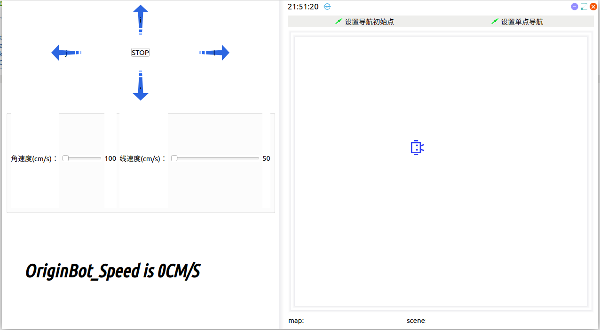

# **上位机控制说明**

???+ hint


	操作环境及软硬件配置如下：
	
	 - OriginBot机器人（Lite版/标准版/Pro 版）
	 - PC：Ubuntu (≥22.04) + ROS2 (≥humble)


## **应用介绍**

 在机器人界面开发中，QT 设计同样是不可忽视的一环。如何将QT界面开发和ROS2、OriginBot联系起来呢？本次示例就希望通过一个简要的开发给大家一个示例。希望大家在后续开发中逐渐完善，部署到自己的项目中。


## **运行方法**

  此次的功能包，我们放在了originbot_desktop/originbot_app中，那么如何使用呢，在PC端的originbot_desktop目录下，运行如下命令

```
ros2 run originbot_app originbot_app
```

运行后可以看到出现如下界面

{.img-fluid tag=2}


## **实现功能**

此QT实现了什么功能呢？在左边，是前后左右的按键控制键，当启动底盘之后，大家可以通过按键以及下方的角速度、线速度控件实现QT控制小车移动。右边是一个简化的Rviz界面，在这个界面大家可以实现建图和导航的功能。

大家可以直接运行导航、建图程序，RVIZ中的界面将会在此QT中展现出来。

### **导航示例**

启动底盘

```
source /opt/ros/foxy/setup.bash
ros2 launch originbot_bringup originbot.launch.py use_lidar:=true
```

启动QT界面

```
ros2 run originbot_app originbot_app
```

启动导航：

```
 source /opt/ros/foxy/setup.bash
ros2 launch originbot_navigation nav_bringup.launch.py
```

运行后，大家可以看到如下界面：


点击设置单点导航


机器同样会规划规划路径并移动。

[](https://www.guyuehome.com/){:target="_blank"}