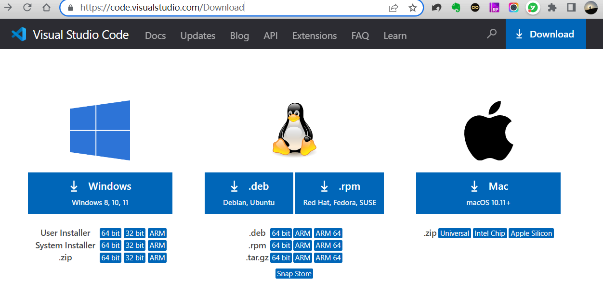
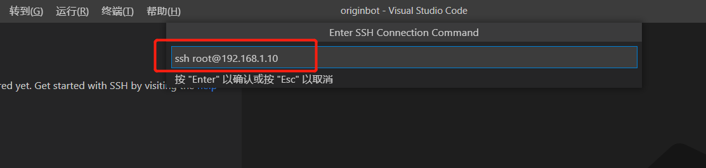
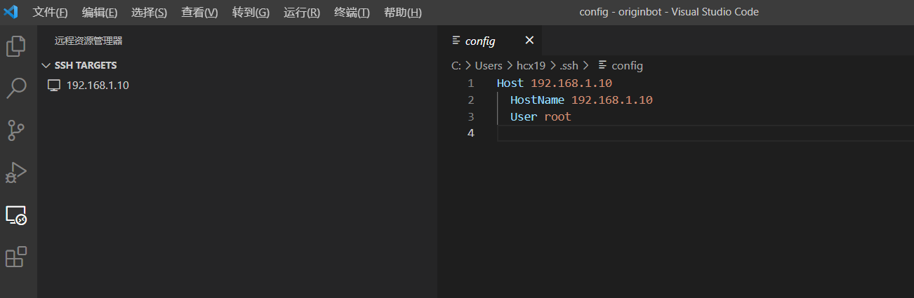
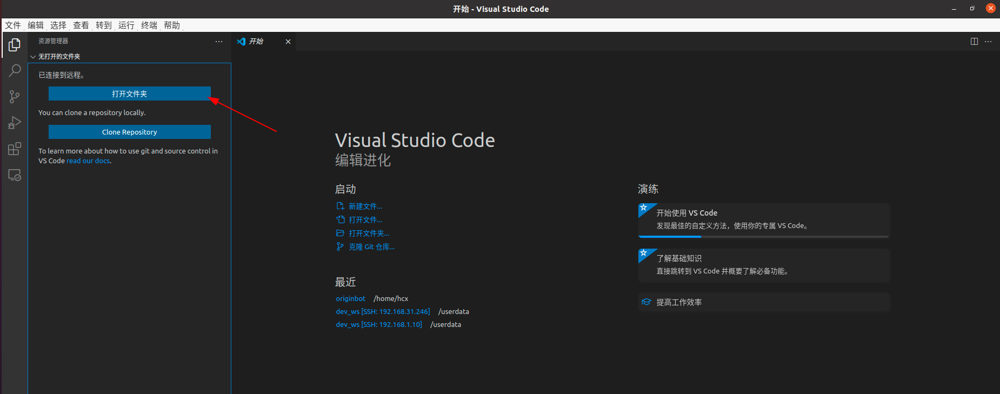
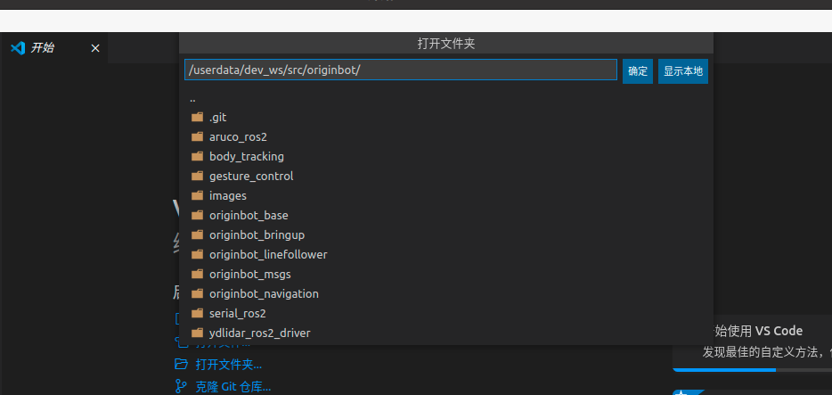

# **搭建开发环境**

OriginBot支持ssh远程登录后进行开发，如果大家不习惯远程命令行开发的话，也可以在PC端搭建一个可视化的开发环境，这里我们介绍如何使用VSCode进行远程开发。

???+ hint
    操作环境及软硬件配置如下：
    

     - OriginBot机器人（Lite版/标准版/Pro版）
     - PC：Ubuntu (≥22.04) + ROS2 (≥humble) + VSCode

<iframe
  src="//player.bilibili.com/player.html?aid=516658213&bvid=BV1eg411a7A9&cid=866084309&page=9autoplay=0"
  scrolling="no"
  border="0"
  width="800px"
  height="460px"
  frameborder="no"
  framespacing="0"
  allowfullscreen="true"
>
</iframe>

## **安装VSCode**

VSCode官方提供多种操作系统下的安装包，大家可以根据自己使用的操作系统选择下载。

[VSCode的下载链接](https://code.visualstudio.com/Download){:target="_blank"}

{.img-fluid tag=1 title="VSCode的下载页面"}

下载完成后，双击安装包，按照提示的步骤完成安装即可。

???+ hint
    如果在Ubuntu环境下操作，请下载.deb的安装包，下载完成后，使用以下命令即可安装：

    sudo dpkg -i 文件名.deb

## **安装SSH插件**

打开安装好的VSCode，选择右侧的“Extensions”扩展插件，在搜索栏中输入“ssh”进行搜索，找到“Remote - SSH”插件，然后点击安装。

{.img-fluid tag=2 title="安装SSH插件"}

安装好之后，在VSCode左侧出现一个“远程资源管理器”。

{.img-fluid tag=2 title="安装SSH插件"}

## **配置远程连接**

点击VSCode左侧新出现的“远程资源管理器”，点击“+”添加按钮。

{.img-fluid tag=3 title="配置远程连接"}

在弹出的提示框中，输出ssh的完整命令，回车。

{.img-fluid tag=3 title="配置远程连接"}

然后选择第一项默认的配置文件，保存刚才输入的ssh命令信息。

{.img-fluid tag=3 title="配置远程连接"}

保存成功后，也可以按照提示打开该配置文件，这样下次在远程登录，就不需要填写信息了。而且在左侧的列表中，也新增了远程目标的IP地址。

{.img-fluid tag=3 title="配置远程连接"}

## **连接远程服务器**

右键点击远程服务器的IP地址，然后选择在当前窗口中打开。

{.img-fluid tag=4 title="连接远程服务器"}

很快打开一个新的窗口，并让我们选择目标服务器的系统，我们选择“Linux”。

{.img-fluid tag=4 title="连接远程服务器"}

接下来填写目标服务器的用户密码：root。

{.img-fluid tag=4 title="连接远程服务器"}

稍等片刻便登录成功啦。

{.img-fluid tag=4 title="连接远程服务器"}

选择打开文件夹。

{.img-fluid tag=4 title="连接远程服务器"}

然后我们选择OriginBot的工作空间，userdata在稍靠下的位置，滑动鼠标滚轮即可看到。

{.img-fluid tag=4 title="连接远程服务器"}

这样，我们就可以远程访问OriginBot上的代码啦，还可以随时修改，会实时同步到机器人端。此外，我们还可以在连接成功的VSCode中，启动多个终端，便于我们输入各种在OriginBot上运行的命令。

{.img-fluid tag=4 title="连接远程服务器"}

{:target="_blank"}

