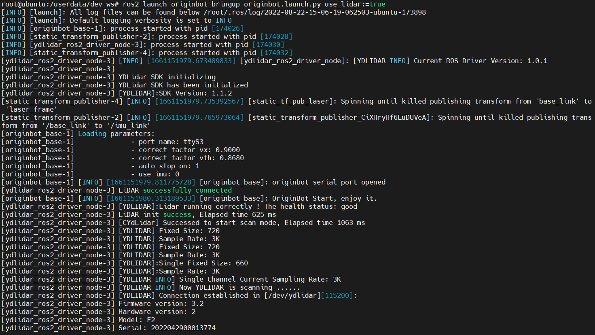
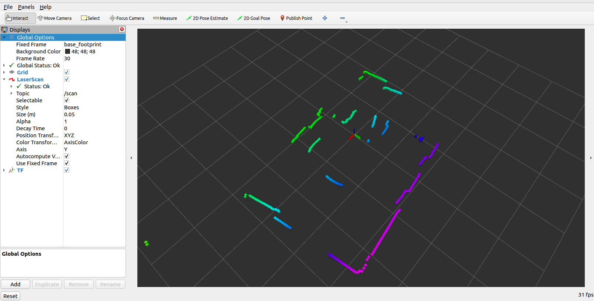

# **雷达驱动与可视化**

???+ hint
    操作环境及软硬件配置如下：
    

     - OriginBot机器人（标准版/Pro 版）
     - PC：Ubuntu (≥22.04) + ROS2 (≥humble)


<iframe
  src="//player.bilibili.com/player.html?aid=516658213&bvid=BV1eg411a7A9&cid=866110216&page=13&autoplay=0"
  scrolling="no"
  border="0"
  width="800px"
  height="460px"
  frameborder="no"
  framespacing="0"
  allowfullscreen="true"
>
</iframe>


## **雷达驱动**

SSH连接OriginBot成功后，在终端中输入如下指令，即可启动机器人底盘及雷达驱动：

```bash
ros2 launch originbot_bringup originbot.launch.py use_lidar:=true
```

{.img-fluid tag=1 title="启动机器人底盘及雷达驱动"}


## **数据可视化**

在同一网络中的PC端，启动上位机可视化显示软件：

```bash
ros2 launch originbot_viz display_lidar.launch.py
```


很快就可以看到雷达的实时数据了
{.img-fluid tag=1 title="雷达的实时数据可视化"}


???+ hint
    确保在PC端已经安装好Ubuntu+ROS2系统，并且完成[originbot_desktop](https://gitee.com/guyuehome/originbot_desktop){:target="_blank"}代码仓库的下载和编译。此外，还可以使用“ros2 run rviz2 rviz2”单独启动Rivz2，手动配置Fixed Frame选择base_link，添加Laserscan之后，订阅雷达话题，也可以达到类似的效果。


[](https://www.guyuehome.com/){:target="_blank"}

