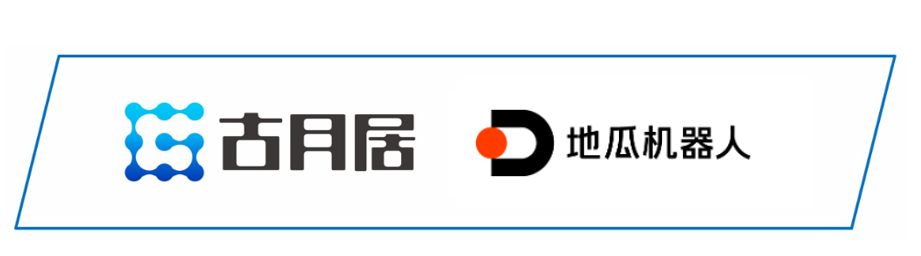

# **参与贡献**

## **核心贡献者**

诚挚邀请各位开发者可以参与到OriginBot项目当中来，参与的方式和形式有很多种：

## **提供反馈**

  - 在使用OriginBot套件的过程中，如有任何问题或者建议，欢迎在[古月居社区版块](https://www.guyuehome.com/interlocution?id=1826932316801544194){:target="_blank"}提问讨论；

  - 在使用OriginBot软件的过程中，如有发现任何bug，欢迎在[代码仓库](https://gitee.com/guyuehome/originbot){:target="_blank"}中提交Issue；

    

## **贡献代码**

  - 在使用OriginBot套件的过程中，如对原生代码有优化、增加等修改，欢迎在[代码仓库](https://gitee.com/guyuehome/originbot){:target="_blank"}中提交Pull Request；

    

## **开源传递**

  - 如果你对OriginBot有兴趣，欢迎大家点赞该项目，或者分享给身边有需要的开发者；

  - 如果基于OriginBot开源项目衍生出更多有意思的功能或者机器人，欢迎在[社区板块](https://www.guyuehome.com/interlocution?id=1826932316801544194){:target="_blank"}中与大家分享，优秀的项目我们也会在社区中宣传；

{:target="_blank"}

