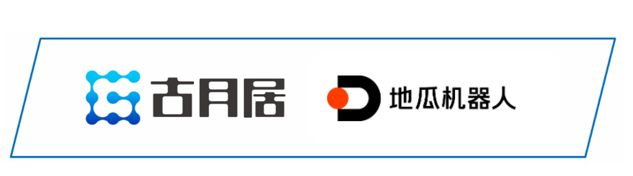

# **关于OriginBot** 

OriginBot是一款智能机器人开源套件，也是一个社区共建的开源项目，旨在让每一位参与者享受机器人开发的乐趣。

该项目由古月居联手地瓜机器人共同发起，欢迎更多企业、组织和开发者加入。

联系方式：brand@guyuehome.com

## **古月居介绍**

古月居，是华语地区知名的ROS机器人社区（[www.guyuehome.com](http://www.guyuehome.com/){:target="_blank"}），致力于为机器人学习者提供优质的交流学习平台，线上用户超过120万人，努力构建集人才、内容、校企为一体的社区生态，2011年创建至今，累积高质量内容超过1000万字、视频课程超过1000小时，出版《ROS机器人开发实践》等畅销图书，与众多高校及企业建立合作，通过AI机器人+社区生态的创新模式，赋能面向未来的人才培养。 

