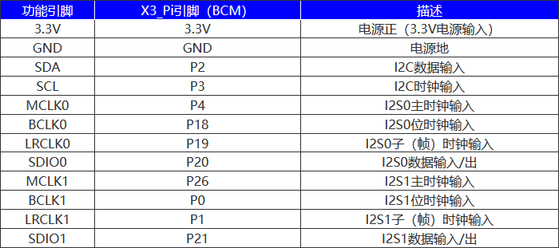
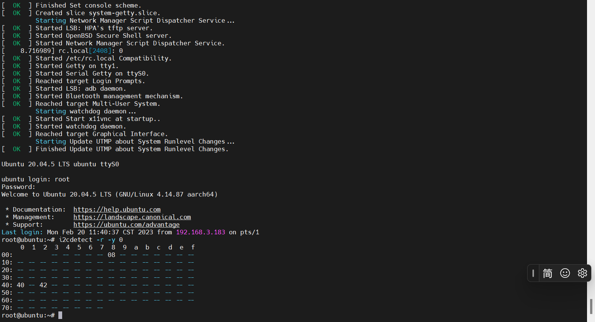
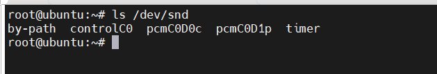
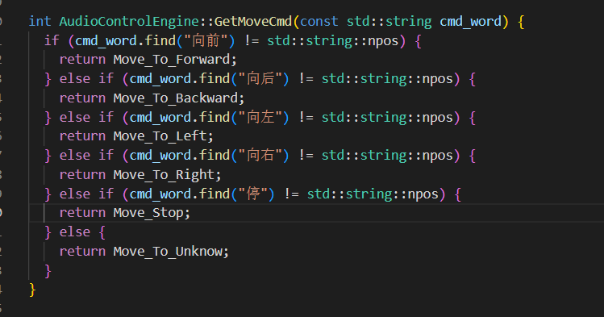

# **OriginBot开发之语音控制**

???+ hint
    操作环境及软硬件配置如下：

     - OriginBot机器人（标准版/Lite版）
     - PC：Ubuntu (≥22.04) + ROS2 (≥humble)
     - 麦克风扩展板


## **功能介绍**

随着电子产品的日益发展，语音识别技术广泛出现在不同的场景中，例如智能家居、语音助手、电话客服和机器人导游等。而随着技术的不断发展，机器人的语音识别正在变得越来越准确和可靠，这进一步促进机器人在各种领域的应用。

本次开发的语音控制功能需要额外搭配地瓜机器人开发平台的智能语音模块一起使用。得益于X3上5Tops算力的BPU，可以实现低延迟算法推理能力，以及语音算法模块实现的远场（3~5米）降噪、回声消除，高准确率的asr识别功能，同时用户可以自主的配置语音命令词或者直接根据语音识别来定义机器人的行为。

## **功能运行**

### **配置环境**

SSH连接OriginBot成功后，配置智能语音模块：

```
# 从TogetheROS的安装路径中拷贝出运行示例需要的配置文件。
cp -r /opt/tros/lib/hobot_audio/config/ .

# 加载音频驱动，设备启动之后只需要加载一次
bash config/audio.sh
```

### **启动机器人底盘**

在终端中输入如下指令，启动机器人底盘：

```
ros2 launch originbot_bringup originbot.launch.py
```

### **启动语音控制**

以下是口令控制功能的指令：

=== ":fontawesome-solid-car: v2.x版本镜像"

    ``` bash
    ros2 launch audio_control audio_control.launch.py
    ```

=== ":material-car: v1.x版本镜像"

    ``` bash
    ros2 launch audio_control hobot_audio_control.launch.py
    ```


## **演示效果**


## **智能语音模块说明**

此次搭配的智能语音模块是基于RDK X3 而设计的音频模块，采用 ES7210 高性能四通道编码芯片、ES8156 高性能立体声音频解码芯片，通过I2C接口控制，I2S接口传输音频。板载标准3.5mm耳机接口，可通过外接耳机播放音乐。板子左右四角各有一个高质量MEMS硅麦克风，可以立体声录音。

**购买渠道**

可以查看RDK 用户手册[音频转接板)](https://developer.d-robotics.cc/rdk_doc/Basic_Application/audio/audio_board_x3)
有使用方法和购买链接

**产品特性**

- 供电电压：3.3V
- 音频编码芯片：ES7210
- 音频解码芯片：ES8156
- 控制接口：I2C
- 音频接口：I2S
- ADC 信噪比：102dB
- DAC 信噪比：110dB

**接口**



**安装方式**


**检测硬件运行环境方法**

```
i2cdetect -r -y 0
```



其中`08`是`ES8156`的设备地址，`40`和`42`是 `ES7210`的设备地址。

**加载驱动音频codec(编解码器) 和X3 音频框架驱动**

```
sudo modprobe es7210
sudo modprobe es8156
sudo modprobe hobot-i2s-dma
sudo modprobe hobot-cpudai
sudo modprobe hobot-snd-7210 snd_card=5
```

**检测是否加载成功**

```
ls /dev/snd
```



成功加载后，运行 `ls  /dev/snd` 命令可以看到已经生成音频控制节点，pcm的录音、播放节点。

**录音测试方法**

```
#采集4通道麦克风的录音5秒钟：
sudo tinycap ./4chn_test.wav -D 0 -d 0 -c 4 -b 16 -r 48000 -p 512 -n 4 -t 5
#采集2通道麦克风的录音5秒钟：
sudo tinycap ./2chn_test.wav -D 0 -d 0 -c 2 -b 16 -r 48000 -p 512 -n 4 -t 5
```

**播放**

```
#播放2通道的音频（不支持直接播放4通道录音）：
sudo tinyplay ./2chn_test.wav -D 0 -d 1
```

可以使用音箱或者3.5mm接口耳塞接入位号U4的插口中听效果，也可以从系统中拉出音频文件至电脑中播放。

## **语音控制进阶**

是否可以重新定义语音控制的功能呢？答案是，那必须能呀！

可以修改智能语音识别Node里面对于命令词的定义配置，同时修改语音控制Node里面对于自定义命令词的控制策略或者直接增加一个语音控制APP。

智能语音识别Node中，设备唤醒词和命令词的配置文件在/opt/tros/lib/hobot_audio/config/hrsc/cmd_word.json文件里面（当然，若用户将此config文件夹拷贝到了其他路径，那以实际使用的配置路径为准），默认的配置如下：

```
{
    "cmd_word": [
    "你好",
    "向前走",
    "向后退",
    "向左转",
    "向右转",
    "停止运动"
    ]
}
```

第一个词为唤醒词。那么之后的命令如何进行操作呢？



这个函数定义在audio_control\src\audio_control_engine.cpp中，大家只需修改此处关键词以及增加相应函数操作即可自行DIY。


[](https://www.guyuehome.com/){:target="_blank"}
