# **视觉巡线（AI深度学习）X3**

???+ hint
    操作环境及软硬件配置如下：

     - OriginBot机器人（Lite版/标准版）
     - PC：Ubuntu (≥22.04) + ROS2 (≥humble) + pytorch + docker
     - 巡线场景：黑色路径线，背景有明显反差


## **应用目标**

在[视觉巡线（OpenCV）](../application/cv_line_follower.md){:target="_blank"}中，我们已经可以让小车跟随黑色的路径线运动，实现了最基础的视觉巡线任务，不过大家可能已经发现，基于OpenCV的图像识别受光线影响较大，更换场地后，就需要重新调整阈值，有没有可能让机器人自主适应环境的变化呢？也就是让机器人自己来学习。


没问题，深度学习大家一定都听说过，使用这种方法，我们就可以实现数据驱动化的视觉巡线效果，需要适应什么样的场地，只需要采集一些图片数据，就可以啦，接下来我们就来尝试一下。


## **原理简介**

### **深度学习流程**

相比传统图像处理，深度学习能够让机器视觉适应更多的变化，从而提高复杂环境下的精确程度。在正式开始之前，我们先简单介绍下深度学习的基本流程。

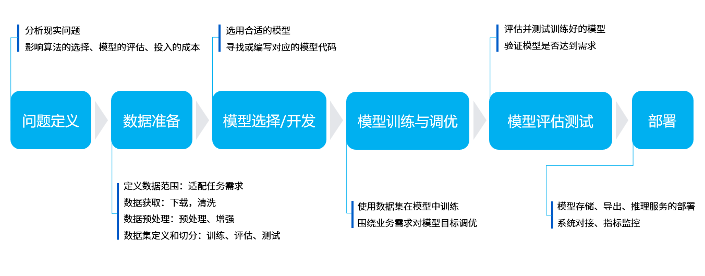{.img-fluid tag=1}

机器学习的核心目的是要帮助我们解决问题，可以分为六个主要步骤：

- **问题定义**：我们要解决的问题是什么？比如这里的视觉巡线，那就要识别线在图像中的位置。
- **数据准备**：针对要解决的问题，着手准备数据。比如要准备各种巡线场景的照片，给机器学习使用。
- **模型选择/开发**：模型就是处理数据的一套流程，也就是我们常听说的CNN卷积神经网络、GAN生成对抗网络、RNN循环神经网络等等。
- **模型训练与调优**：把数据放入模型中，训练得到最优化的参数，可以理解为是机器在学习的过程。
- **模型评估测试**：就像小测验一样，我们拿一些数据给训练好的模型，看下效果如何。
- **部署**：一切准备就绪之后，就可以把训练好的模型放到机器人上了，也就是正式把知识传授给某一个机器人，它就可以解决之前提出的问题啦。


### **视觉巡线流程**

{.img-fluid tag=1}

OriginBot具有两个主动轮，一个从动轮，通过两个主动轮差速进行旋转控制。其中MCU模块主要用于小车的电机运动控制通过串口与主控RDK X3进行通信。主控制器选用地瓜RDK X3，具备10T算力，能够轻松处理复杂的CNN推理工作。

整套系统如上图所示，RDK X3通过摄像头获取小车前方环境数据，图像数据通过训练好的CNN模型进行推理得到引导线的坐标值，然后依据一定的控制策略计算小车的运动方式，通过UART向小车下发运动控制指令实现整个系统的闭环控制。

PC用于进行数据标注以及训练,为了提高效率这里采用RDK X3将图片通过以太网发送至PC端进行标注的方式。


## **运行方法**

### **场景说明**

在OriginBot的应用代码中，我们已经为大家训练好了一套巡线的模型，使用的场景如下：

{.img-fluid tag=1}


如果大家身边也有类似的环境，可以暂时跳过以上提到的机器学习步骤，直接进入部署环节，我们先来试一试使用深度学习的视觉巡线效果如何吧。


### **启动视觉巡线**

先将OriginBot放置到巡线的场景中，尽量向下调节相机角度，避免外界干扰。

{.img-fluid tag=1}


接下来启动巡线功能，注意命令后需要跟模型路径和名称的参数：

```bash
cd /userdata/dev_ws/src/originbot/originbot_deeplearning/line_follower_perception/
ros2 run line_follower_perception line_follower_perception --ros-args -p model_path:=model/resnet18_224x224_nv12.bin -p model_name:=resnet18_224x224_nv12
```
{.img-fluid tag=1}


### **启动机器人**

SSH连接OriginBot成功后，在终端中输入如下指令，启动机器人底盘和相机：

```bash
ros2 launch originbot_bringup camera_internal.launch.py
ros2 launch originbot_bringup originbot.launch.py
```

相机启动成功后，就可以在巡线终端中看到动态识别的路径线位置了：

{.img-fluid tag=1}


运行后稍等片刻，就可以看到机器人开始巡线运动啦。


深度学习是基于数据的，机器人在数据中见过的场景，才能学会，如果没见过的，识别效果就不太好了，所以如果大家使用巡线颜色、周边环境差别较大，还是需要尽量多采集一些数据，让机器人都可以学会，完整的深度学习流程可以参考如下内容。


## **AI深度学习**

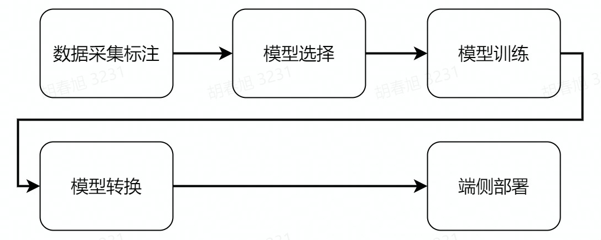{.img-fluid tag=1}

接下来的深度学习操作主要分为以上几个步骤，在操作之前，还需要完成PC端环境的配置，我们一起来体验下深度学习吧。


### **PC端环境配置**

PC端的基础环境是Ubuntu+ROS+pytorch+docker，请大家先按照[电脑端环境配置](../guide/pc_config.md){:target="_blank"}完成Ubuntu、ROS、OriginBot功能包的配置。


#### **安装pytorch**

训练框架选用pytorch，大家可以在PC端的Ubuntu系统中，直接使用如下命令进行安装：

```
pip3 install torch torchvision torchaudio --extra-index-url https://download.pytorch.org/whl/cpu
```


???+ hint
    为了保证通用性，这里安装的是CPU版本的pytorch，若硬件上有GPU，也可选用GPU版本pytorch，训练速度更快。


#### **安装Docker**

后续模型转换需要用到Docker，以节省环境配置的时间，需要大家先进行安装，并下载模型转换使用的镜像。


ubuntu环境下docker的安装可以参考如下网站或网上资料完成：

[Ubuntu Docker 安装](https://www.runoob.com/docker/ubuntu-docker-install.html){:target="_blank"}


安装完成后，就可以通过如下命令，下载后续模型转换的工具链和docker镜像啦。

- 下载AI工具链OE包（6.1GB）

```bash
wget -c ftp://vrftp.horizon.ai/Open_Explorer_gcc_9.3.0/2.3.3/horizon_xj3_open_explorer_v2.3.3_20220727.tar.gz
```

- 下载AI工具链docker（14.8GB）

```bash
wget -c ftp://vrftp.horizon.ai/Open_Explorer_gcc_9.3.0/2.3.3/x3pi_toolchain/ai_toolchain_2.3.3.tar.gz
```

???+ hint
    以上docker镜像的体积较大，请保证网络通畅，耐心等待。


#### **相关功能包介绍**

在深度学习的整个流程中，我们将用到三个直接相关的功能包/文件夹：

- **10_model_convert**：用来存放浮点模型转定点模型相关代码和配置，该文件夹内容全部需要在AI工具链docker中运行；

- **line_follower_model**：用来存放模型训练相关内容，如数据标注、模型训练、以及生成onnx模型，该文件夹内容全部在PC上运行；

- **line_follower_perception**：用来存放RDK X3上运行的代码，可以在板端编译或者通过交叉编译方式生成RDK X3上运行的package。


其中，10_model_convert和line_follower_model两个包放置在[originbot_desktop代码仓库](https://gitee.com/guyuehome/originbot_desktop){:target="_blank"}中，line_follower_perception放置在[originbot代码仓库](https://gitee.com/guyuehome/originbot){:target="_blank"}中。


环境准备好之后，我们就可以着手开始啦。


### **数据采集与标注**

数据是深度学习的基础，我们先要完成数据的采集和标注，这个过程主要在PC端完成，需要订阅OriginBot机器人端的实时图像，主要流程如下：

{.img-fluid tag=1}

（1）启动OriginBot相机，采集巡线场景的图像，发布图像话题image_raw；

（2）PC端订阅OriginBot发布的图像话题，获取图像数据；

（3）PC端对图像进行剪裁，并且人工完成每一幅图像中路径线的标注；

（4）保存标注结果和对应的图像。


#### **启动OriginBot相机**

SSH连接OriginBot成功后，在终端中输入如下指令，启动OriginBot的相机：

```bash
export RMW_IMPLEMENTATION=rmw_cyclonedds_cpp
ros2 launch originbot_bringup camera.launch.py
```

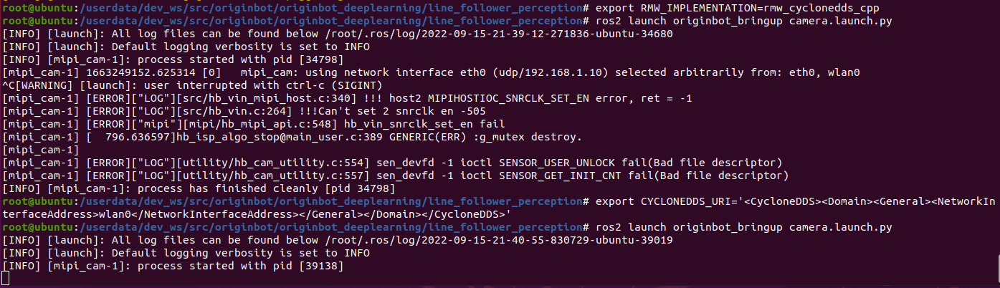{.img-fluid tag=1}


???+ hint
    数据采集过程可以人为摆放机器人的姿态，不启动机器人底盘，单独启动相机即可。


#### **启动数据采集与标注程序**

在PC端，通过如下指令，启动line_follower_model包中的数据采集与标注程序，

```bash
export RMW_IMPLEMENTATION=rmw_cyclonedds_cpp
cd ~/dev_ws/src/originbot_desktop/originbot_deeplearning/line_follower_model
ros2 run line_follower_model annotation
```
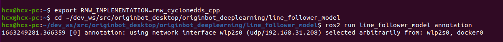{.img-fluid tag=1}


为保证通信的流畅，以上使用cyclonedds，配置之后，cyclonedds会自动绑定某一网卡，如果通信网卡不对的话，可使用如下命令更换：
​    

     export CYCLONEDDS_URI='<CycloneDDS><Domain><General><NetworkInterfaceAddress>wlan0</NetworkInterfaceAddress></General></Domain></CycloneDDS>'


#### **数据采集与标注**

启动成功后，按下键盘上回车键，程序会订阅最新图像话题，剪裁后通过一个可视化窗口显示出来，数据采集成功：

{.img-fluid tag=1}


用鼠标左键点击画面垂直方向上路径线的中心处，即完成该帧图像数据的标注：

{.img-fluid tag=1}


按下回车键，程序自动保存该图片至当前路径下的image_dataset文件夹中，并且保存标记结果。图片命名方式为：

> xy_[x坐标]_[y坐标]_[uuid].jpg

其中uuid为图片唯一标志符，避免出现文件名称相同。

???+ hint
    若点击不准确可以多次鼠标左键点击，直到满意为止。如果没有点击标注，回车后会跳过该帧图像，不会放入数据集。


{.img-fluid tag=1}

不断调整机器人的在场景中的位置，考虑各种可能出现的图像效果，循环完成以上数据采集和标注过程，采集足够数量的数据，建议至少100张，用于后续模型训练。当环境或者场地变化时也可采集对应的图片一起训练提高模型的适应性。

{.img-fluid tag=1}


### **模型训练**

#### **模型选择**

卷积神经网络（Convolutional Neural Network, CNN）是一种目前广泛用于图像，自然语言处理等领域的深度神经网络模型。1998 年，Lecun 等人提出了一种基于梯度的反向传播算法用于文档的识别。在这个神经网络中，卷积层 (Convolutional Layer) 扮演着至关重要的角色。随着运算能力的不断增强，一些大型的 CNN 网络开始在图像领域中展现出巨大的优势，2012 年Krizhevsky等人提出了AlexNet网络结构，并在ImageNet图像分类竞赛中以超过之前11%的优势取得了冠军。随后不同的学者提出了一系列的网络结构并不断刷新ImageNet的成绩，其中比较经典的网络包括：VGG(Visual Geometry Group) ，GoogLeNet和ResNet。卷积神经网络由输入层、卷积层、池化层、全连接层以及输出层组成，其结构如下：

{.img-fluid tag=1}


综合考虑模型成熟度、训练模型对CPU/GPU的硬件要求，这里选择ResNet网络作为backbone。残差神经网络（ResNet）是由微软研究院的何恺明、张祥雨、任少卿、孙剑等人提出，在2015 年的ILSVRC（ImageNet Large Scale Visual Recognition Challenge）中取得了冠军。ResNet巧妙地利用了shortcut连接，解决了深度网络中模型退化的问题，是当前应用最为广泛的CNN特征提取网络之一。ResNet18结构如下：

{.img-fluid tag=1}

在RDK X3上ResNet18推理性能高达232FPS，ResNet50推理性能也超过100FPS，高帧率保证了数据处理的实时性，是后续提高车速以及实现更复杂应用的必要条件。这里先使用ResNet18网络结构，后期遇到瓶颈考虑更深的ResNet50网络结构。为了满足输出引导线坐标值x，y这里需要修改ResNet18网络FC输出为2，即直接输出引导线的x，y坐标值。ResNet18输入分辨率为224x224。


#### **模型训练**

以上提到的模型可以直接复用pytorch中的定义，数据集的切分和模型的训练，都封装在line_follower_model功能包的代码中。

{.img-fluid tag=1}


直接在PC端，运行如下指令，即可开始训练：

```bash
cd ~/dev_ws/src/originbot_desktop/originbot_deeplearning/line_follower_model
ros2 run line_follower_model training
```

{.img-fluid tag=1}


模型训练过程需要一段时间，预计在30分钟左右，请大家耐心等待。


训练完成后，会产生模型文件。
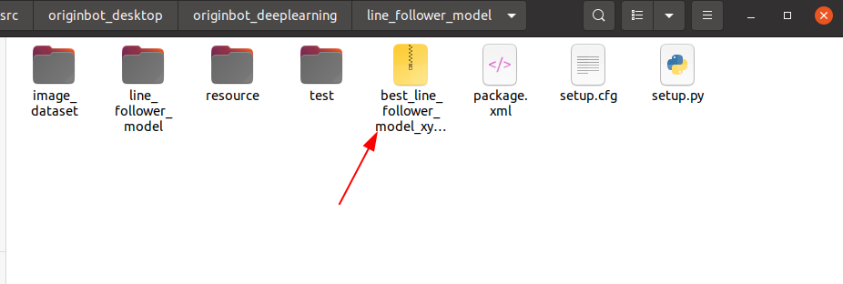{.img-fluid tag=1}


### **模型转换**

pytorch训练得到的浮点模型如果直接运行在RDK X3上效率会很低，为了提高运行效率，发挥BPU的5T算力，这里需要进行浮点模型转定点模型操作。

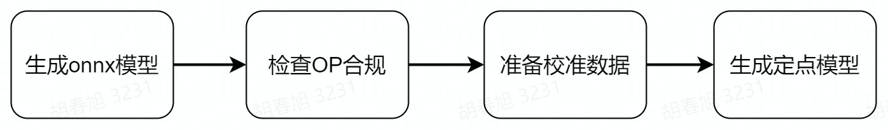{.img-fluid tag=1}


#### **生成onnx模型**

在PC端，通过如下命令，使用generate_onnx将之前训练好的模型，转换成onnx模型：

```bash
cd ~/dev_ws/src/originbot_desktop/originbot_deeplearning/line_follower_model
ros2 run line_follower_model generate_onnx
```
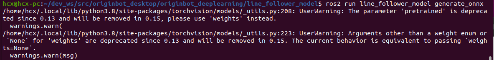{.img-fluid tag=1}


运行后在当前目录下得到生成的best_line_follower_model_xy.onnx模型。
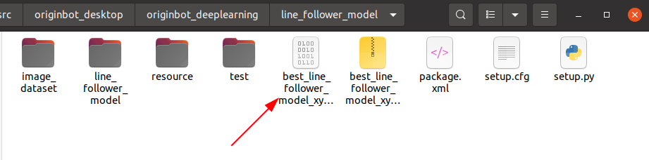{.img-fluid tag=1}


#### **启动AI工具链docker**
解压缩之前下载好的AI工具链的docker镜像和OE包，并将docker镜像解压出来的数据文件都拷贝到OE包中的data文件夹下。
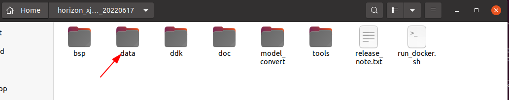{.img-fluid tag=1}
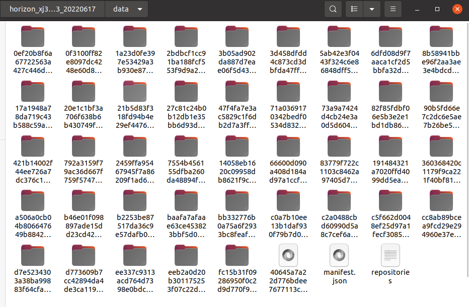{.img-fluid tag=1}

将originbot_desktop代码仓库中的10_model_convert包拷贝到至OE开发包ddk/samples/ai_toolchain/horizon_model_convert_sample/03_classification/目录下。
{.img-fluid tag=1}


再把line_follower_model功能包下标注好的数据集文件夹和生成的onnx模型拷贝到以上10_model_convert包中：
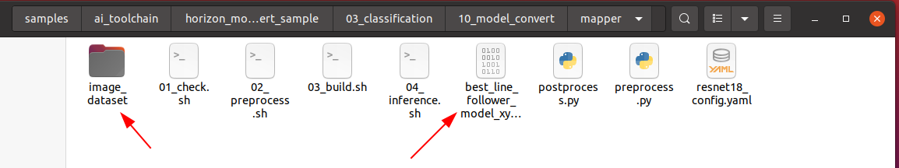{.img-fluid tag=1}


然后回到OE包的根目录下，加载AI工具链的docker镜像：

```bash

sh run_docker.sh /data/
```
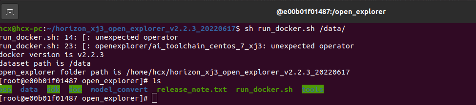{.img-fluid tag=1}


#### **生成校准数据**

该步骤生成的校准数据主要供下一步模型编译进行校准用，可以使用训练模型的部分数据，没有特殊要求，只要确保标准正确即可，数量以100张左右为宜，上一步我们已经将数据集拷贝完成。

在启动的Docker镜像中，完成如下操作：

```bash
cd ddk/samples/ai_toolchain/horizon_model_convert_sample/03_classification/10_model_convert/mapper
sh 02_preprocess.sh
```
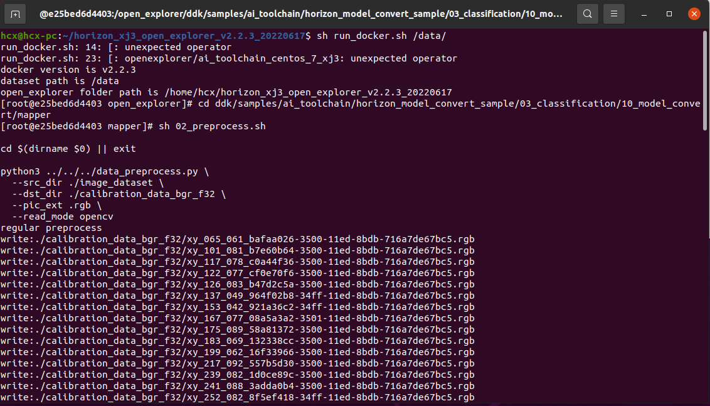{.img-fluid tag=1}


#### **模型编译生成定点模型**

该步骤将生成定点模型文件，用于后续在机器人上的部署：

```bash
cd ddk/samples/ai_toolchain/horizon_model_convert_sample/03_classification/10_model_convert/mapper
sh 03_build.sh
```

{.img-fluid tag=1}

编译成功后，会在10_model_output路径下生成最终的模型文件。
{.img-fluid tag=1}


我们可以右键拷贝模型文件，放到line_follower_model功能包里，以备后续部署使用。
{.img-fluid tag=1}


### **模型部署**

通过前面模型转换已经得到可以在RDK X3BPU上运行的定点模型，如何将其部署在RDK X3上，实现图像获取、模型推理、运动控制整套功能呢？这里基于TogetheROS中的Hobot DNN实现。Hobot DNN是TogetheROS软件栈中的板端算法推理框架，在地瓜RDK X3上利用BPU处理器实现AI推理功能，为机器人应用开发提供更简单易用的模型集成开发接口，包括模型管理、基于模型描述的输入处理及结果解析，以及模型输出内存分配管理等功能。


#### **模型部署**

将编译生成的定点模型resnet18_224x224_nv12.bin，拷贝到OriginBot端line_follower_perception功能包下的model文件夹中，替换原有的模型，并且重新编译工作空间。


编译完成后，就可以通过如下命令部署模型，其中参数model_path和model_name指定模型的路径和名称：

```bash
cd /userdata/dev_ws/src/originbot/originbot_deeplearning/line_follower_perception/
ros2 run line_follower_perception line_follower_perception --ros-args -p model_path:=model/resnet18_224x224_nv12.bin -p model_name:=resnet18_224x224_nv12
```
{.img-fluid tag=1}


#### **启动相机**

先将OriginBot放置到巡线的场景中。


通过如下命令，启动零拷贝模式下的摄像头驱动，加速内部的图像处理效率：

```bash
ros2 launch originbot_bringup camera_internal.launch.py
```


相机启动成功后，就可以在巡线终端中看到动态识别的路径线位置了：

{.img-fluid tag=1}


#### **启动机器人**

最后，再启动OriginBot底盘，机器人就可以自主寻线运动啦：

```bash
ros2 launch originbot_bringup originbot.launch.py
```


[](https://www.guyuehome.com/){:target="_blank"}