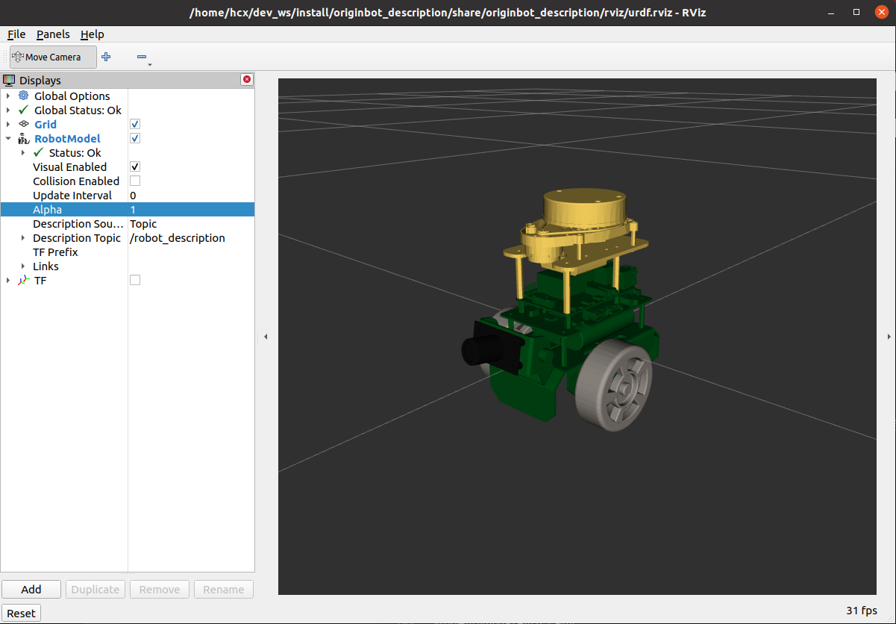
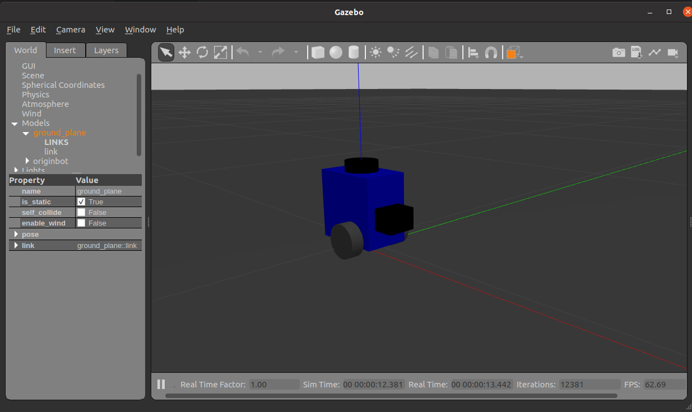
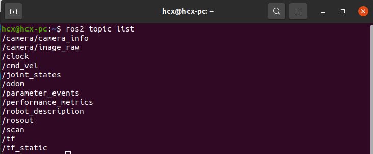
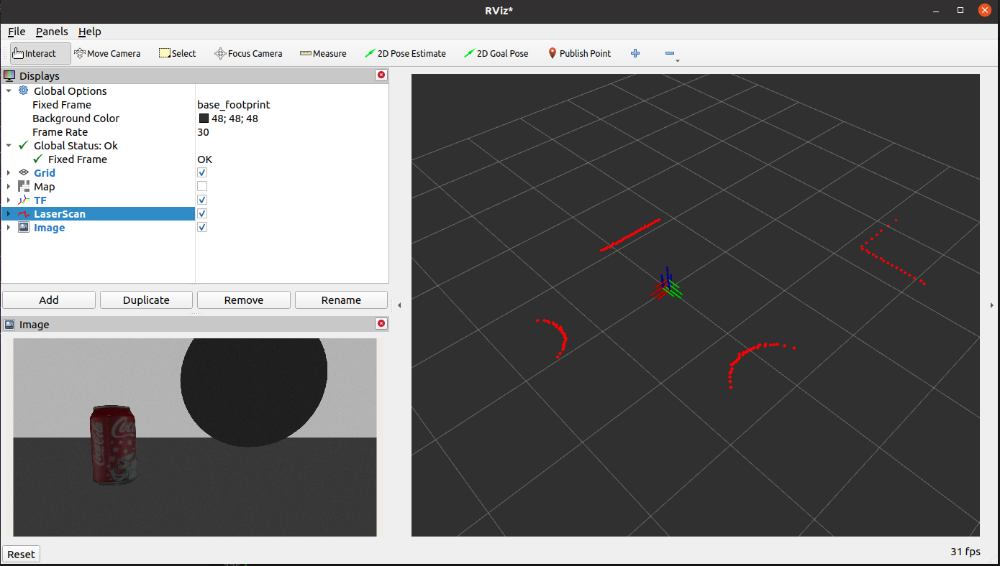

# **虚拟仿真**

???+ hint
    操作环境及软硬件配置如下：
    

     - PC：Ubuntu (≥22.04) + ROS2 (≥humble)


## **开发环境配置**

在PC端安装好Ubuntu+ROS2系统，并且完成originbot_desktop代码仓库的下载和编译。


具体操作方法请见：[下载/编译PC端功能包](../guide/pc_config.md#3-pc){:target="_blank"}


## **三维模型可视化**

在PC端运行如下指令：

```
ros2 launch originbot_description display.launch.py
```


即可加载机器人三维模型，并启动Rviz2上位机可视化界面，显示机器人的三维模型：

{.img-fluid tag=1}


## **三维仿真环境**

### **安装依赖**

在运行仿真环境之前，现在PC上确认以下功能包是否安装：

```bash
sudo apt install ros-${ROS_DISTRO}-gazebo-ros
sudo apt install ros-${ROS_DISTRO}-gazebo-ros2-control
sudo apt install ros-${ROS_DISTRO}-gazebo-plugins
sudo apt install ros-${ROS_DISTRO}-ros2-control
sudo apt install ros-${ROS_DISTRO}-ros2-controllers
```


### **启动仿真**

启动终端，运行如下指令，等待Gazebo仿真软件的启动：

```bash
ros2 launch originbot_gazebo originbot_gazebo.launch.py
```

{.img-fluid tag=1}

???+ hint
    1. 为保证模型顺利加载，请将离线模型文件库下载并放置到~/.gazebo/models下，否则可能会出现Gazebo无法启动的问题。[点击下载离线模型](https://github.com/osrf/gazebo_models){:target="_blank"}
    1. 如使用虚拟机无法显示机器人模型，还需要将虚拟机设置中的"加速3D图形"关闭，并在Ubuntu系统的.bashrc里加入“export SVGA_VGPU10=0”，使用CPU渲染Gazebo。


### **查看仿真数据**

当前仿真环境中的各项数据是否有成功仿真出来呢，我们可以通过话题列表来确认：

```bash
ros2 topic list
```

{.img-fluid tag=1}

可以看到，在当前仿真环境中，速度控制、里程计、相机图像、雷达数据等都已经被成功仿真了。


### **控制机器人运动**

启动一个新的终端，运行键盘控制节点，即可通过键盘控制仿真环境中的机器人运动：

```bash
ros2 run teleop_twist_keyboard teleop_twist_keyboard
```


### **查看传感器可视化数据**

先在仿真环境中放入一些障碍物：

{.img-fluid tag=1}


然后启动Rviz：

```bash
ros2 run rviz2 rviz2
```


在Rviz中配置Image和LaserScan的显示项，订阅对应的话题，即可看到可视化效果：

{.img-fluid tag=1}


[](https://www.guyuehome.com/){:target="_blank"}

