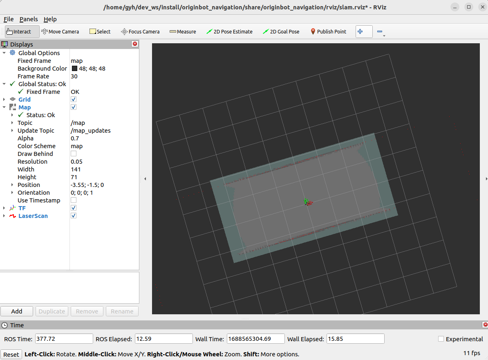
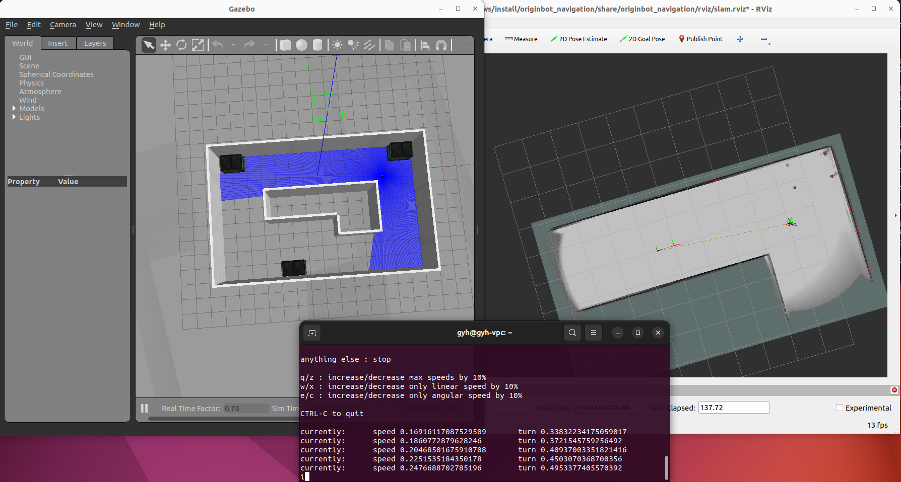
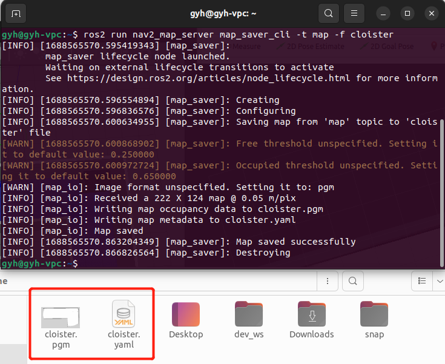

# **地图构建(Gazebo)**

???+ hint
    操作环境及软硬件配置如下：
    

     - PC：Ubuntu (≥22.04) + ROS2 (≥humble)


## **启动Gazebo仿真环境**

在PC端打开一个新终端，在终端中输入如下指令，启动Gazebo仿真环境：

```bash
ros2 launch originbot_gazebo originbot_navigation_gazebo.launch.py
```

稍等片刻，启动成功后，即可看到包含机器人模型的仿真环境：

{.img-fluid tag=1}


## **启动SLAM及可视化显示**

在PC端打开一个新终端，在终端中输入如下指令，启动cartographer建图算法：

```bash
ros2 launch originbot_navigation cartographer_gazebo.launch.py
```

{.img-fluid tag=1}

???+ hint
    确保在PC端已经完成[originbot_desktop](https://gitee.com/guyuehome/originbot_desktop){:target="_blank"}代码仓库的下载和编译。如果不方便使用originbot_desktop代码仓库，也可以使用“ros2 run rviz2 rviz2”单独启动Rivz2，手动添加map、tf、laserscan等显示插件，也可以达到类似的效果。


## **键盘控制建图**

为了让机器人建立周边环境的完整信息，我们还需要启动一个键盘控制节点：

```bash
ros2 run teleop_twist_keyboard teleop_twist_keyboard
```


现在，我们就可以在键盘控制的终端中，点击键盘的上下左右键，控制机器人探索未知的环境啦，Rviz中会逐渐出现地图的全貌。

{.img-fluid tag=1}


## **保存地图**

建图完成后，可以使用如下指令来保存地图：

```bash
ros2 run nav2_map_server map_saver_cli -t map -f cloister
```

{.img-fluid tag=1}

???+ info
    以上指令会将地图保存到终端的当前路径下，在后续导航使用前，需要拷贝到originbot_navigation功能包中。


[](https://www.guyuehome.com/){:target="_blank"}

