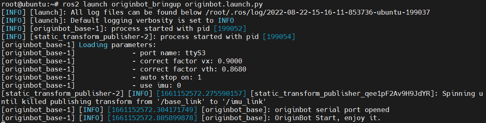
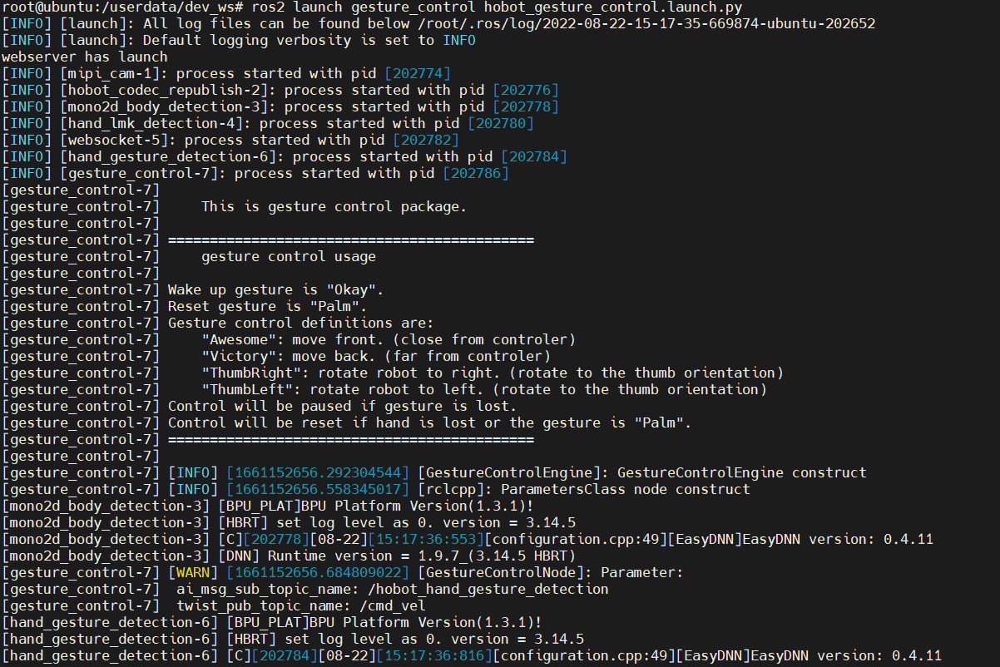
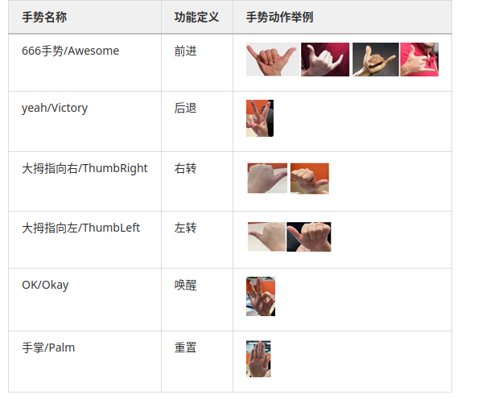
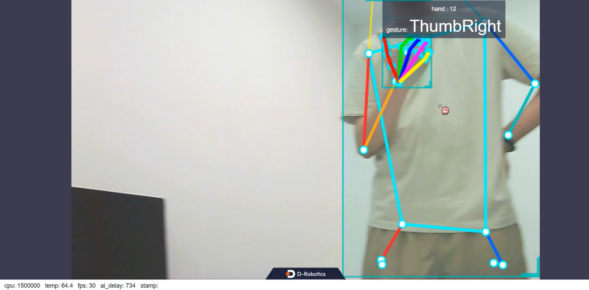
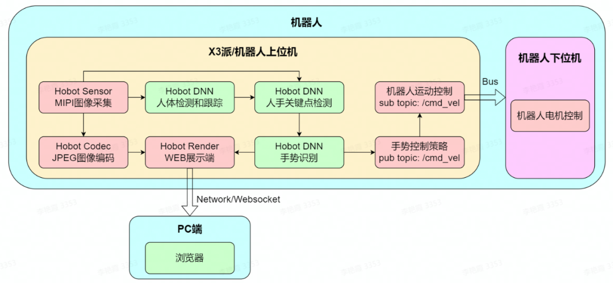

# **手势控制**

???+ hint
    操作环境及软硬件配置如下：
    

     - OriginBot机器人（Lite版/标准版/Pro 版）
     - PC：Ubuntu (≥22.04) + ROS2 (≥humble)


## **启动机器人底盘**

SSH连接OriginBot成功后，在终端中输入如下指令，启动机器人底盘：

```bash
ros2 launch originbot_bringup originbot.launch.py
```

{.img-fluid tag=1 title="启动机器人底盘"}


## **启动手势控制功能**

=== ":fontawesome-solid-car: v2.x版本镜像"

    ``` bash
    cd /userdata/dev_ws
    
    # 启动launch文件
    ros2 launch gesture_control gesture_control.launch.py
    ```

=== ":material-car: v1.x版本镜像"

    ``` bash
    cd /userdata/dev_ws
    
    # 从TogetheROS的安装路径中拷贝出运行示例需要的配置文件
    cp -r /opt/tros/lib/mono2d_body_detection/config/ .
    cp -r /opt/tros/lib/hand_lmk_detection/config/ .
    cp -r /opt/tros/lib/hand_gesture_detection/config/ .
    
    # 启动launch文件
    ros2 launch gesture_control hobot_gesture_control.launch.py
    ```

{.img-fluid tag=1 title="启动手势控制功能"}

???+ Attention
    启动应用功能时，请注意配置文件在当前运行的路径下，否则应用功能找不到配置文件，会运行失败。


## **手势控制机器人效果**

启动成功后，站在OriginBot摄像头前，通过以下手势就可以控制机器人运动啦。





## **上位机可视化显示**

打开浏览器，访问机器人的ip地址，即可看到视觉识别的实时效果。
{.img-fluid tag=1 title="上位机可视化显示"}


## **原理简介**

手势控制功能为通过手势控制机器人小车运动，包括左右旋转和前后平移运动，由MIPI图像采集、人体检测和跟踪、人手关键点检测、手势识别、手势控制策略、图像编解码、WEB展示端组成，流程如下图：

{.img-fluid tag=1 title="原理简介"}

详细原理讲解请见：

[https://developer.d-robotics.cc/rdk_doc/Robot_development/apps/car_gesture_control](https://developer.d-robotics.cc/rdk_doc/Robot_development/apps/car_gesture_control){:target="_blank"}

[](https://www.guyuehome.com/){:target="_blank"}

