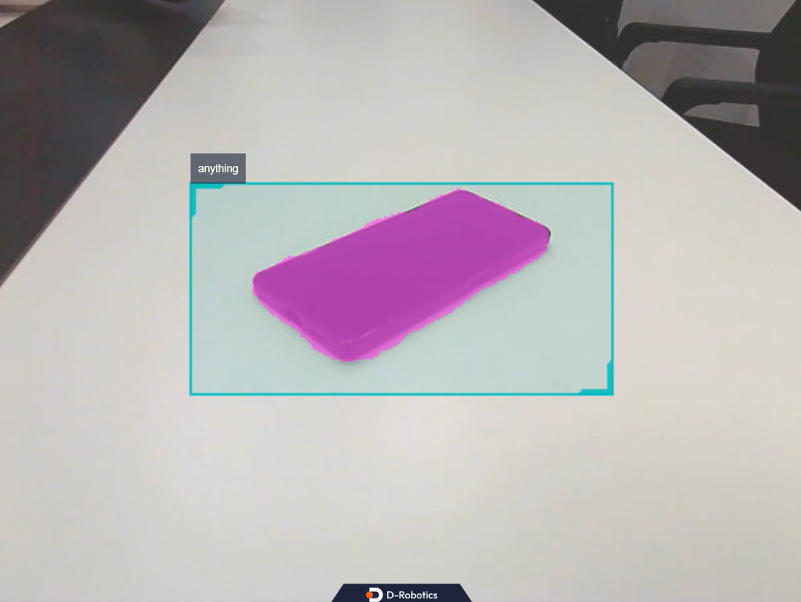

# **分割一切**

???+ hint
    操作环境及软硬件配置如下：

     - OriginBot机器人（Pro版）
    
     - PC：Ubuntu (≥22.04) + ROS2 (≥humble)


mono_mobilesam package 是基于 Mobile SAM 量化部署的使用示例。图像数据来源于本地图片回灌和订阅到的image msg。SAM 依赖检测框输入进行分割, 并分割检测框中的目标, 无需指定目标的类别信息, 仅需提供框。最终将算法信息通过话题发布, 同时在Web页面渲染可视化。

应用场景：结合检测框进行障碍物分割、水渍区域分割等。

## **运行案例**
``` bash
# 进入工作空间
cd /userdata/dev_ws

# 从tros的安装路径中拷贝出运行示例需要的配置文件。
cp -r /opt/tros/${TROS_DISTRO}/lib/mono_mobilesam/config/ .

# 配置USB摄像头
export CAM_TYPE=usb

# 启动launch文件
ros2 launch mono_mobilesam sam.launch.py 
```
### **WEB端查看例程效果**

运行成功后，在同一网络的PC端，打开浏览器，输入 http://IP:8000 ，选择“web展示端”，即可查看图像和算法效果，IP为OriginBot的IP地址。




[](https://www.guyuehome.com/){:target="_blank"}
