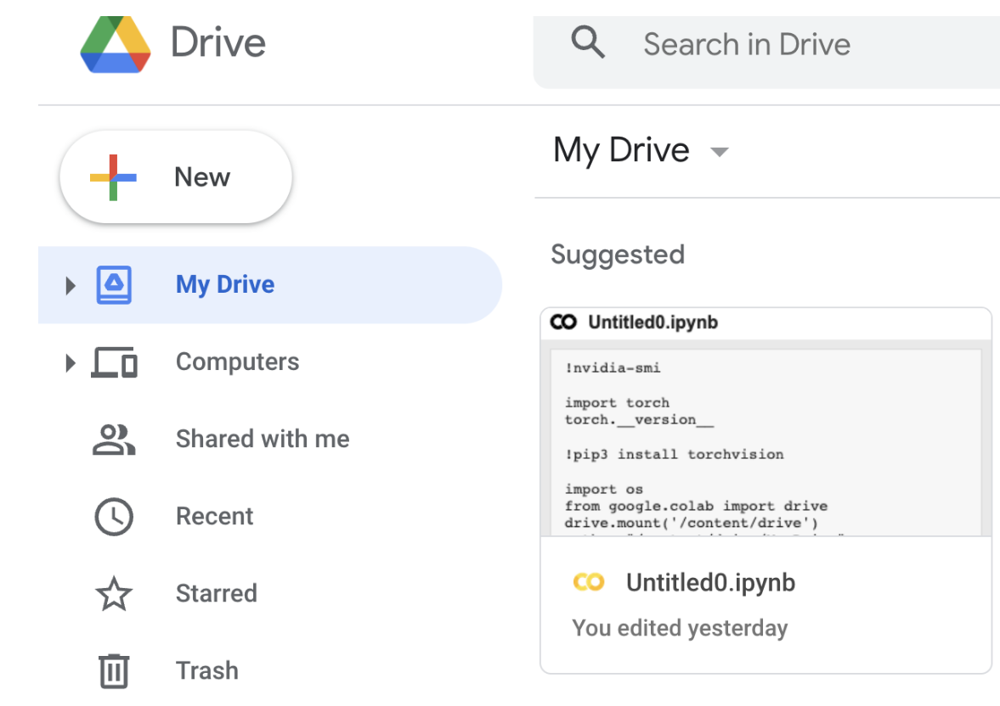

# **踢球射门**

???+ hint
	操作环境及软硬件配置如下：

     - OriginBot机器人（Lite版/标准版）
     - PC：Ubuntu (≥22.04) + ROS2 (≥humble)


## **应用介绍**

在世界杯的足球赛场上，大家见识到了球员们驰骋在足球场上的种种场面。不知道大家会不会也幻想有一天机器人也能真正的上足球赛场进行一场惊心动魄的较量呢？接下来就让我们来以 OriginBot 为例，开发一项踢足球的新功能吧！

首先有两个必须的要素，一个是足球，另一个是球门。小车实现踢足球项目则可以通过识别足球和球门，让小车运球前往球门即可。这里我们就总结出了这个项目的三要素，识别足球、小车运球、小车射门。


## **硬件配置**

### **场景说明**

在 OriginBot 的应用代码中，我们已经为大家训练好了一套识别足球的模型。[足球](https://detail.tmall.com/item.htm?app=chrome&bxsign=scdvWbq-VPcbgEMWU8q8H2Xd2OPhfI7etyomDDJ9EoY7TouDT_px7NiaPKFlkIjQLJrzgVn5FZYdoiKaGLnJbC-CDRvAn2fkVJ8nKQrwkbDgW0rIgxHZJx4kyriZQK_HFuw&cpp=1&id=653536038144&price=13.9-45.9&shareUniqueId=18620108203&share_crt_v=1&shareurl=true&short_name=h.UgMIhFv&sourceType=item,item&sp_abtk=gray_ShareGlobalNavigation_1_code_simpleAndroid&sp_tk=TVN5R2RZWVRsSHk=&spm=a2159r.13376460.0.0&suid=24dfb5fb-b23b-4269-b9c2-06ef25d8ca5e&tbSocialPopKey=shareItem&tk=MSyGdYYTlHy&un=78f593f474668cb68bcc5a13b9bc225d&un_site=0&ut_sk=1.YbWZ+L47U8IDAJfaQBYzv5sf_21646297_1667803454429.Copy.1)大小为直径4cm。效果如下。


如果大家身边也有类似的环境，即可直接进行部署环节，测试一下深度学习的物体识别跟踪效果。


### **硬件说明**

为了实现更好的一个踢球的效果，我们将摄像头拉到最低，同时我们给OriginBot小车增添了一个帮助我们更好的运球，[点击此链接](https://pan.baidu.com/s/1gJgBzcP9t5k4DMupsanG2Q?pwd=f3xg){:target="_blank"}可以将夹爪的3D模型下载下来，如果可以的话，大家可以将夹爪通过3D打印的方式打印出来，安装如下：


当然了，如果不方便3D打印，同样可以用身边的东西制作一个。这里我们采用了硬纸版，如下图所示：


## **运行方法**

### **启动足球识别和运球功能**

  首先将 OriginBot 放置到相近似的场景中。接下来启动功能。

```
cd /userdata/dev_ws
source install/setup.bash
ros2 run play_football play_football
```


### **启动机器人**

SSH连接OriginBot成功后，在终端中输入如下指令，启动机器人底盘和相机：

```
ros2 launch originbot_bringup camera_internal.launch.py
ros2 launch originbot_bringup originbot.launch.py
```

运行后，即可看到机器人开始追踪足球了。


### **射门**

在射门前需要做一些准备工作，此处我们没有去识别球门，那么如何去射门呢？ Navigation！ 所以需要我们先建立一张地图，在地图上明确球门的位置。

 启动导航节点，设置起点（小车当前位置）和终点（球门位置）同时启动运球节点，小车即可前往球门位置。

```
ros2 launch originbot_navigation nav_bringup.launch.py
```


## **效果展示**

射门：


运球：


## **YoLov5 训练足球识别模型**

### 模型选择

此处我们选择的是大家常用的YOLOv5算法。此处我们简单介绍一下它的工作原理。 

用官方的话来讲，YOLOv5实现了一种叫做单阶段目标检测的方法，它可以在一次前向传播过程中完成物体检测、识别和定位的任务，那么它具体是如何实现的呢？

- 首先，YOLOv5采用了一种称为自适应非极大值抑制（A-NMS）的算法，它可以通过动态调整非极大值抑制的阈值来提高检测精度。

- 然后，YOLOv5使用了一种叫做深度可分卷积神经网络（DCNN）的模型来提取图像特征，并使用多个不同大小的卷积核来进行特征提取，以便捕捉多尺度的目标。

- 最后，YOLOv5使用了一种叫做多尺度预测的方法，它可以对不同大小的目标进行单独的检测，并且通过对比不同尺度的预测结果来提高检测精度。

清楚这些，才能帮助我们更好的去写代码，做算法解析。

### **准备模型训练环境**

  这里提供两种方式供大家选择。

- PC端训练模型

​      PC 端训练即可按照正常步骤进行。

- 云端训练模型

​      此处模型训练为了方便大家，我们选用了云端训练模型，避免因为显卡的原因训练耗时过长。云服务器我们选用的是谷歌的 Colab。

```
https://drive.google.com/
```

选择 My Drive 文件夹，点击New新建一个文件夹，并取名为 play_football.



然后右击选择 Google Colaboratory。

点击修改，可以更改笔记本运行卡为 GPU 。


此外，大家可以尝试使用一些指令查看相应的参数。

```
#查看显卡参数
!nvidia-smi

#查看pytorch
import torch
torch.__version__
```

将 google drive 挂载进云电脑。

```
import os
from google.colab import drive
drive.mount('/content/drive')
 
path = "/content/drive/My Drive"
 
os.chdir(path)
os.listdir(path)
```

下载Yolov5算法包

```
git clone https://github.com/ultralytics/yolov5 
cd yolov5
git reset --hard 5e970d4 
```

接下来就可以按照训练Yolov5的流程正常进行了。

**额外补充：**

（1）、在环境使用上，colab默认下载最新的 pytorch 版本，但是2.0版本使用的版本不能过高，推荐大家使用此版本。

```
!pip install torch==1.9.0+cu111 torchvision==0.10.0+cu111 torchaudio==0.9.0 -f https://download.pytorch.org/whl/torch_stable.html
```

（2）、不论使用云端还是PC端，在网络架构上，为了匹配RDK X3的使用，需要将网络架构（yolo.py）改成如下：

```
  def forward(self, x):
      # x = x.copy()  # for profiling
      z = []  # inference output
      self.training |= self.export
      for i in range(self.nl):
          x[i] = self.m[i](x[i])  # conv
          bs, _, ny, nx = x[i].shape  # x(bs,255,20,20) to x(bs,3,20,20,85)
          #  x[i] = x[i].view(bs, self.na, self.no, ny, nx).permute(0, 1, 3, 4, 2).contiguous()
          x[i] = x[i].permute(0, 2, 3, 1).contiguous()
```

（3）、模型导出，需要将 ONNX opset 改成 10 或者 11；torch.onnx.export 部分的默认输入名称参数由 'images'改为 'data'；parser.add_argument 改为672x672即可。


### **AI工具链转换**

此处可参见[视觉巡线](../application/deeplearning_line_follower.md#ai_1){:target="_blank"}部分，使用2.2.3a版本工具链。接下来，给大家介绍一些核心要点。

- 首先大家需要配置好ai工具链的环境，此处可以参见[地瓜机器人开发手册](https://developer.d-robotics.cc/rdk_doc/Advanced_development/toolchain_development/beginner){:target="_blank"}。

- 配置环境后，可以看到在此目录下有关于 YOLOV5 相关的一些转换工具。

  ```
  horizon_xj3_open_explorer_v2.2.3a_20220701/ddk/samples/ai_toolchain/horizon_model_convert_sample/04_detection/03_yolov5s/mapper
  ```

  在这个目录下，大家可以同视觉巡线般，依次执行如下命令。

  ```
  ./01_check.sh
  ./02_preprocess.sh
  ./03_build.sh
  #完成这三步后，大家即可看到在model_output目录下生成了一个.bin文件，那么如何验证此文件是生效了的呢？
  ./04_inference.sh
  ```

  

  此时大家会发现有一个报错，此处需要大家对执行文件做一个更改，首先到04_inference.sh更改图片路径，其次需要更改postprocess.py内容，更改如下：
  
  ```python
   def get_yolov5s_config():
        yolov5s_config = EasyDict()
        yolov5s_config.ANCHORS = np.array([
            10, 13, 16, 30, 33, 23, 30, 61, 62, 45, 59, 119, 116, 90, 156, 198,
            373, 326
        ]).reshape((3, 3, 2))
        yolov5s_config.STRIDES = np.array([8, 16, 32])
        yolov5s_config.NUM_CLASSES = 1
        yolov5s_config.CLASSES = ["football"]
        yolov5s_config.INPUT_SHAPE = (672, 672)
        return yolov5s_config
  
  
    def postprocess(model_output,
                    model_hw_shape,
                    origin_image=None,
                    origin_img_shape=None,
                    score_threshold=0.7,
                    nms_threshold=0.45,
                    dump_image=True):
        t1 = cv2.getTickCount()
        yolov5s_config = get_yolov5s_config()
        classes = yolov5s_config.CLASSES
        num_classes = yolov5s_config.NUM_CLASSES
        anchors = yolov5s_config.ANCHORS
        num_anchors = anchors.shape[0]
        strides = yolov5s_config.STRIDES
        input_shape = yolov5s_config.INPUT_SHAPE
  
    if origin_image is not None:
        org_height, org_width = origin_image.shape[1:3]
    else:
        org_height, org_width = origin_img_shape
    process_height, process_width = model_hw_shape
  
    model_output[0] = model_output[0].reshape([1, 84, 84, 3,
                                               6]).transpose([0, 3, 1, 2, 4])
    model_output[1] = model_output[1].reshape([1, 42, 42, 3,
                                               6]).transpose([0, 3, 1, 2, 4])
    model_output[2] = model_output[2].reshape([1, 21, 21, 3,
                                               6]).transpose([0, 3, 1, 2, 4])
  
    pred_sbbox, pred_mbbox, pred_lbbox = model_output[0], model_output[
        1], model_output[2]
  
    pred_sbbox = yolov5s_decoder(pred_sbbox, num_anchors, num_classes,
                                 anchors[0], strides[0])
    pred_mbbox = yolov5s_decoder(pred_mbbox, num_anchors, num_classes,
                                 anchors[1], strides[1])
    pred_lbbox = yolov5s_decoder(pred_lbbox, num_anchors, num_classes,
                                 anchors[2], strides[2])
    pred_bbox = np.concatenate([
        np.reshape(pred_sbbox, (-1, 5 + num_classes)),
        np.reshape(pred_mbbox, (-1, 5 + num_classes)),
        np.reshape(pred_lbbox, (-1, 5 + num_classes))
    ],
                               axis=0)
    print(process_height, process_width)
    bboxes = postprocess_boxes(pred_bbox, (org_height, org_width),
                               input_shape=(process_height, process_width),
                               score_threshold=score_threshold)
    nms_bboxes = nms(bboxes, nms_threshold)
    if dump_image and origin_image is not None:
        logging.info(f"detected item num: {len(nms_bboxes)}")
        draw_bboxs(origin_image[0], nms_bboxes)
    t2 = cv2.getTickCount()
    print('post consumption {0} ms'.format((t2-t1)*1000/cv2.getTickFrequency()))
    return nms_bboxes
  ```
  
  


  此时会生成一张demo图片，验证我们模型的效果。

 


### **板端部署**

将编译生成的定点模型play_football.bin，拷贝到OriginBot端playfootball_node功能包下的config文件夹中，替换原有的模型，并且重新编译工作空间。


### **控制方式**

在运球示例中，我们采用的方式和巡线是类似的，追踪球并且跟运球，执行方式如下：

```bash
ros2 run play_football play_football
ros2 launch originbot_bringup camera_internal.launch.py
ros2 launch originbot_bringup originbot.launch.py
```


而在射球过程中，则使用到了导航的方式使得机器向目标点运行。

值得一提的是，不同的机器可能会存在不同的差异，需要大家做一些在运动控制参数上的微调。


```c++
// 机器运动控制
  auto message = geometry_msgs::msg::Twist();

  if(exist_result == 1){
      message.angular.z = -1.0 * (target_point - 480) / 300.0; 
      message.linear.x  = 0.24;
  }
  else {
      message.angular.z = 0.15;
      message.linear.x  = 0;
  }
  message.linear.y = 0.0;
  message.linear.z = 0.0;
  message.angular.x = 0.0;
  message.angular.y = 0.0;
  cmd_vel_publisher_->publish(message);
```


[](https://www.guyuehome.com/){:target="_blank"}