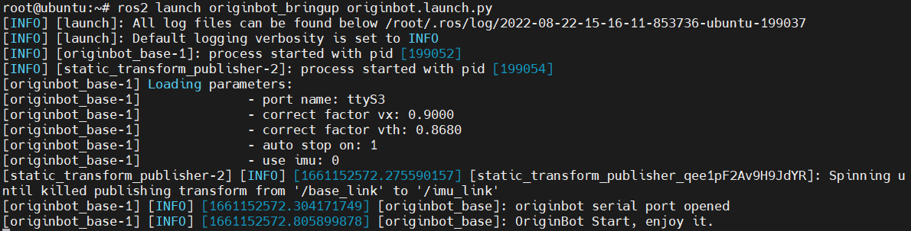
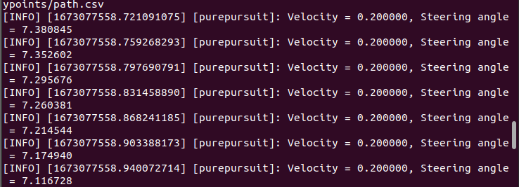
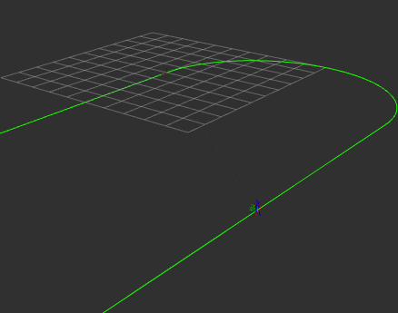
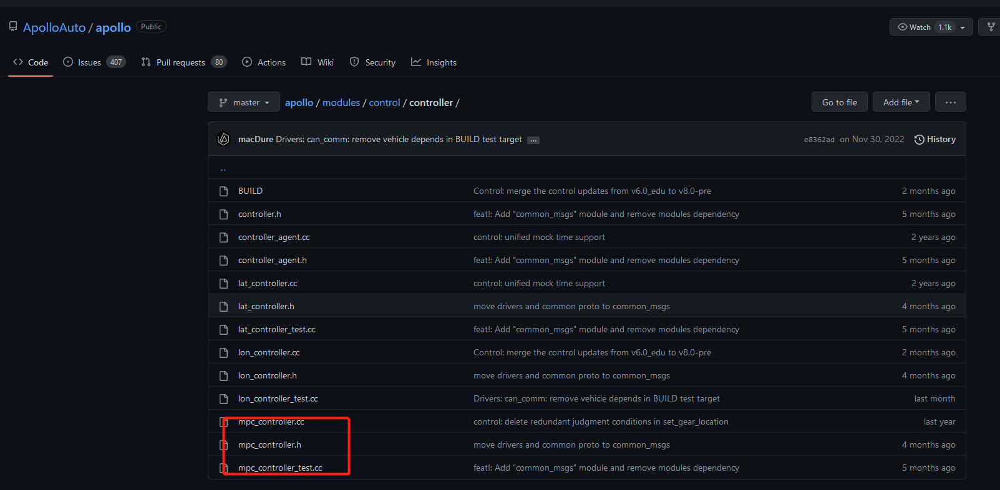

# **轨迹跟踪**

???+ hint
    操作环境及软硬件配置如下：
    

     - OriginBot机器人（标准版）
     - PC：Ubuntu (≥22.04) + ROS2 (≥humble)

本例旨以 OriginBot 轨迹跟踪为例模拟自动驾驶控制模块，其中功能开发参考 百度Apollo ，同时为了大家在移植上更为方便，仅使用单车模型的横向运动，这样便可以使得不同的运动学模型所受影响更小。

代码目录如下：


##  **运行案例**

### **启动底盘和雷达**

SSH连接OriginBot成功后，在终端中输入如下指令，启动机器人底盘和激光雷达：

```
ros2 launch originbot_bringup originbot.launch.py
```



### **启动轨迹跟踪**

选择Pure Pursuit：

```
ros2 run originbot_autonomous purepursuit_node
```



选择 MPC ：

```
ros2 launch originbot_autonomous originbot_mpc.launch.py
```


同时，打开rviz后，点击界面中topic，选择Path，即可在界面中看到，有如下轨迹显示



## **原理浅析**

PurePuesuit 和 MPC 算法是自动驾驶中常用的控制算法，目的是为了让规划处的轨迹点更加平滑以及满足车辆本身的运动学轨迹。在Autoware和Apollo 中，这两种算法都是有其实现方式的。可参见：

Apollo：



Autoware：


### **概述**

在具体聊到两种算法实现前，需要先了解到，现在主流的两种轨迹跟踪算法分为基于几何的跟踪以及基于模型的跟踪方法。

在此次实现上基本可以视为已知坐标信息，包括(x,y,yaw)和曲率Kappa,计算出控制量转向角，也即横向运动量，使得小车可以在轨迹内平稳运行。

以MPC为例，图示如下：


### **PurePursuit**

纯跟踪算法提出“预瞄距离”的概念，根据预瞄距离寻找目标轨迹中符合条件的目标路径点，判断逻辑就是寻找目标轨迹上哪个点和当前车辆位置的相对距离等于预瞄距离，则该点就是当前时刻的目标点。控制目标则是计算多大的前轮偏角，可以使当前小车位置运动到目标位置。在这个基础上，不妨简单看一下其中的核心点，预瞄距离是什么。

简单来说，预瞄距离好比人开车时后找一个跟踪参考点，比如在行驶在直道时，我们会选择较高的速度，并且习惯考虑前方较远的点作为跟踪参考点；在行驶在弯道时，就会选择减速，习惯选择较近的点作为跟踪参考点。所以这个值是我们可以自己设置的一个值。这个值的设置也会极大影响小车的运动。比如在此次示例的代码中在findCloestindex函数内，我们根据预瞄距离找到了一个最近的点

```c++
//公式 : ld=l+kvld=l+kv (过于依赖前视距离的选取，可以采用动态前视距离ld=l+kvld=l+kv其中l、kl、k为系数，根据速度调整前视距离)
double ld = kv*linear_x+ld0;
double ld_now = 0;
while(ld_now<ld && index<=(int)xr.size()) {
    double dx_ref = xr[index+1] - xr[index];
    double dy_ref = yr[index+1] - yr[index];
    ld_now += sqrt(pow(dx_ref,2)+pow(dy_ref,2));
    index++;
}
```

获取到这个点之后，在根据小车本身的模型限制计算出转角：

```c++
double PurePursuit::calSteeringAngle(double alpha,double ld) 
{
	double steer = atan2(2*track*sin(alpha),ld);
	if (steer > M_PI) {
        steer -= M_PI*2;
        } else if (steer < (-M_PI)) {
        steer += M_PI*2;
        }
    return steer;
}
```

### **MPC**

MPC的求解相对来说更为复杂。直接亮出代码框架：

1、获取车体参数。

2、选取状态量和控制量。

3、对AB矩阵做离散化，Apollo中增加了扰动矩阵。

4、设定QR矩阵。

5、设定预测步数，并对ABQR做增广。

6、设定相关参数的约束并获取各传感器的值。

7、求解控制量u，最后拿到u[0].

更为具体的逻辑可以参考[此链接](https://blog.csdn.net/u013914471/article/details/83824490){:target="_blank"}


[](https://www.guyuehome.com/){:target="_blank"}

