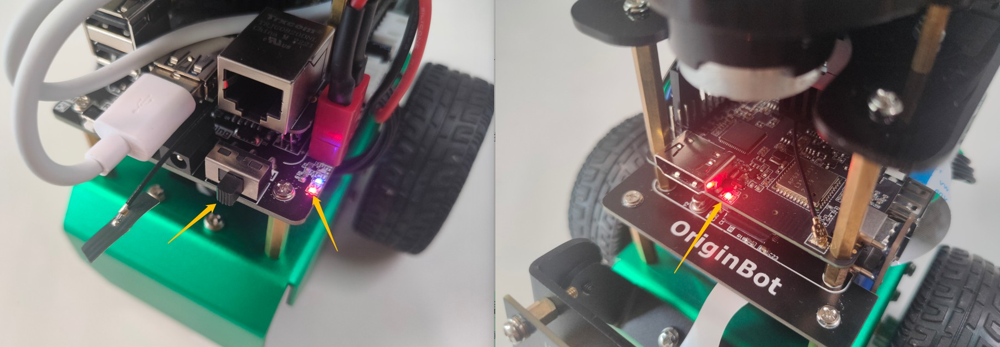
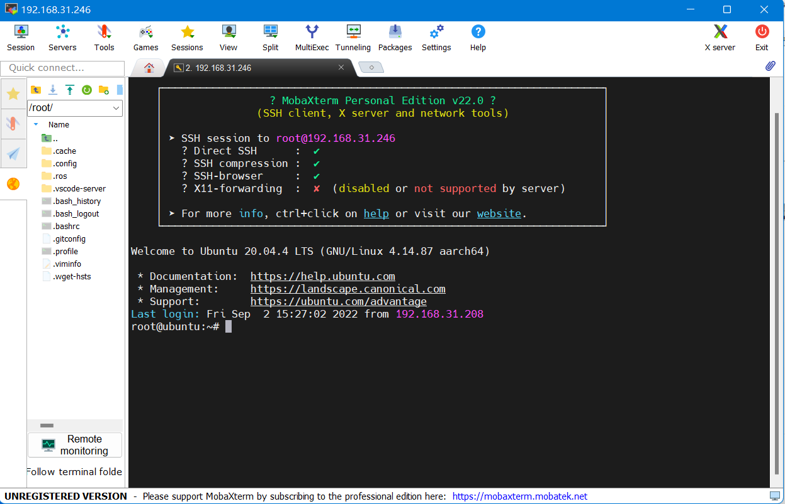
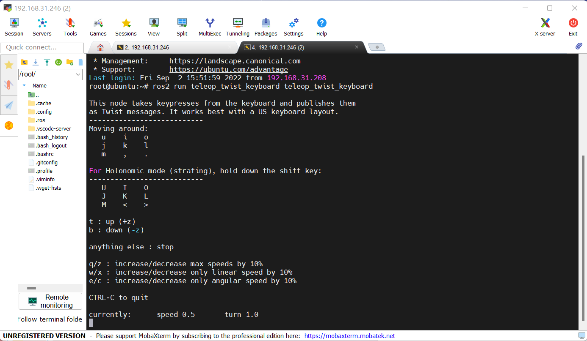
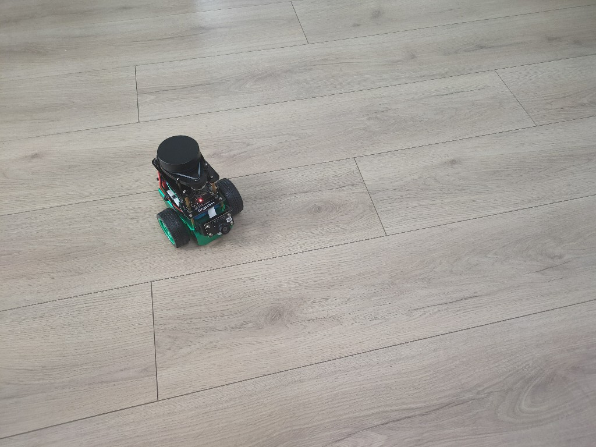

# **快速上手**

完成套件组装和系统烧写后，接下来就可以准备启动OriginBot了。

<iframe
  src="//player.bilibili.com/player.html?aid=516658213&bvid=BV1eg411a7A9&cid=866084308&page=8&autoplay=0"
  scrolling="no"
  border="0"
  width="800px"
  height="460px"
  frameborder="no"
  framespacing="0"
  allowfullscreen="true"
>
</iframe>


## **上电启动**

（1）打开电源总开关，扩展板电源灯点亮、RDK X3/RDK X5电源指示灯点亮

{.img-fluid tag=1}

（2）雷达开始旋转（如有连接）

（3）稍等5~10s，启动成功

## **远程连接**

（1）启动SSH软件，远程登录OriginBot

???+ info
    如果在PC端的Ubuntu环境中，也可以在终端中使用以下命令实现ssh远程登录（注意将IP地址修改为实际地址；如果使用虚拟机，要将网络设置为**桥接模式**）：
    ssh root@192.168.31.246

  

{.img-fluid tag=1}


（2）输入用户名和密码：root（用户名），root（密码）

（3）远程登录成功

{.img-fluid tag=1}


## **示例运行**

我们先来运行机器人遥控的示例，熟悉机器人的基本操作。


SSH连接成功后，输入以下指令，启动机器人底盘驱动：

```bash
ros2 launch originbot_bringup originbot.launch.py
```

???+ hint
    启动成功后，可以听到机器人控制器的蜂鸣器短鸣0.5秒。

{.img-fluid tag=1}


再启动一个SSH远程连接的终端，运行如下指令，启动键盘控制节点：

```bash
ros2 run teleop_twist_keyboard teleop_twist_keyboard
```

{.img-fluid tag=1}


根据终端中的提示，即可控制机器人前后左右运动了，也可以参考提示，动态调整机器人的运动速度。

{.img-fluid tag=1}

???+ hint
    如果机器人启动自动停车功能，松开按键后0.5秒，机器人会自动停车；如果关闭自动停车功能（默认），松开按键后，机器人不会自动停止，必须要点击“k”才能控制停车。


## **断电关机**

如果需要关闭机器人，可以在终端中输入如下指令，关闭软件系统：

```bash
halt
```


稍等5秒左右，就可以关闭机器人控制器上的电源开关，机器人关机完成。


???+ Attention
    直接关闭电源开关也可以断电关机，但有可能损坏软件系统正在读写的文件，导致系统出现意外问题。


至此，我们已经初步上手OriginBot啦，可以参考“**基础使用**”和“**应用功能**”继续深入开发。


[](https://www.guyuehome.com/){:target="_blank"}

