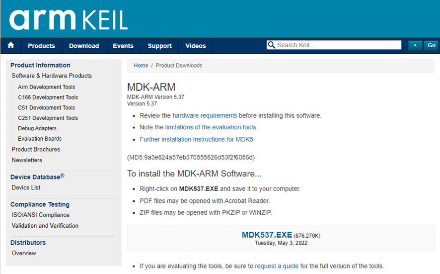
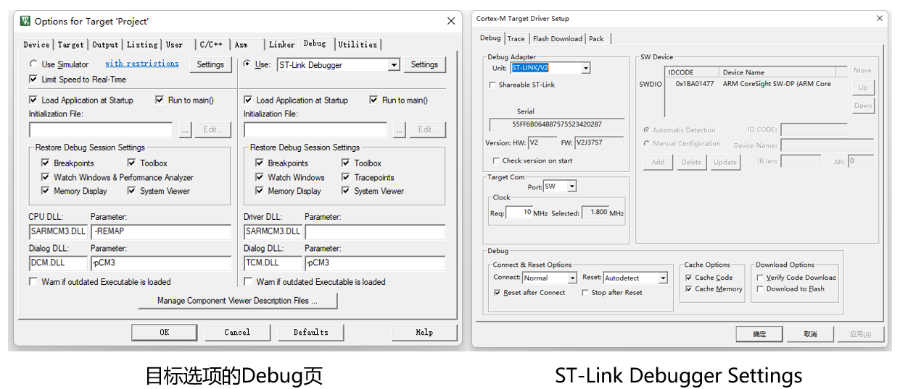
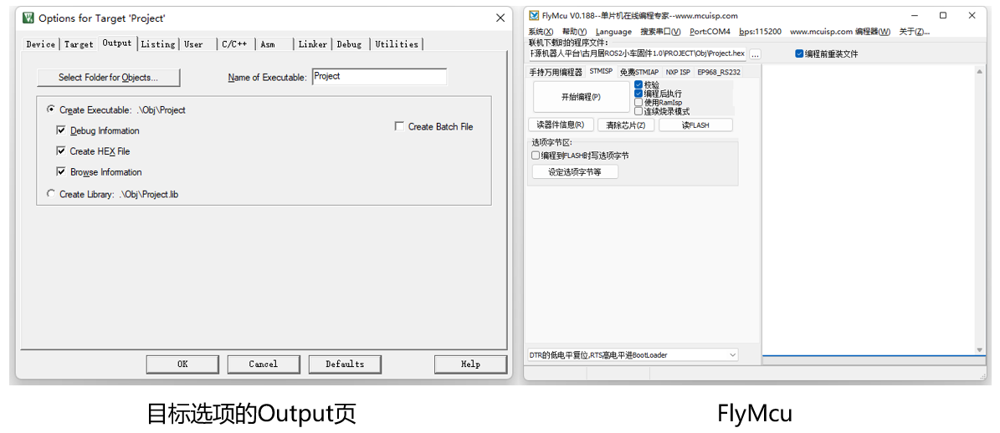

# **控制器固件安装**

OriginBot的控制器出厂未烧写固件，大家可以通过以下两种方式中的一种进行固件安装。

1. [**直接烧写官方预编译好的固件**](#download_controller_firmware)【推荐】
2. [**通过源码调试下载固件**](#debug_controller_code)


## **<span id="download_controller_firmware">烧写控制器固件</span >**

<iframe
  src="//player.bilibili.com/player.html?aid=516658213&bvid=BV1eg411a7A9&cid=865911983&page=7"
  scrolling="no"
  border="0"
  width="800px"
  height="460px"
  frameborder="no"
  framespacing="0"
  allowfullscreen="true"
>
</iframe>

### **下载官方固件**

请从以下表格中，选择下载适合自己机器人的控制器固件。


#### 最新版本

| 项目                | 版本   | 发布日期  | 下载链接                                                     | 说明                                  |
| ------------------- | ------ | --------- | ------------------------------------------------------------ | ------------------------------------- |
| OriginBot控制器固件 | v1.0.6 | 2024.9.23 | [originbot_controller_firmware_v1.0.6](https://pan.baidu.com/s/1qMlekq84JQBM8OZC3pm0rA?pwd=gyh1){:target="_blank"} | OriginBot控制器固件，可以直接烧写使用 |

> 如需要下载以往版本的镜像，[可点击此处跳转下载](../material/open_source_link.md#sd){:target="_blank"}

### **连接烧写数据线**

（1）断开控制器与RDK X3之间的串口通信连接


（2）固件烧录时由稍后连接的TypeC线供电，为确保烧写正常，请勿打开机器人的总电源开关

（3）使用typeC线连接扩展板的“Burning”口和电脑（可使用雷达自带的TypeC线）


???+ hint
    Burning口会通过USB给控制器供电，如果控制器中已有固件，其中加入了电池保护，电压低于9.4V时蜂鸣器会常响报警，所以若此时蜂鸣器一直响，可以忽略。


### **下载官方固件**

（1）电脑端启动flymcu软件（[点击此处下载](../material/common_software.md){:target="_blank"}）；

（2）点击Port，选择烧写固件的串口（选择带“CH340”编号的串口）；

（3）在flymcu软件中，选择准备烧写的固件文件，按照下图进行配置后，点击“开始编程”；
{.img-fluid tag=1 title="下载官方固件"}

（4）等待右侧日志提示编程完成，固件下载/更新结束；

（5）下载结束之后，恢复控制器与RDK X3之间的串口通信连接。


## **<span id="debug_controller_code">源码调试下载</span >**

OriginBot控制器固件的源代码完全开源，大家也可以从[originbot_controller](https://gitee.com/guyuehome/originbot_controller){:target="_blank"}下载，之后配置开发环境，即可在线调试或者二次开发。

### **安装Keil软件**

访问Keil软件的[下载网页](https://www.keil.com/demo/eval/arm.htm){:target="_blank"}，点击下载软件：

{.img-fluid tag=2 title="下载Keil软件"}


下载完成后，可参考以下步骤完成软件的安装：

{.img-fluid tag=2 title="安装Keil软件"}

### **下载固件源码**

使用如下命令，下载OriginBot控制器固件的源代码：

```bash
git clone https://gitee.com/guyuehome/originbot_controller
```


### **打开工程并安装依赖库**

启动Keil软件后，选择打开工程，选择上一步下载源码中的工程文件，然后继续安装必要的软件包：

{.img-fluid tag=2 title="安装依赖库"}


### **编译器配置**

OriginBot 控制器固件需要使用Keil V5编译器进行编译，部分使用者直接下载的Keil可能需要另外下载v5版本编译器，此处给出参考链接供使用者参考：
[Stm32配置keil5编译版本](https://j7h4nezmu0.feishu.cn/docx/UsbUdQdShoxhpLxFPTvceJsmnQb?from=from_copylink){:target="_blank"}


### **调试下载**

如果使用调试器在线调试，需要进行如下配置：

{.img-fluid tag=2 title="配置调试选项"}


如果希望编译生成HEX二进制文件，并通过USB下载，需要进行如下配置，配置后再编译就可以出现HEX文件，并可通过FlyMCU软件下载：

{.img-fluid tag=2 title="配置输出选项"}

[](https://www.guyuehome.com/){:target="_blank"}

