# **套件组装**

{.img-fluid tag=0 title="OriginBot结构爆炸图"}

???+ attention
    安装步骤预计需要30~60分钟，安装过程中请注意：
    

     1. 固定螺丝时，请勿大力拧紧螺丝，避免滑丝；
     2. 固定板卡时，请在四个铜柱或螺丝都固定之后，再分别拧紧；

<iframe
  src="//player.bilibili.com/player.html?aid=736883095&bvid=BV1dD4y1P7Xp&cid=1018090380&page=1&autoplay=0"
  scrolling="no"
  border="0"
  width="800px"
  height="460px"
  frameborder="no"
  framespacing="0"
  allowfullscreen="true"
>
</iframe>

## **取出机器人底盘**

所有物料：
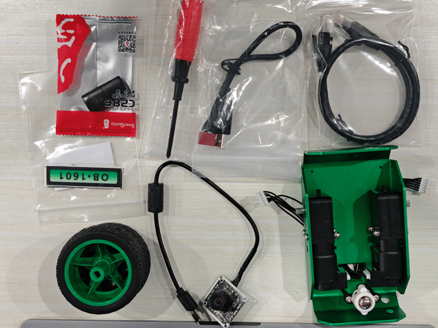{.img-fluid tag=2}
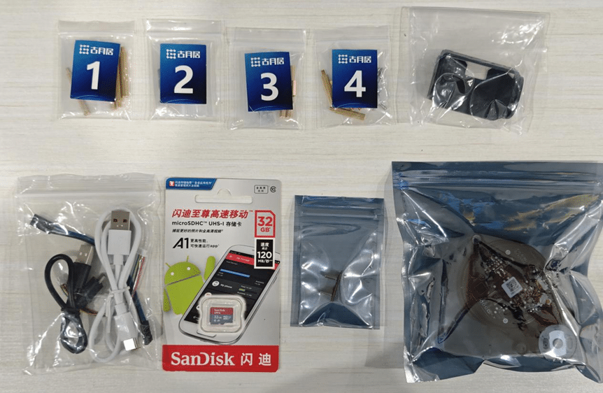{.img-fluid tag=2}

机器人底盘已经安装好万向轮和电机。

{.img-fluid tag=2}

### 安装控制器支撑铜柱

所需物料：

{.img-fluid tag=2}

底盘的固定孔上自带螺纹，将四个铜柱直接拧紧即可：

{.img-fluid tag=2}

### 安装动力电池

所需物料：

{.img-fluid tag=2}

（1）安装魔术贴纸

撕掉魔术贴的双面胶，分别粘贴在底盘和电池上：

{.img-fluid tag=2}

（2）安装电池

通过魔术贴将电池固定在底盘上，电池应尽量靠近左侧，保证重心在电机中轴上：

{.img-fluid tag=2}

## **安装控制器板卡**

### 安装控制器上层支撑铜柱

所需物料：

{.img-fluid tag=2}

将铜柱放置于控制器的正面孔位，从反面使用螺丝拧紧：

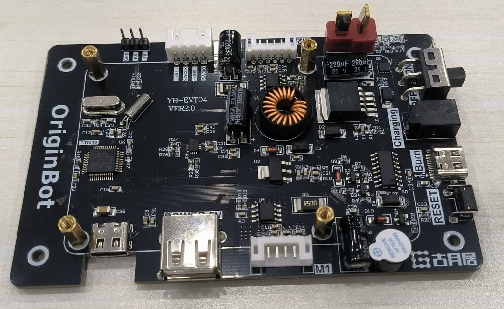{.img-fluid tag=2}

### 安装控制器板卡

所需物料：

{.img-fluid tag=2}

使用螺丝将控制器固定在底盘的4个支撑铜柱上，并将之前穿出的电机线分别连接到控制器的对应端口：

{.img-fluid tag=2}

???+ hint

    1.  注意电机接口序号，左侧电机连接控制左侧接口，右侧电机连接控制右侧接口；
    1.  插入白色端口时，建议用另外一只手按住控制器端的接口，避免用力过大翘起；
    1.  此时请勿连接电池电源线，避免后续误操作；

## **安装处理器板卡**

### 安装处理器板卡

所需物料：

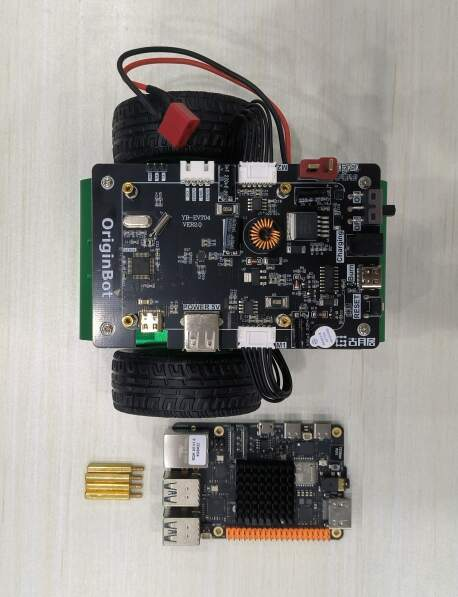{.img-fluid tag=2}

如果不需要安装激光雷达，可以直接通过螺丝将RDK X5安装到控制器上的支撑铜柱上,还可以贴上散热片：

{.img-fluid tag=2}

## **安装相机**

### 安装相机模块

所需物料：

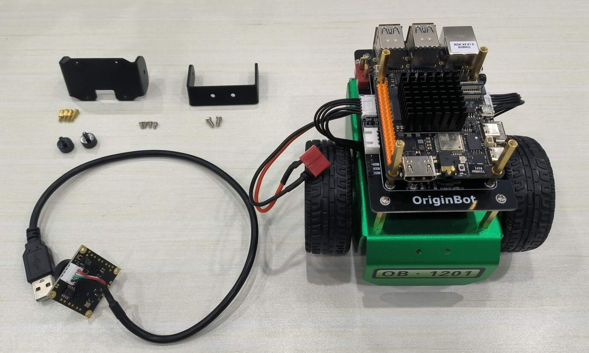{.img-fluid tag=2}

（1）安装相机固定架（一）

相机固定架上自带螺纹，将2个螺丝直接拧紧：

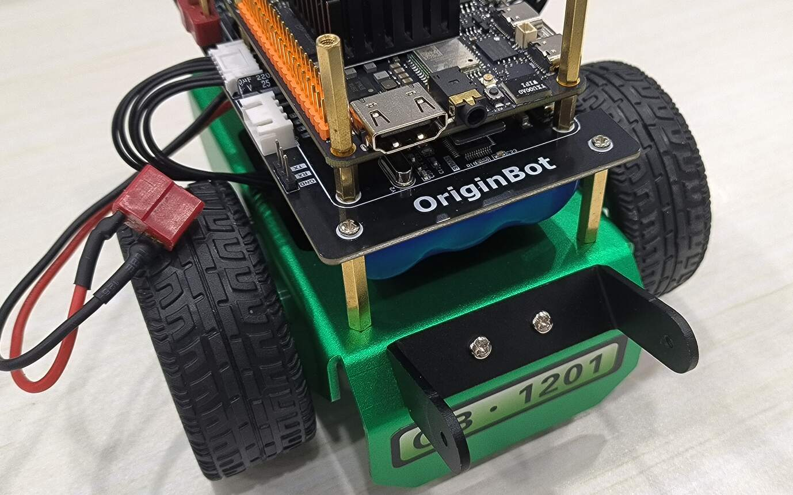{.img-fluid tag=2}

（2）安装相机固定架（二）

使用两个螺丝，将相机模块安装在固定架上：

{.img-fluid tag=2}

（3）安装相机

连接四个黄色铜柱，然后将相机连接上支架：
{.img-fluid tag=2}

{.img-fluid tag=2}

（4）连接相机数据线

将相机的USB线从底盘控制器与电池之间穿过，连接到RDK X3/RDK X5的接口上：

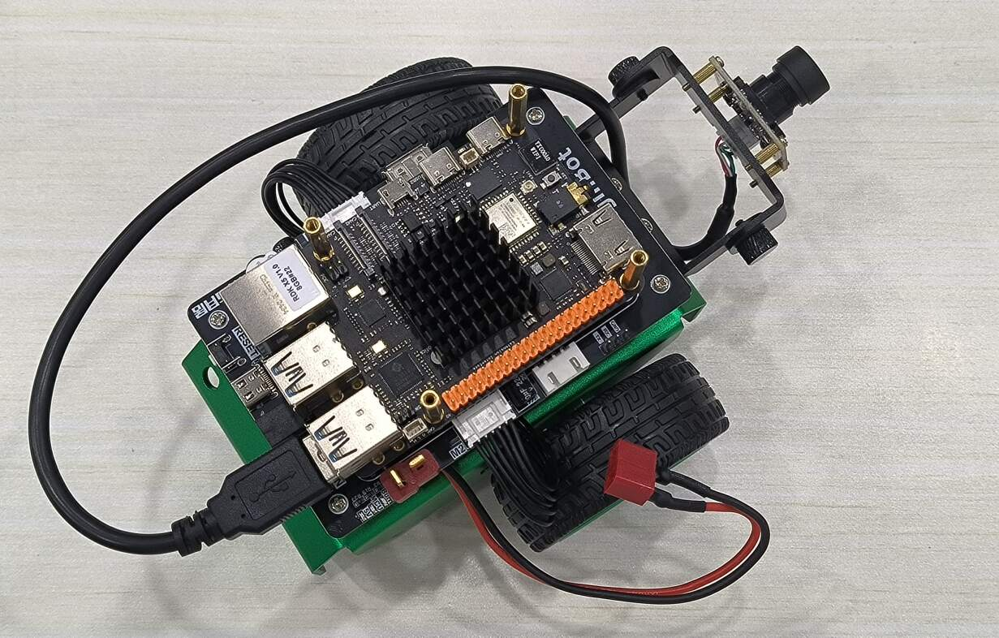{.img-fluid tag=2}

## **安装激光雷达**

所需物料：

{.img-fluid tag=2}

(1) 将三个铜柱穿过到雷达驱动板对应的孔位，另外一侧通过三个螺丝固定，拧紧铜柱，并将雷达串口线连接：

{.img-fluid tag=2}

(2) 使用四个螺丝将雷达驱动板固定到小车的支撑铜柱上：

{.img-fluid tag=2}

(3) 将串口线另一端连接至雷达：

{.img-fluid tag=2}

(4) 安装雷达，使用三个螺丝将雷达固定到雷达驱动板的支撑铜柱上：

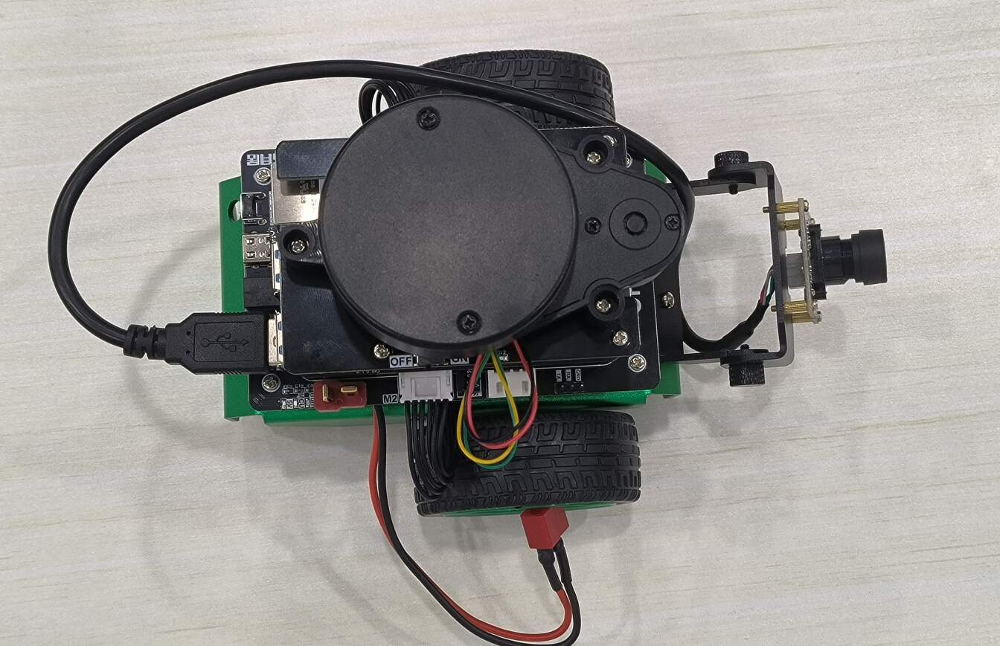{.img-fluid tag=2}

## **连接线缆**

所需物料：

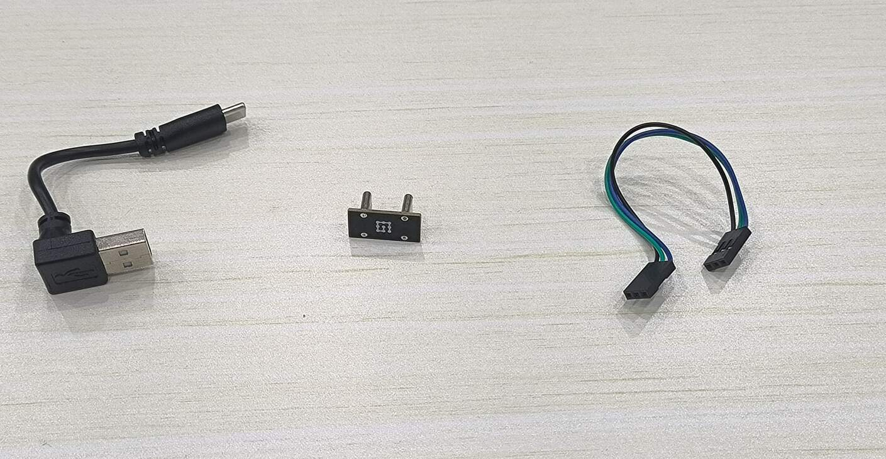{.img-fluid tag=2}

（1）连接供电模块

RDK X3/RDK X5由控制器通过TypeC口进行供电，使用TypeC供电模块连接控制器的电源输出和主板的电源输入：

???+ hint
    插拔TypeC供电模块时，请小心用力，避免损坏贴片引脚。

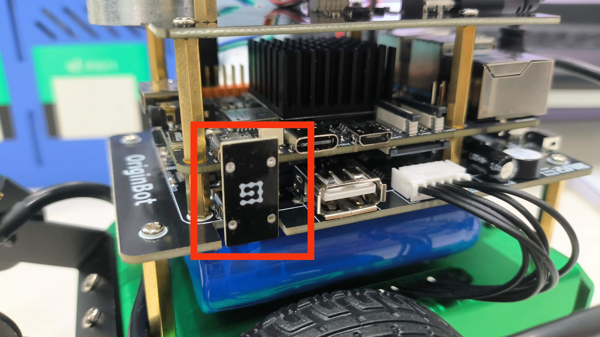{.img-fluid tag=2}

（2）连接串口通信线

使用串口通信线连接控制器和RDK X3 / RDK X5的通信接口：

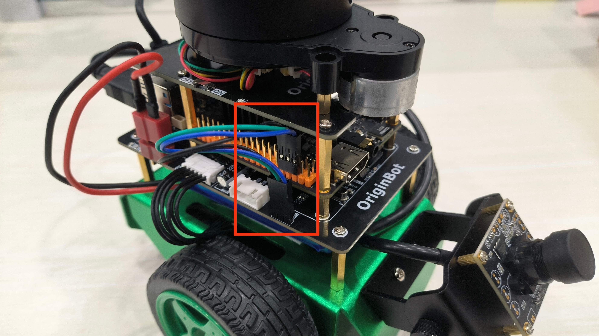{.img-fluid tag=2}

???+ hint
    请注意接线顺序，TX-RX，RX-TX，GND-GND；

（3）连接雷达通信线

雷达原装的TypeC数据线较长，可以使用套件中的短线，一侧连接RDK X3/RDK X5的USB口，另外一侧连接雷达串口模块的TypeC口：

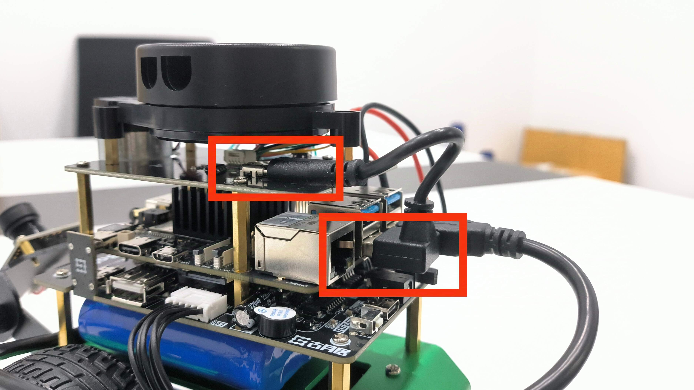{.img-fluid tag=2}

（4）连接总电源线

检查机器人各部分已经按照操作步骤正确安装，且控制的开关处于“OFF”状态，连接电池的总电源线至控制器：

{.img-fluid tag=2}

???+ hint
    电源插口较紧，且距离RDK 较近，请谨慎安装插入。将T形插头的两个平面部分贴近插座会相对好插一些。

## **安装车牌（可选）**

### **粘贴车牌**

根据需要，将套件中附带的唯一编号贴纸粘贴到底盘的前后两侧。

{.img-fluid tag=2}

至此，OriginBot安装完成。

{.img-fluid tag=2}

{:target="_blank"}