# **系统镜像安装与备份**

OriginBot出厂未安装系统，大家可以通过以下方式进行安装：

- [**烧写OriginBot SD卡镜像**](#download_sd_image)


如果在使用过程中，想要备份当前状态下的系统镜像，可以参考如下说明自行备份，备份之后的镜像，依然可以适用以上烧写方法。

- [**备份OriginBot SD卡镜像**](#backup_sd_image)


------


## **<span id="download_sd_image">烧写OriginBot SD卡镜像</span >**


### **下载OriginBot SD卡镜像**

请从以下表格中，下载机器人的SD卡镜像，并将下载好的**文件解压缩**。

| 版本   | 适应型号    |    下载链接                                                     | 包含软件版本                     |
| ------ | ---------- | ------------------------------------------------------------ | -------------------------------- |
| v3.0.1 | OriginBot Pro | [originbot_sd_image_v3.0.1](https://pan.baidu.com/s/149A_6VqJ7zHVimKIWDGKXQ?pwd=gyh1 ){:target="_blank"} | ros：humble<br />TogetheROS：2.3.2|
| v2.2.0 | OriginBot 标准版 / OriginBot Lite | [originbot_sd_image_v2.2.0](https://pan.baidu.com/s/149A_6VqJ7zHVimKIWDGKXQ?pwd=gyh1 ){:target="_blank"} | ros：foxy<br />TogetheROS：2.1.2 |

> 如需要下载以往版本的镜像，[可点击此处跳转下载](../material/open_source_link.md#sd){:target="_blank"}


### **烧写SD卡镜像**

<iframe
  src="//player.bilibili.com/player.html?aid=516658213&bvid=BV1eg411a7A9&cid=865880997&page=2&autoplay=0"
  scrolling="no"
  border="0"
  width="800px"
  height="460px"
  frameborder="no"
  framespacing="0"
  allowfullscreen="true"
>
</iframe>


（1）使用读卡器将SD卡插入计算机，SD卡容量建议≥16GB；

（2）启动镜像烧写软件（可参考[常用软件](../material/common_software.md){:target="_blank"}下载）；

（3）确认SD卡设备号，选择要烧写的系统镜像；


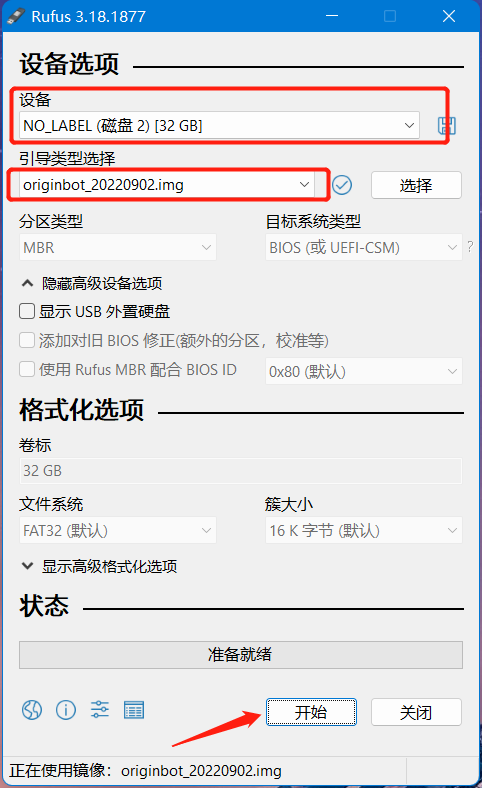

（4）点击“开始”后，继续点击“确认”，开始烧写镜像；


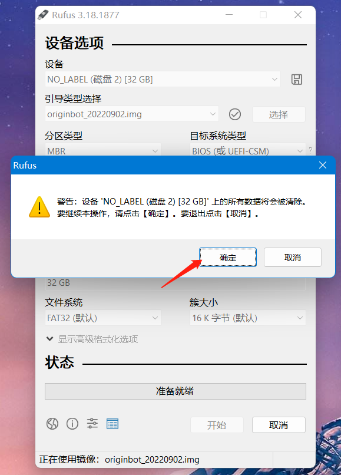

（5）进度条会显示当前的烧写进度，烧写完成后，即可退出软件。


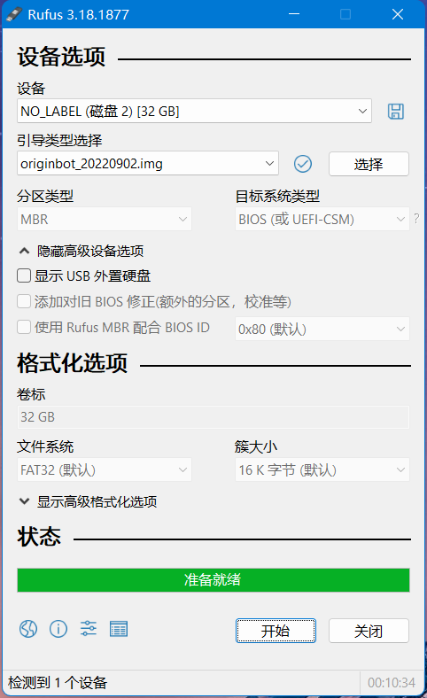

### **启动 OriginBot**

（1）确认机器人套件已经正确安装，并成功安装对应版本系统，然后插入SD卡启动电源；

（2）使用套件中的网线连接机器人端RDK X3/RDK X5的网口；

???+ Attention
    RDK X3有线网络默认采用静态IP配置，初始IP地址为192.168.1.10.

    RDK X5有线网络默认采用静态IP配置，初始IP地址为192.168.127.10.

（3）将网线的另一端连接到PC端的网口，首先配置自己的电脑属性，以RDK X3为例：

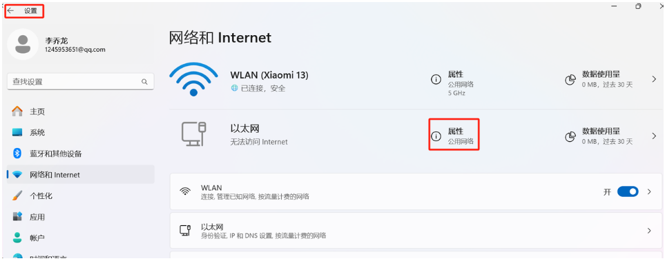{.img-fluid tag=1}
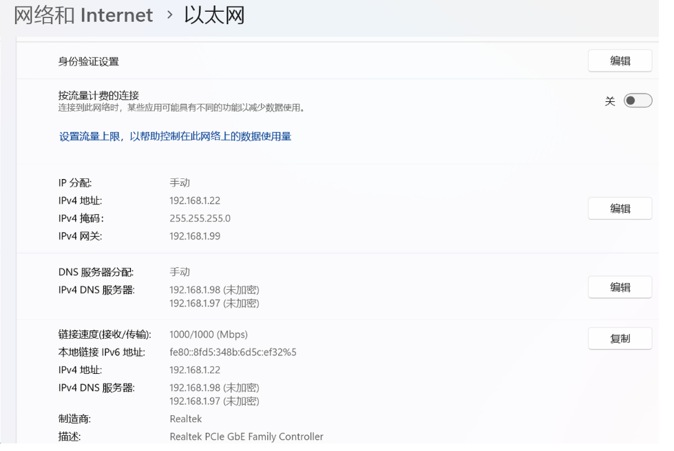{.img-fluid tag=1}

启动MoboXterm软件，点击左上角Session，然后点击SSH连接：

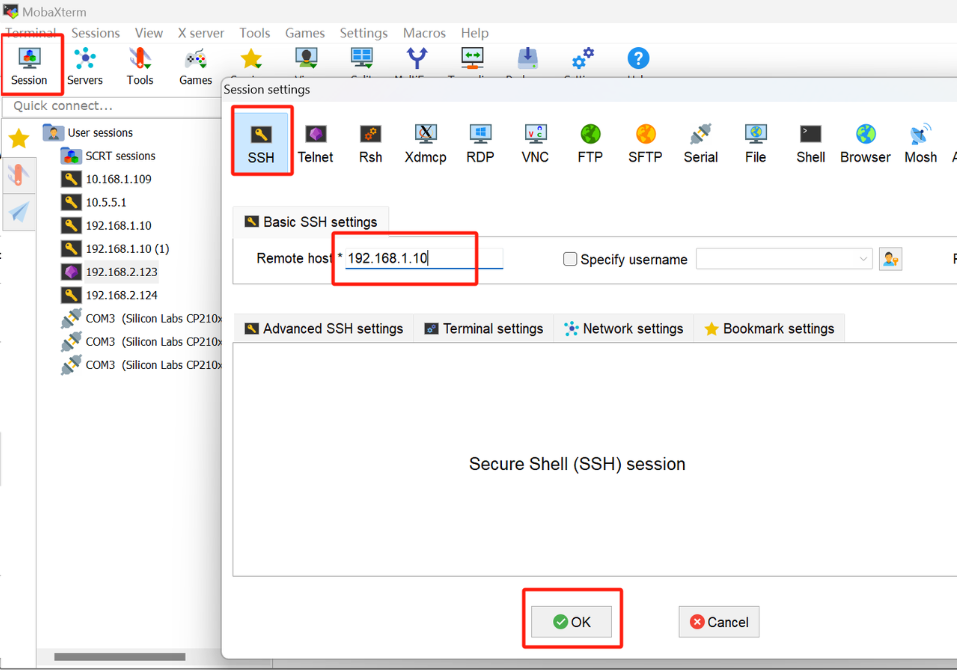{.img-fluid tag=1}


（4）在MoboXterm软件中可以看到出现登录提示,输入用户名及密码，用户名和密码均为root：

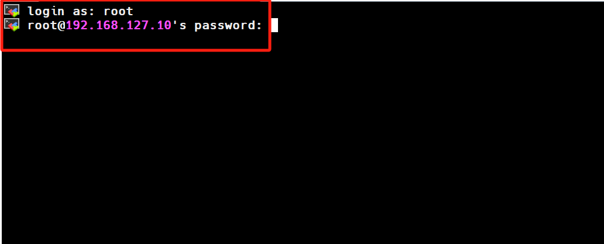{.img-fluid tag=1}

（5）至此成功进入机器人的系统：

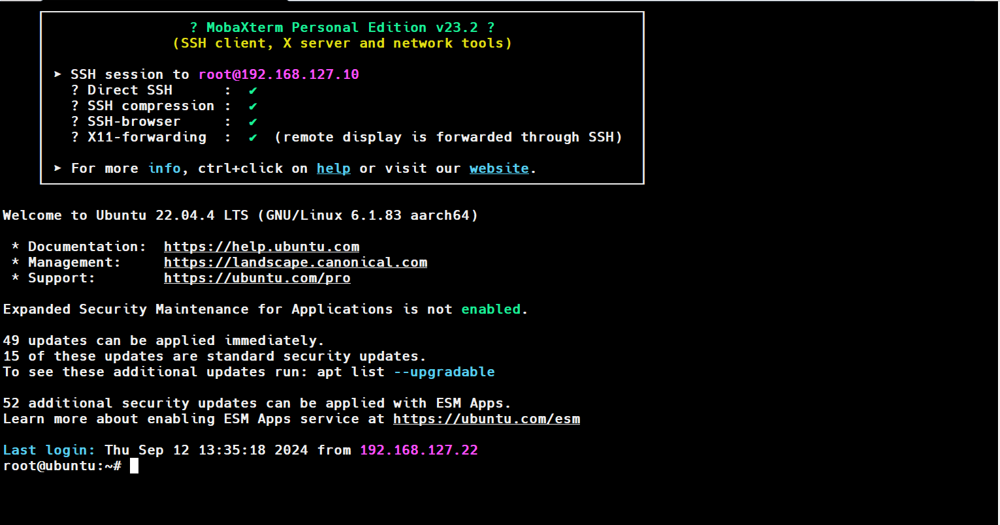{.img-fluid tag=1}


### **扩展SD卡空间**

<iframe
  src="//player.bilibili.com/player.html?aid=516658213&bvid=BV1eg411a7A9&cid=865882863&page=4&autoplay=0"
  scrolling="no"
  border="0"
  width="800px"
  height="460px"
  frameborder="no"
  framespacing="0"
  allowfullscreen="true"
>
</iframe>


为了减少系统镜像大小，便于下载和烧写，系统镜像中的空闲空间已经被压缩，如果需要使用SD卡的完整空间，还需要手动扩展。

启动 OriginBot 并通过无线连接登录后，使用如下指令即可扩展：

```bash
#如使用V1.x版本，使用以下命令
sudo growpart /dev/mmcblk2 1
sudo resize2fs /dev/mmcblk2p1

#如使用V2.x版本，使用以下命令
sudo growpart /dev/mmcblk2 2
sudo resize2fs /dev/mmcblk2p2
```

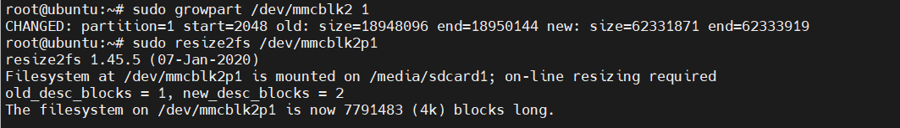{.img-fluid tag=1}


运行成功后，重启系统即可生效，使用如下命令确认系统空间扩展成功，这里使用的SD卡为32GB：

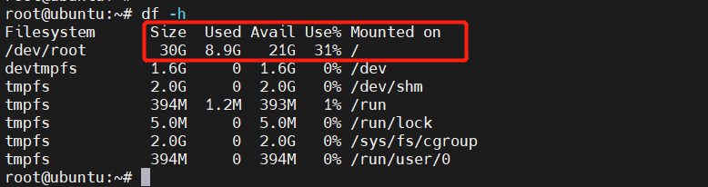{.img-fluid tag=1}


### **无线WIFI连接介绍**

<iframe
  src="//player.bilibili.com/player.html?aid=516658213&bvid=BV1eg411a7A9&cid=865881701&page=5&autoplay=0"
  scrolling="no"
  border="0"
  width="800px"
  height="460px"
  frameborder="no"
  framespacing="0"
  allowfullscreen="true"
>
</iframe>

完成Ubuntu安装后，启动系统，参考以下链接，完成无线网络的配置：

```bash
sudo nmcli device wifi rescan        # 扫描wifi网络
sudo nmcli device wifi list          # 列出找到的wifi网络
sudo wifi_connect "SSID" "PASSWD"    # 连接某指定的wifi网络
```

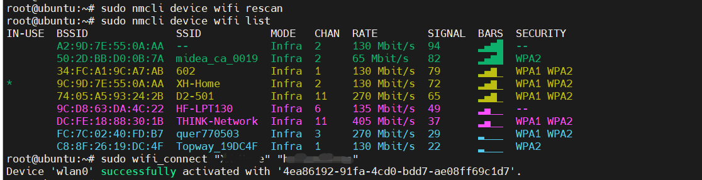{.img-fluid tag=1}

等到终端返回信息“successfully activated"，就说明WIFI连接成功。我们可以Ping一个网站，来检查一下连接。如果能够Ping通，就说明网络已经连接成功，现在就可以成功连接到互联网，便于后续的软件下载和更新了。

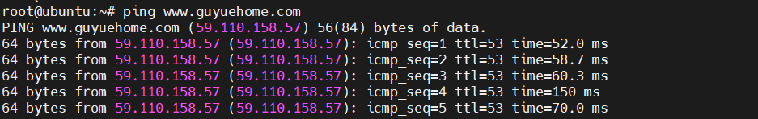{.img-fluid tag=1}

### **SSH远程登录**

<iframe
  src="//player.bilibili.com/player.html?aid=516658213&bvid=BV1eg411a7A9&cid=865881692&page=6&autoplay=0"
  scrolling="no"
  border="0"
  width="800px"
  height="460px"
  frameborder="no"
  framespacing="0"
  allowfullscreen="true"
>
</iframe>

网络配置完成后，就可以不受线缆的约束啦，大家可以通过无线网络远程登录机器人进行开发。

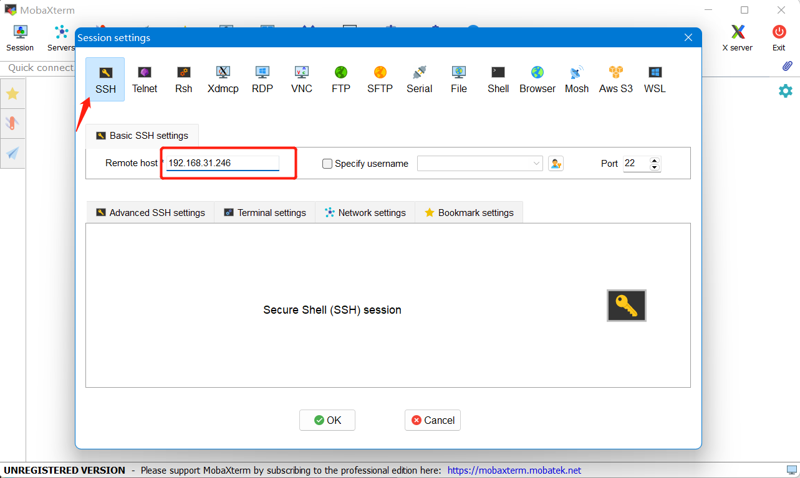{.img-fluid tag=1}

???+ info
    此处根据使用的是有线网络还是无线网络，填入对应的IP地址。IP地址可以使用ifconfig命令查询，eth0对应有线网卡，wlan0对应无线网卡。


输入用户名和密码：root/root，即可登陆成功：

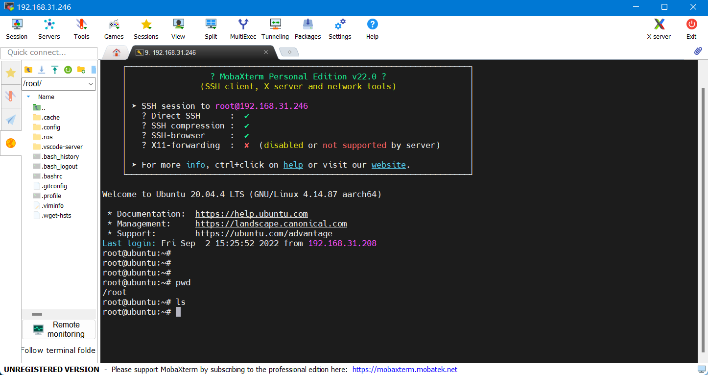{.img-fluid tag=1}


???+ info
    - 如果在PC端的Ubuntu环境中，也可以在终端中使用以下命令实现ssh远程登录（注意将IP地址修改为实际地址）：
        ssh root@192.168.31.246
    
    - 如果使用虚拟机，要将网络设置为**桥接模式**
    
    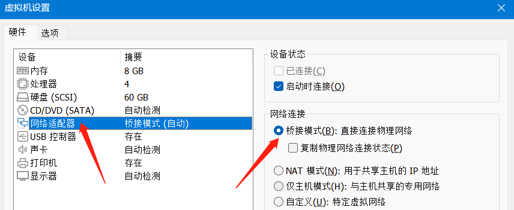


###  **串口连接**

除了最常用的有限和无线连接之外，串口连接也非常常见，大家可以使用串口观察机器人启动时的LOG以及调试程序，
RDK X3和RDK X5版本关于串口硬件连接存在一些小区别，首先介绍RDK X3版本，其串口连接如下所示：

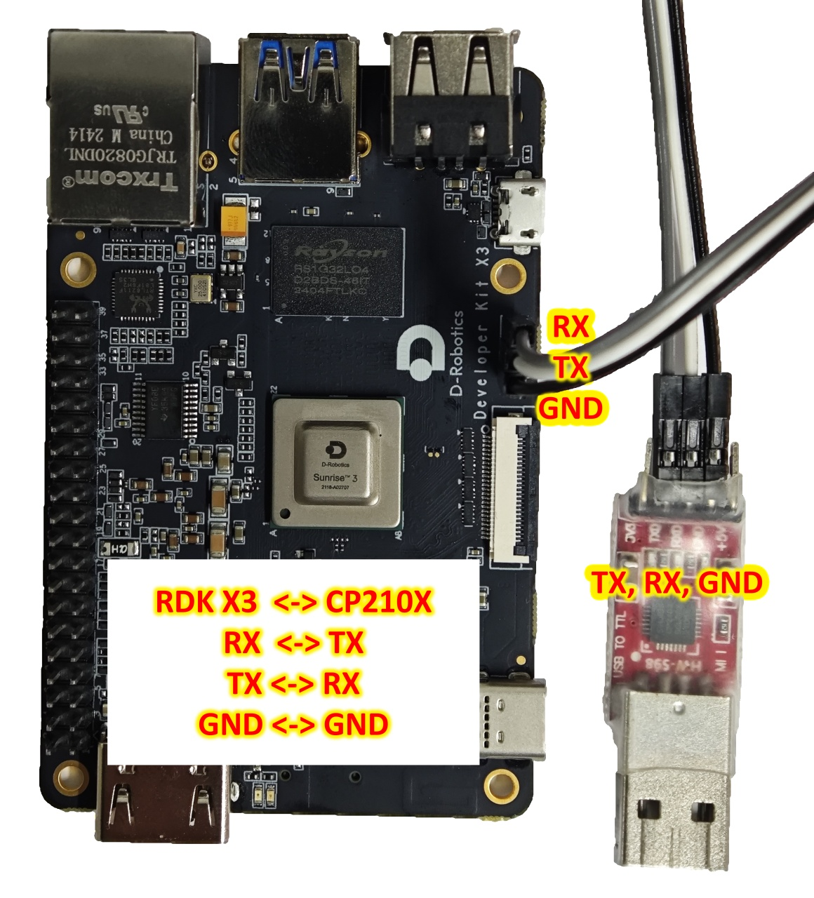{.img-fluid tag=1}

大家可以使用套件中的串口模块如上图进行RDK X3版本连接；

RDK X5则是使用MicroUSB的方式进行连接，如下图所示：
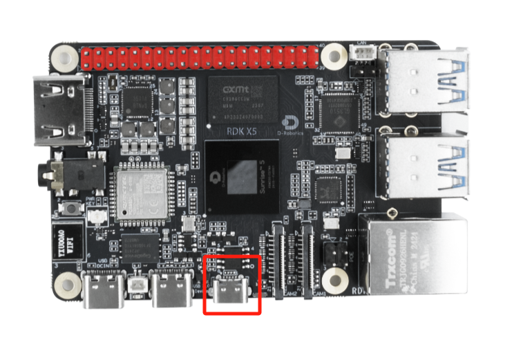{.img-fluid tag=1}

连接之后，大家可以启动MoboXterm软件进行连接，需要如下图所示进行设置：

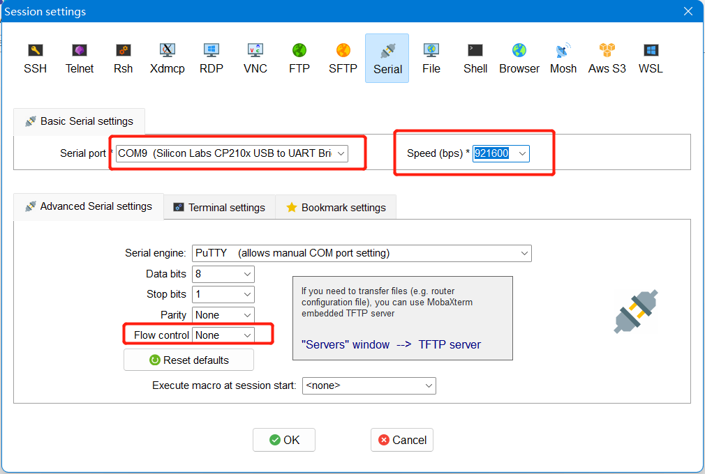{.img-fluid tag=1}

设置成功后点击OK，即可进入系统界面，如果已经开机则不会显示LOG信息，如果线连接再进行开机则会出现开机LOG信息，输入账号密码后即可进行操作界面：
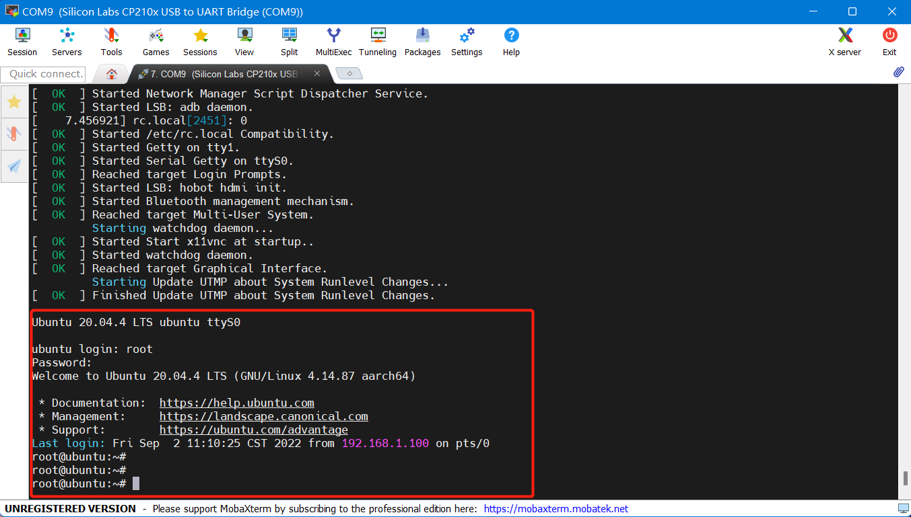{.img-fluid tag=1}


## **<span id="backup_sd_image">备份OriginBot SD卡镜像</span >**

以下备份过程在电脑端的Ubuntu系统中完成。


### **压缩磁盘空间**

为减少镜像大小，我们先使用gparted软件压缩SD卡的磁盘空间。将SD卡插入运行的电脑中，安装并启动gparted软件：

```bash
sudo apt-get install gparted
sudo gparted
```


在打开的gparted软件中，右上角选择SD卡：
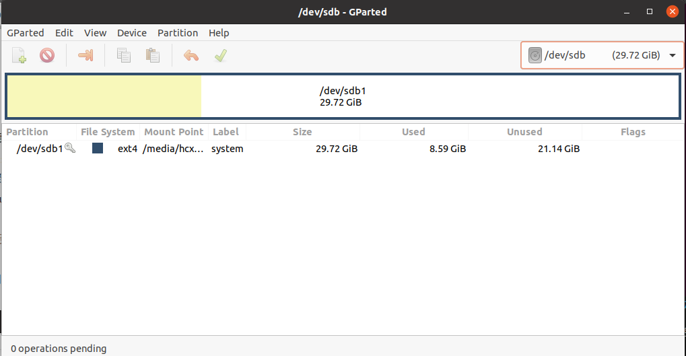{.img-fluid tag=1}


然后右键选择卸载SD卡的挂载：
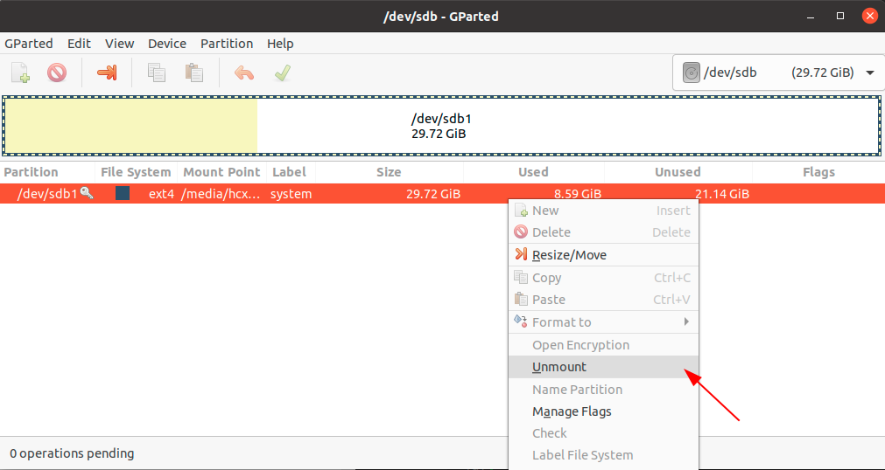{.img-fluid tag=1}


继续点击右键，选择“Resize/Moves”选项，重新设置SD卡的空间大小：
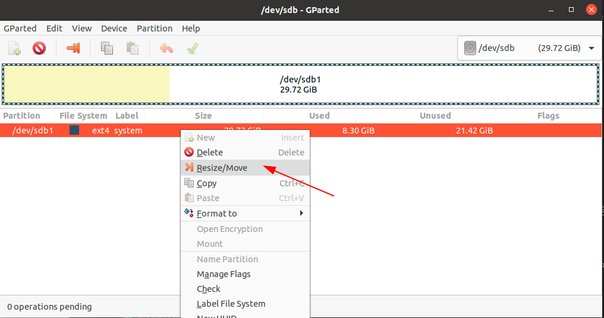{.img-fluid tag=1}


拖拽空间划分条右侧，压缩空间，其中黄色是占用的分区，白色是空闲的分区，注意保留一点白色空闲分区，避免镜像无法启动。
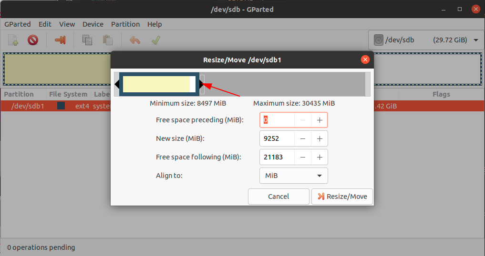{.img-fluid tag=1}


确认后点击软件中的执行按钮，开始进行压缩操作。
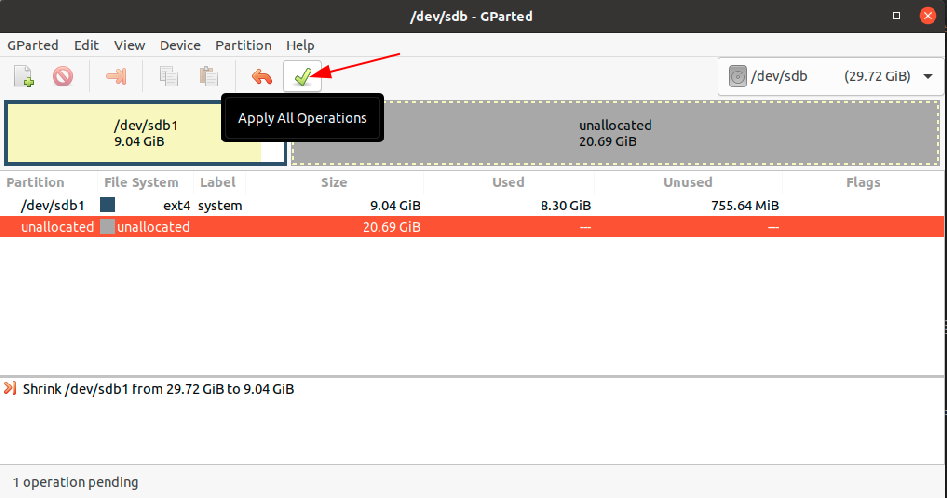{.img-fluid tag=1}


压缩完成后，即可关闭gparted软件。


### **查看磁盘信息**

打开终端，使用fdisk命令查看当前磁盘情况。

```bash
sudo fdisk -u -l
```
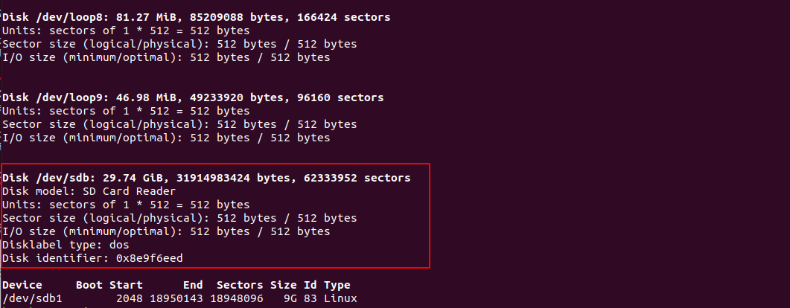{.img-fluid tag=1}


图中/dev/sdb就是SD卡的磁盘编号，继续使用如下命令查看SD卡分区信息：

```bash
sudo fdisk -u -l /dev/sdb
```
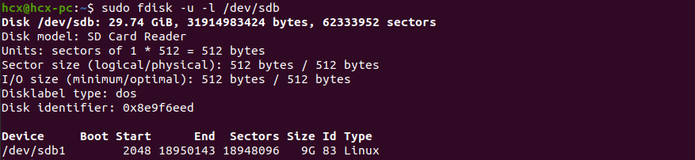{.img-fluid tag=1}


### **开始磁盘备份**

现在就可以使用dd命令，来备份SD卡到img文件中了。

```bash
sudo dd bs=512 count=[fdisk命令中最大的end数+1] if=/dev/sdb of=originbot_backup.img
```
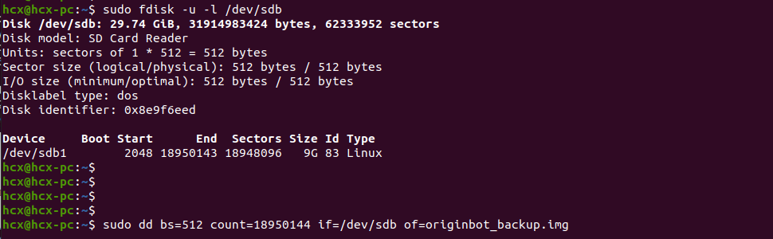{.img-fluid tag=1}


此时终端中并没有提示信息，但是备份已经开始，时间较长，请耐心等待。


完成备份后，终端指令会自动跳出，当前路径下得到img镜像备份文件。
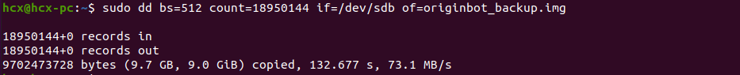{.img-fluid tag=1}


生成的img镜像文件较大，有需要的话，可以继续使用zip等工具进行压缩和解压缩使用。


至此，SD卡镜像备份完毕，需要使用时，参考[**烧写OriginBot SD卡镜像**](#download_sd_image)即可。


[](https://www.guyuehome.com/){:target="_blank"}