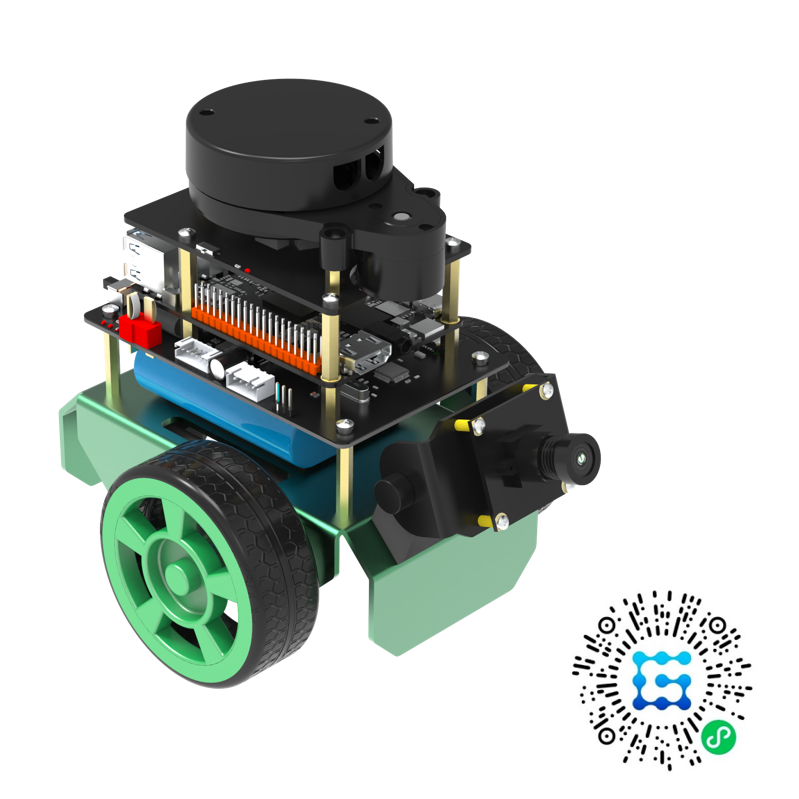

# **OriginBot智能机器人开源套件**

> **最新消息**：OriginBot V3.0.0版本正式发布，OriginBot全系升级，同时推出OriginBot Pro版，九大升级，[点击查看](./reference/changelog.md){:target="_blank"}

{.img-fluid tag=1}

    <a href="#originbot_1" class="md-button">了解OriginBot</a>
    <a href="/guide/quick_guide/" class="md-button md-button--primary">马上开始</a>

## **OriginBot**

OriginBot是一款智能机器人开源套件，更是一个社区共建的开源项目，旨在让每一位参与者享受机器人开发的乐趣。

### **开源共建**

“开源就是力量”——这是OriginBot的核心精神，欢迎每一位开发者参与其中。

**▶  开源生态**

所得超所见，所见即开源，从结构到电气，从驱动到应用，OriginBot小巧的身躯中，是一个庞大的开源世界，欢迎每一位开发者从这里汲取营养，更欢迎每一位开发者贡献力量。

**
持续迭代  ◀
**

怕什么真理无穷，进一寸有一寸的欢喜。依托强大的社区支持，OriginBot和它的开发者，都不止于每一步的前行，软硬件持续迭代，版本周期更新，让我们一起成长壮大。

### **全栈开发**

智能机器人开发之路漫漫修远，OriginBot将陪伴每一位开发者上下求索。

**▶  全技术栈**

OriginBot项目技术栈横跨结构、电气、嵌入式、ROS、人工智能等诸多领域，无论你想从事哪些方面的研究，都可以在这里找到归宿，快速了解机器人设计的完整路径，掌握技术开发的核心方法。

**
内容齐全  ◀
**

OriginBot套件就是一把钥匙，可以打开智能机器人学习的大门，硬件、软件、图文、视频、论坛一应俱全，都会从这里链接覆盖，多样化的软硬件内容助力每一位开发者的的成长。

### **智能应用**

OriginBot结构简约，应用却不简单，可以拓展无限可能。

**▶  算力强劲**

OriginBot原生搭载地瓜机器人开发板——RDK X3/RDK X5，高算力强劲支撑，CV加速、人体跟踪、手势识别、视觉巡线等案例丰富，享受AI乐趣，真正开发“智能”机器人。

**
应用丰富  ◀
**

OriginBot以ROS2及TogetheROS™.Bot（地瓜深入优化的ROS开源机器人操作系统）作为机器人软件系统，兼容ROS生态中的众多应用功能，即装即用；原装应用丰富，快速开始SLAM、定位导航、视觉处理、机器学习等应用开发。

### **源于热爱**

每位机器人开发者都曾有“从零开发一款机器人”的梦想，OriginBot源于这一份最初的热爱。

**▶  独一无二**

每一台OriginBot都是独一无二的，套件中包含唯一序号的车牌，从“0000”开始顺序编码，为你的爱车挂上车牌，你就是它的主人，更多可能性等待大家一起探索。

**
起航开发  ◀
**

OriginBot希望唤醒每一位开发者最初的梦想，寻找适合自己的开发之路，未来路长，请多多关照，我们这就一同起航！
 
 
 
<a href="guide/quick_guide/" class="md-button">起航机器人开发</a>

## **配置参数**

| 主要配置项 | Pro版 | 标准版 | Lite版 |
| ----- |:----------------------------------------------------------------------------------------------------------------------------------------- | ----------------------------------------------------------------------------------------------------------------------------------------- | ----------------------------------------------------------------------------------------------------------------------------------------- |
| 效果图 | {.img-fluid tag=1 title="OriginBot Pro"}  | {.img-fluid tag=1 title="OriginBot 标准版"}  | {.img-fluid tag=1 title="OriginBotLite版"} |
| 应用处理器 | RDK X5 CPU：八核ARM Cortex-A55@1.5GHz GPU：32Gflops，等效算力10TOPS 内存：8GB LPDDR4 RAM 存储：32GB（TF卡） | RDK X3 CPU：四核ARM Cortex-A53@1.5GHz BPU：双核@1GHz，等效算力5TOPS 内存：4GB LPDDR4 RAM 存储：32GB（TF卡） | RDK X3 CPU：四核ARM Cortex-A53@1.5GHz BPU：双核@1GHz，等效算力5TOPS 内存：4GB LPDDR4 RAM 存储：32GB（TF卡） |
| 运动控制器 | MCU：STM32F103 Flash容量：64K RAM容量：20KB  | MCU：STM32F103 Flash容量：64K RAM容量：20KB  | MCU：STM32F103 Flash容量：64K RAM容量：20KB  |
| 差速底盘 | 带编码器TT电机 2 摄像头支架 万向轮及支架 | 带编码器TT电机 2 摄像头支架 万向轮及支架 | 带编码器TT电机 2 摄像头支架 万向轮及支架 |
| 摄像头 | 720P USB相机 | 720P USB相机 | 720P USB相机 |
| 激光雷达(TOF) | 6Hz扫描频率， 360°扫描角度  3000HZ 测距频率 | 6Hz扫描频率， 360°扫描角度 3000HZ 测距频率 | - |
| 姿态传感器 | 加速度、陀螺仪、角度输出 自带卡尔曼滤波 | 加速度、陀螺仪、角度输出 自带卡尔曼滤波 | 加速度、陀螺仪、角度输出 自带卡尔曼滤波 |
| 视频课程 | 古月居定制课程 | 古月居定制课程 | 古月居定制课程 |
| 电池续航   (支持边冲边用) | 3~5小时 3000 mAh（典型值） 12.6V 800mA充电器 | 3~5小时 3000 mAh（典型值） 12.6V 800mA充电器 | 3~5小时 3000 mAh（典型值） 12.6V 800mA充电器 |
| 尺寸 | 长：180 mm 宽：132 mm 高：147 mm（±2） | 长：180 mm 宽：132 mm 高：147 mm（±2） | 长：180 mm 宽：132 mm 高：109 mm（±2） |
| 重量 | 0.80 kg（±0.05） | 0.78 kg（±0.05） | 0.62 kg（±0.05） |
| 最大速度 | 1.2 m/s（±0.05） | 0.8 m/s（±0.05） | 1.0 m/s（±0.05） |
| 操作软件 | ubuntu 22.04（Server） ROS2 Humble TogetheROS 3.0.0 | ubuntu 20.04（Server） ROS2 Foxy TogetheROS 2.1.0 | ubuntu 20.04（Server） ROS2 Foxy TogetheROS 2.1.0 |
| 其他配件 | 唯一编号车牌贴纸 螺丝、铜柱、线缆、读卡器安装工具等 | 唯一编号车牌贴纸 螺丝、铜柱、线缆、读卡器安装工具等 | 唯一编号车牌贴纸 螺丝、铜柱、线缆、读卡器安装工具等 |

## **参与贡献**

诚挚邀请各位开发者可以参与到OriginBot项目当中来，参与的方式和形式有很多种：

### **提供反馈**

- 在使用OriginBot套件的过程中，如有任何问题或者建议，欢迎在[古月居社区版块](https://www.guyuehome.com/interlocution?id=1826932316801544194){:target="_blank"}提问讨论；

- 在使用OriginBot软件的过程中，如有发现任何bug，欢迎在[代码仓库](https://gitee.com/guyuehome/originbot){:target="_blank"}中提交Issue；
  
  

### **贡献代码**

- 在使用OriginBot套件的过程中，如对原生代码有优化、增加等修改，欢迎在[代码仓库](https://gitee.com/guyuehome/originbot){:target="_blank"}中提交Pull Request；
  
  

### **开源传递**

- 如果你对OriginBot有兴趣，欢迎点赞该项目的源码仓库，或者分享给身边有需要的开发者；

- 如果基于OriginBot开源项目衍生出更多有意思的功能或者机器人，欢迎在[社区板块](https://www.guyuehome.com/interlocution?id=1826932316801544194){:target="_blank"}中与大家分享，优秀的项目我们也会在社区中宣传；
  
  
  
  

## **链接汇总**

- 社区主站：[https://www.originbot.org](https://www.originbot.org/){:target="_blank"}

- 开源仓库：
  
  | 名称                   | 链接                                                                                                                     | 说明                 |
  | -------------------- | ---------------------------------------------------------------------------------------------------------------------- | ------------------ |
  | originbot            | [https://gitee.com/guyuehome/originbot](https://gitee.com/guyuehome/originbot){:target="_blank"}                       | originbot机器人端功能包仓库 |
  | originbot_desktop    | [https://gitee.com/guyuehome/originbot_desktop](https://gitee.com/guyuehome/originbot_desktop){:target="_blank"}       | originbot电脑端功能包仓库  |
  | originbot_controller | [https://gitee.com/guyuehome/originbot_controller](https://gitee.com/guyuehome/originbot_controller){:target="_blank"} | originbot控制器源码仓库   |

- 论坛交流：[https://www.guyuehome.com/interlocution?id=1826932316801544194](https://www.guyuehome.com/interlocution?id=1826932316801544194){:target="_blank"}

- 地瓜机器人开发者社区：[https://developer.d-robotics.cc/](https://developer.d-robotics.cc/){:target="_blank"}

- 古月知道：[https://www.guyuehome.com/chat/](https://www.guyuehome.com/chat/){:target="_blank"}
  
  

{:target="_blank"}