# **机器人里程计校准**

???+ hint
    操作环境及软硬件配置如下：
    

     - OriginBot机器人（Lite版/标准版/Pro 版）
     - PC：Ubuntu (≥22.04) + ROS2 (≥humble)
     - 卷尺
     - 手机指南针/量角器


由于每台机器人的电机及编码器物理性能均有微小差异，代码中已经进行了初步的校准，为了达到更好的定位效果，依然建议针对每台到手的实际机器人进行以下校准操作。


## **准备工作**
在机器人端的工作空间中，打开originbot_base功能包下的launch文件夹，将robot.launch.py中出厂自带的校准系数改为“1.0”：
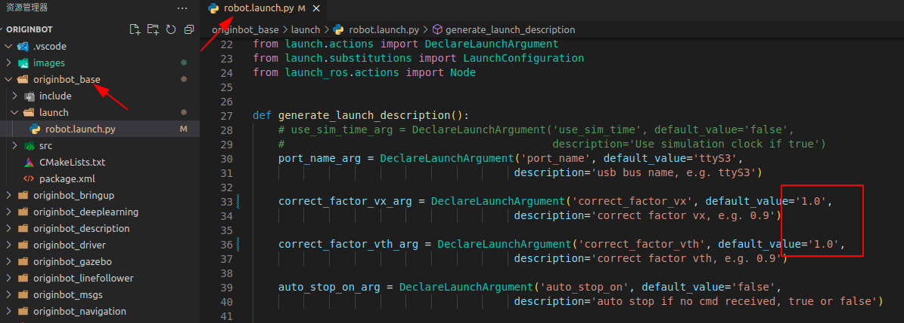{.img-fluid tag=1 title="里程计校准"}


???+ hint
    注意修改时使用浮点数格式，修改后要重新编译才能生效。


## **线速度校准**

线速度校准的原理是找到实际速度和计算速度之间的线性比例关系，通过线性系数让计算速度尽量靠近实际速度。


操作步骤如下：

- 将卷尺展开放在地上，作为实际直线里程的参考值：
  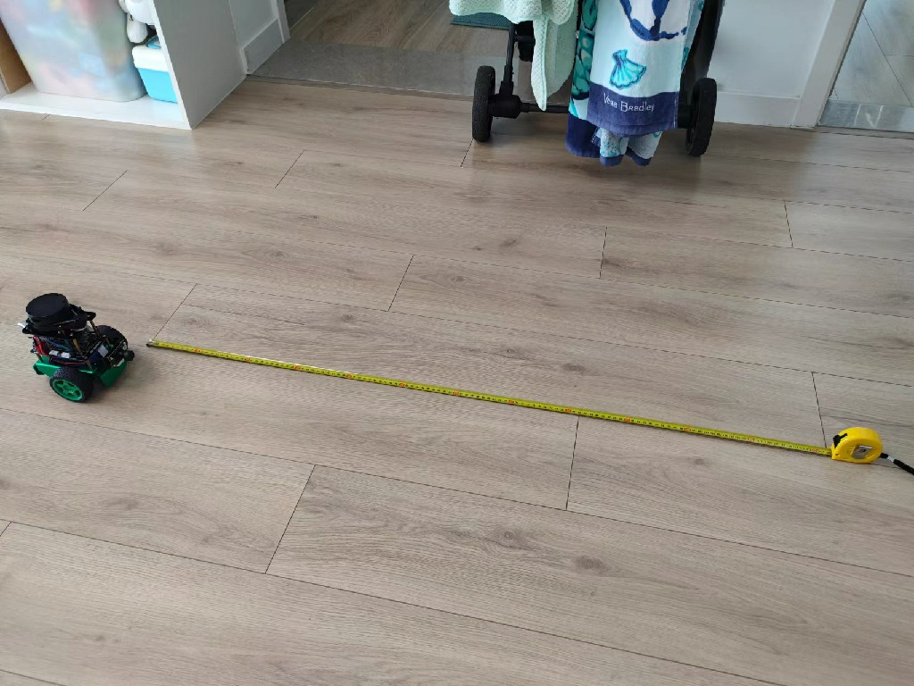{.img-fluid tag=1 title="里程计校准"}

  

- 将机器人放在卷尺刻度的零位置，使用机器人底盘的前边缘作为参考线：
  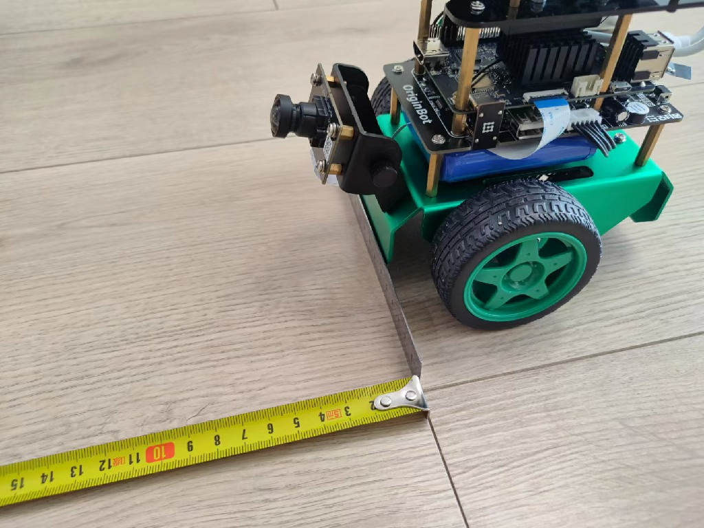{.img-fluid tag=1 title="里程计校准"}

  

- 启动机器人底盘：
```bash
ros2 launch originbot_bringup originbot.launch.py
```


- 动态显示机器人里程计数据

```bash
ros2 topic echo /odom
```


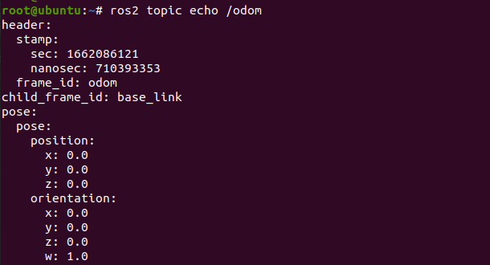{.img-fluid tag=1 title="里程计校准"}


- 启动键盘控制节点，速度调慢一点，控制机器人向前运动：

```bash
ros2 run teleop_twist_keyboard teleop_twist_keyboard
```


- 运动一段距离后，比如1m左右，停止运行，查看此时机器人实际运行的距离，以及odom反馈的累计距离。

  比如此时实际运行的距离是1.023m：
  
  
  
  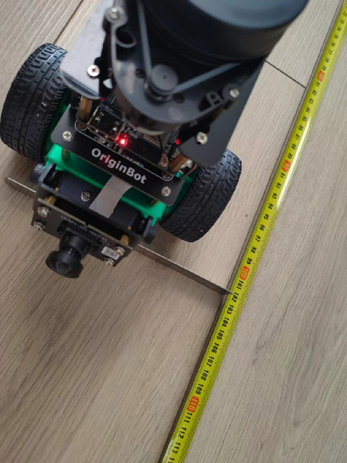{.img-fluid tag=1 title="里程计校准"}


而里程计反馈的是1.139m：


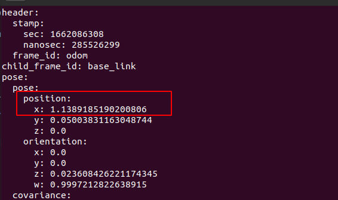{.img-fluid tag=1 title="里程计校准"}


- 计算线速度的校准系数 = 实际运行距离 / 里程计反馈距离
  比如：1.023/1.139 = 0.898

  

- 将校准参数填入robot.launch.py中，线速度校准完毕
  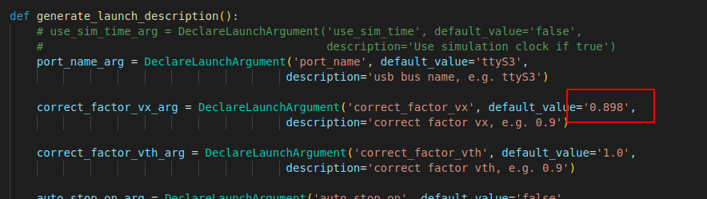{.img-fluid tag=1 title="里程计校准"}


???+ hint
    为提高校准精度，可以重复以上步骤3~5次，计算得到的系数取平均值。


## **角速度校准**

角速度校准的原理是找到实际角速度和计算角速度之间的线性比例关系，通过线性系数让计算角速度尽量靠近实际角速度。


- 将机器人放在平整的地面上，在地面上寻找一个参考线，或者人为绘制一条参考线，作为机器人旋转的零点：
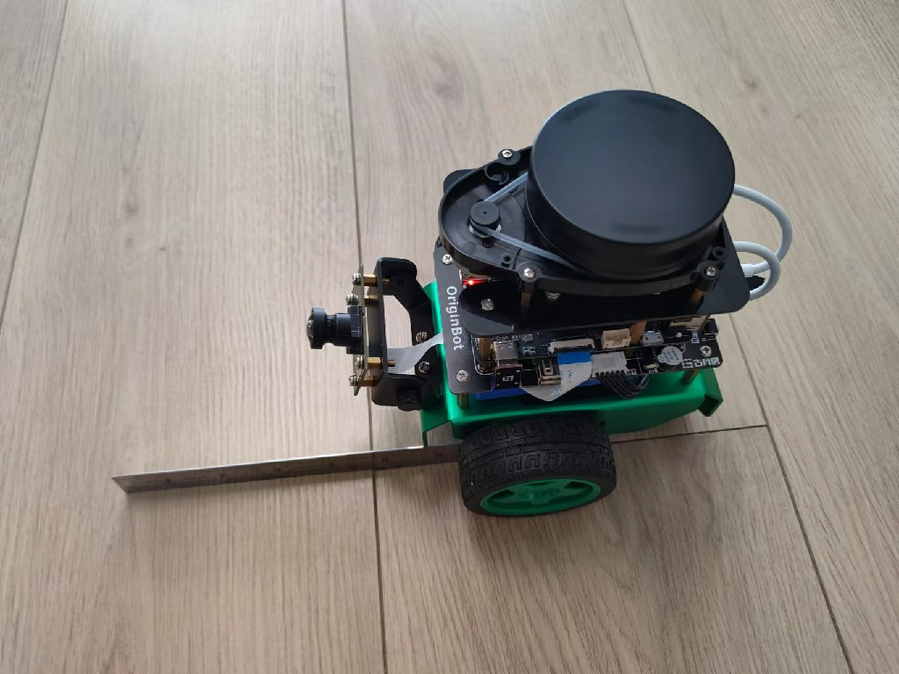{.img-fluid tag=1 title="里程计校准"}


- 启动机器人底盘：

```bash
ros2 launch originbot_bringup originbot.launch.py
```


- 动态显示机器人里程计数据：

```bash
ros2 topic echo /odom
```

{.img-fluid tag=1 title="里程计校准"}


- 启动键盘控制节点，速度调慢一点，控制机器人原地旋转：

```bash
ros2 run teleop_twist_keyboard teleop_twist_keyboard
```


- 旋转一定角度后，比如300度左右，停止运行，标记此时机器人的姿态参考线
  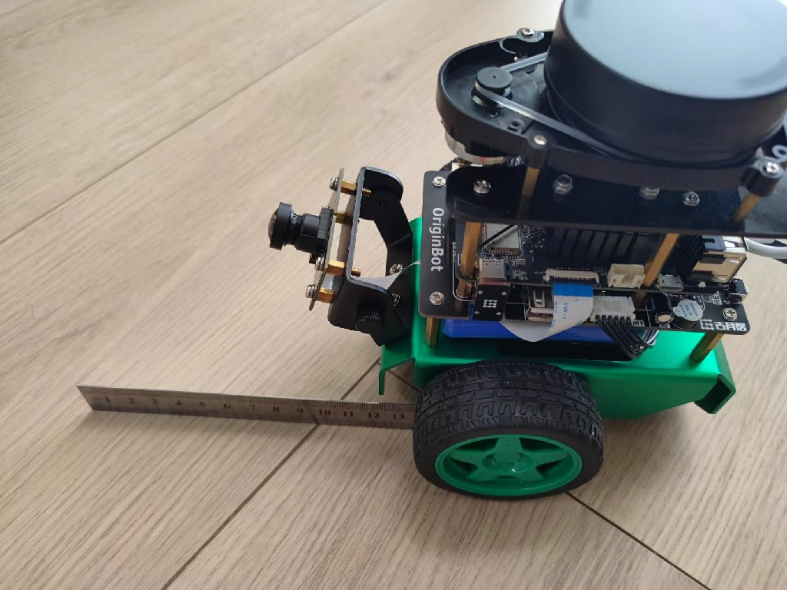{.img-fluid tag=1 title="里程计校准"}


- 计算机器人实际的旋转角度：可以使用量角器测量，也可以使用手机的指南针测量。

  比如机器人位于零点时，手机指南针显示的角度是21度
  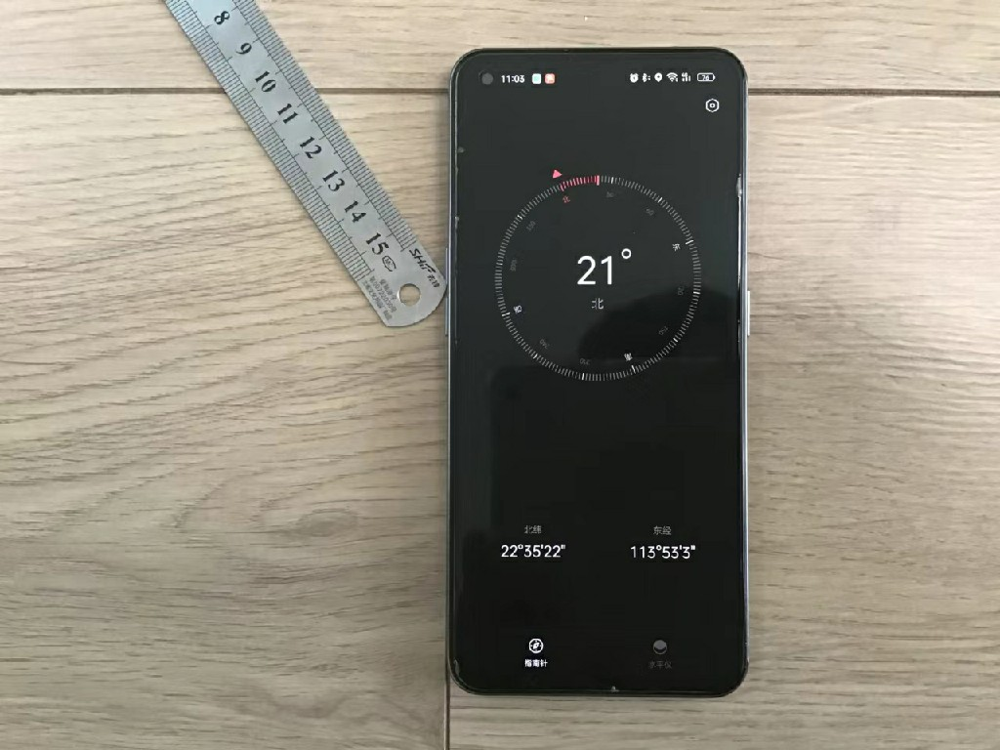{.img-fluid tag=1 title="里程计校准"}


机器人停止运动时，手机指南针显示的角度是341度
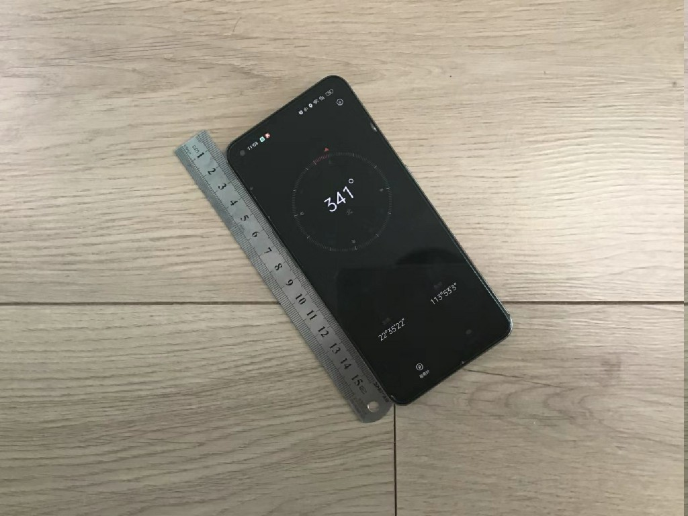{.img-fluid tag=1 title="里程计校准"}


可以得知机器人实际旋转的角度是：341 - 21 = 320度


此时里程计反馈的旋转角度是：


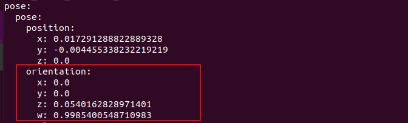{.img-fluid tag=1 title="里程计校准"}


ROS中的姿态默认显示的是四元数，我们需要将四元数转换成欧拉角，可以使用[quaternions网站](https://quaternions.online/)进行在线转换：


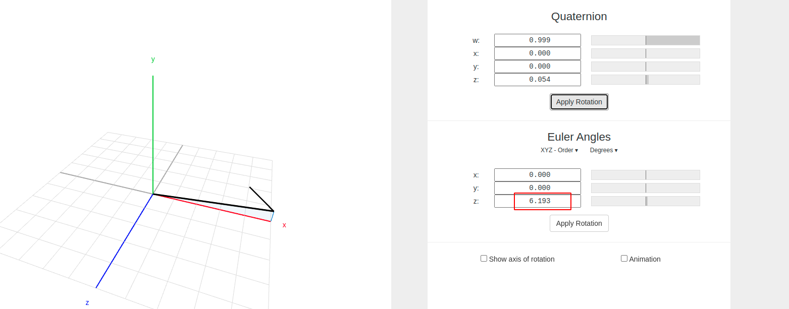{.img-fluid tag=1 title="里程计校准"}


从计算结果中可以发现，机器人里程计应该是积分超过360度之后，又旋转了6.193，也就是一共积分旋转了360+6.193 = 366.193度


- 计算角速度的校准系数 = 实际旋转的角度 / 里程计反馈角度
  比如：320/366.193 = 0.874

  

- 将校准参数填入robot.launch.py中，角速度校准完毕
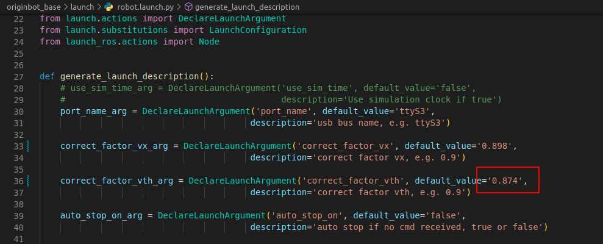{.img-fluid tag=1 title="里程计校准"}


???+ hint
    为提高校准精度，可以重复以上步骤3~5次，计算得到的系数取平均值。


## **校准完成**

完成以上校准操作之后，需要重新编译工作空间才能生效。

重新启动机器人底盘后，可以继续控制机器人运动，对比机器人实际运行的距离和角度，与odom中反馈的数值是否接近，如果误差不大，则校准完成，如果依然存在较大的误差，请重复以上校准操作。


[](https://www.guyuehome.com/){:target="_blank"}

