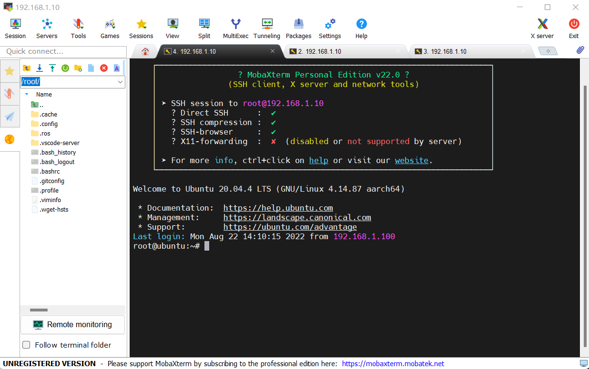
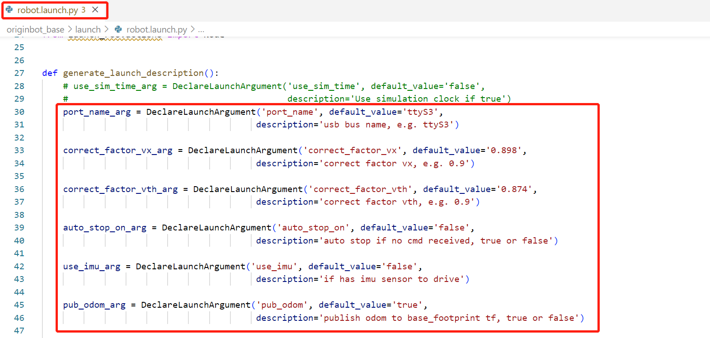
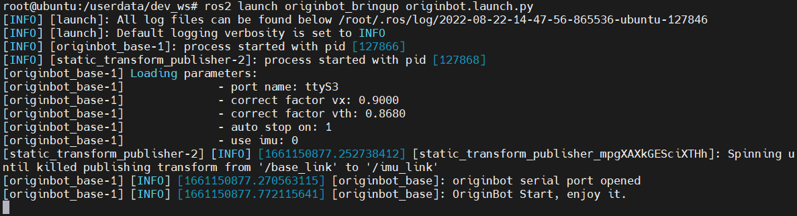
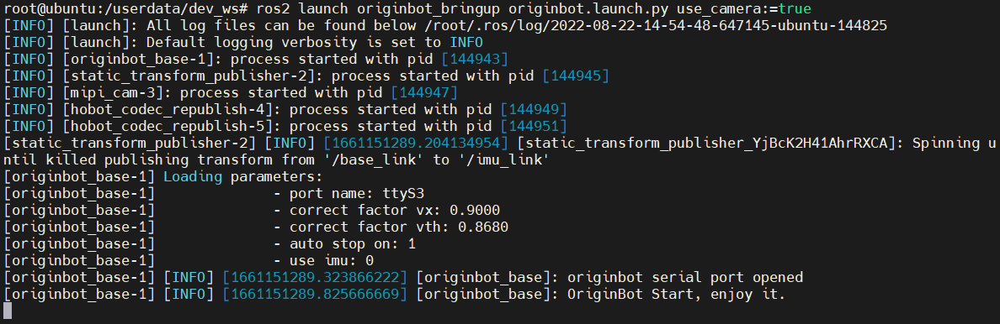
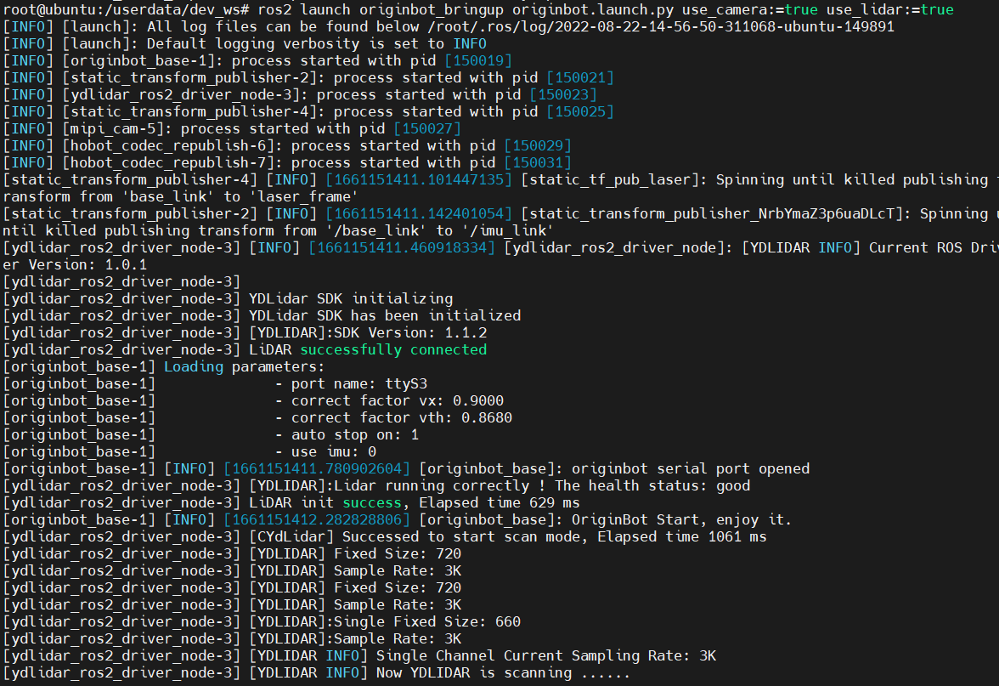
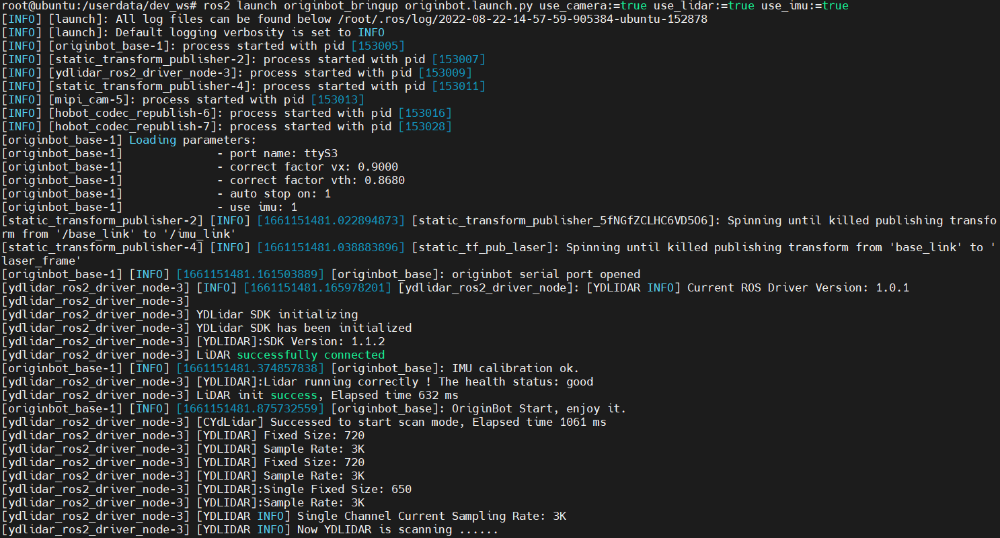

# **机器人启动与参数配置**

基于originbot.launch.py启动文件，我们不仅可以实现OriginBot机器人底盘的启动，还可以利用不同参数的配置与搭配实现不同传感器的组合启动。

???+ hint
    操作环境及软硬件配置如下：
    

     - OriginBot机器人（Lite版/标准版/Pro版）
     - PC：Ubuntu (≥22.04) + ROS2 (≥humble)


<iframe
  src="//player.bilibili.com/player.html?aid=516658213&bvid=BV1eg411a7A9&cid=866084401&page=10&autoplay=0"
  scrolling="no"
  border="0"
  width="800px"
  height="460px"
  frameborder="no"
  framespacing="0"
  allowfullscreen="true"
>
</iframe>


## **机器人启动方法**

在PC端通过SSH连接OriginBot。

{.img-fluid tag=1 title="机器人启动"}


连接成功后，OriginBot机器人启动的命令为：

```bash
ros2 launch originbot_bringup originbot.launch.py use_camera:=true use_lidar:=true use_imu:=true
```


底盘启动成功后，会听到控制器上蜂鸣器响**0.5秒**左右。


### **传感器启动参数**

根据实际连接的传感器，我们可以通过参数配置是否进行驱动：

| 参数名         | 描述                   | 参数值                        | 默认值 |
| -------------- | ---------------------- | ----------------------------- | ------ |
| <font color='green'>**use_camera**</font> | 是否连接并使用摄像头   | true：使用<br />false：不使用 | false  |
| <font color='green'>**use_lidar**</font>  | 是否连接并使用激光雷达 | true：使用<br />false：不使用 | false  |
| <font color='green'>**use_imu**</font>    | 是否连接并使用IMU      | true：使用<br />false：不使用 | false  |

???+ Info
    以上参数可单独配置，也可多项一起配置，如果使用默认值，在启动时可以缺省。  


### **底盘配置参数**

originbot.launch.py会根据以上参数启动对应的传感器，还会调用robot.launch.py启动机器人底盘，在robot.launch.py中，我们也可以配置一些底盘的相关参数：

{.img-fluid tag=2 title="底盘配置参数"}

| 参数名                                            | 描述                                                         | 参数值                    | 默认值 |
| ------------------------------------------------- | ------------------------------------------------------------ | ------------------------- | ------ |
| <font color='green'>**port_name**</font>          | RDK与控制器连接的串口号                                 | string                    | ttyS3  |
| <font color='green'>**correct_factor_vx**</font>  | 线速度的线性校正参数                                         | float                     | 0.898  |
| <font color='green'>**correct_factor_vth**</font> | 角速度的线性校正参数                                         | float                     | 0.874  |
| <font color='green'>**auto_stop_on**</font>       | 自动停车功能开关，启动后若0.5秒没收到Twist速度指令，机器人自动停车 | true：使用，false：不使用 | false  |
| <font color='green'>**use_imu**</font>            | 是否连接并使用IMU（会被originbot.launch.py中的配置覆盖）     | true：使用，false：不使用 | false  |
| <font color='green'>**pub_odom**</font>           | 是否发布基于里程计的odom到base_footprint的tf变换             | true：发布，false：不发布 | true   |

???+ Info
    以上参数值可以结合机器人的实际使用情况，在robot.launch.py文件中修改。  


## **机器人与传感器启动**

### **启动底盘**

使用以下命令，可单独启动机器人底盘，此时不会启动相机、雷达和IMU，可用于运动控制相关应用。

```bash
ros2 launch originbot_bringup originbot.launch.py
```

{.img-fluid tag=3 title="启动底盘"}


### **启动底盘+相机**

使用以下命令，可启动机器人底盘和相机，此时不会启动雷达和IMU，可用于运动控制和视觉处理相关应用。

```bash
ros2 launch originbot_bringup originbot.launch.py use_camera:=true
```

{.img-fluid tag=3 title="启动底盘+相机"}


### **启动底盘+相机+雷达**

使用以下命令，可启动机器人底盘、相机、激光雷达，此时不会启动IMU，可用于运动控制、视觉处理、建图导航相关应用。

```bash
ros2 launch originbot_bringup originbot.launch.py use_camera:=true use_lidar:=true
```

{.img-fluid tag=3 title="启动底盘+相机+雷达"}


### **启动底盘+相机+雷达+IMU**

使用以下命令，可启动机器人底盘、相机、激光雷达、IMU，可用于运动控制、视觉处理、定位导航相关应用。

```bash
ros2 launch originbot_bringup originbot.launch.py use_camera:=true use_lidar:=true use_imu:=true
```

{.img-fluid tag=3 title="启动底盘+相机+雷达+IMU"}


[](https://www.guyuehome.com/){:target="_blank"}

