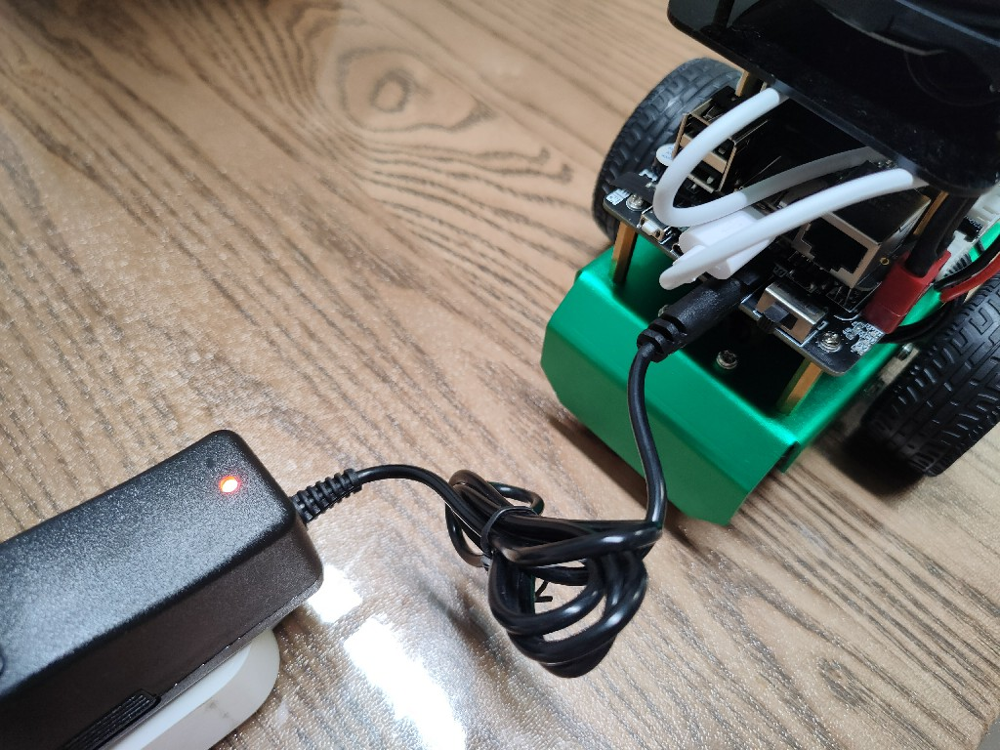

# **机器人充电方法**

???+ hint
    操作环境及软硬件配置如下：
    

     - OriginBot机器人（Lite版/标准版/Pro 版）
     - 充电器：DC4.0 * 1.7mm，12.6V，800mA

## **欠压提醒**

控制器程序中加入了电池保护，电压低于**9.4V**时蜂鸣器会常响报警，此时就需要尽快充电了。

## **充电方法**

???+ Attention
    请使用OriginBot套件中自带的充电器进行充电。
    机器人只有在关机情况下才能进行充电，开始时不会进行充电。

- 确定机器人电源开关处于“OFF”状态；

- 将充电器DC口插到控制器的充电口上；

- 将充电器的AC口插到220V市电插座上，充电器上的灯显示为**红色**，即为正在充电中；

  

- 完成充电后，充电器上的LED灯会变为**绿色**，充电结束，可以拔出充电器。

{:target="_blank"}

