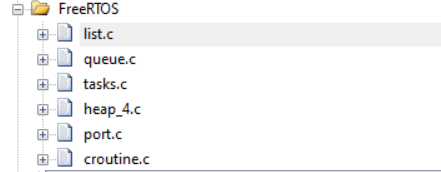

# **控制器实时操作系统RTOS配置**

???+ hint
    操作环境及软硬件配置如下：
    

     - OriginBot机器人（Lite版/标准版/Pro 版）
     - PC：Ubuntu (≥22.04) + ROS2 (≥humble)


## **FreeRTOS搭载**

在控制器固件安装一栏中，大家已经搭载了一般的微控制器处理固件，但是除了一般的处理固件，此处将提供大家关于微控制器实时操作系统中FreeRTOS的处理固件。

FreeRTOS的写入方式与写入一般固件一致，我们提供了一个能实现与一般处理固件功能一致的FreeRTOS示例固件供大家烧写。

**操作方式如下**：

（1）电脑端启动flymcu软件（[点击此处下载](../material/common_software.md)）；

（2）点击Port，选择烧写固件的串口（选择带“CH340”编号的串口）；

（3）在flymcu软件中，选择准备烧写的固件文件，按照下图进行配置后，点击“开始编程”；


## **FreeRTOS简介**

#### RTOS（Real Time Operation System）

RTOS全称为 Real Time Operation System，即实时操作系统。RTOS强调的是实时性，又分为硬实时和软实时。硬实时要求在规定的时间内必须完成操作，不允许超时；而软实时里对处理过程超时的要求则没有很严格。RTOS的核心就是任务调度。

#### FreeRTOS

FreeRTOS是RTOS的一种，尺寸非常小，可运行于微控制器上。微控制器是尺寸小，资源受限的处理器，它在单个芯片上包含了处理器本身、用于保存要执行的程序的只读存储器（ROM或Flash）、所执行程序需要的随机存取存储器（RAM），一般情况下程序直接从只读存储器执行.在FreeRTOS的官网上，我们可以看到其支持的功能。


## **配置FreeRTOS**

配置FreeRTOS需要对原有的代码进行重构，根据FreeRTOS的代码模板重构部分代码使得其遵循FreeRTOS的使用规则，接下来介绍最基本的FreeRTOS配置和部分API。

### 基本配置

首先需要选择一个发行的版本，每一个版本的API会有一些细微的差别，在此项目中选择的是  V10.2.1，其所有源码托管在[代码托管平台](https://sourceforge.net/projects/freertos/files/FreeRTOS/) 

代码下载之后需要将部分文件配置到 originbot_controller 中，主要包括与 MCU 匹配的内核和硬件接口层，可参考[码云仓库](https://gitee.com/guyuehome/originbot_controller/tree/support_Freertos/source/originbot_controller_project/FreeRTOS)



在配置过程中需要对部分文件内容进行修改，例如FreeRTOSConfig.h，在此配置文件中定义了FreeRTOS的任务优先级以及堆栈大小等，我们需要在这个基础上增加有关中断机制的定义。

```
#define vPortSVCHandler SVC_Handler
#define xPortPendSVHandler PendSV_Handler
```

之所以需要定义，原因在于在 port.c 中定义了如下三个中断机制以保证FreeRTOS的任务轮询

```
void xPortPendSVHandler( void );
void xPortSysTickHandler( void );
void vPortSVCHandler( void );
```

由于 xPortSysTickHandler 在原有项目中已经使用故无需重新定义，只需重构原有实现即可。

```
extern void xPortSysTickHandler(void);
void SysTick_Handler(void) 
{
    if(xTaskGetSchedulerState()!=taskSCHEDULER_NOT_STARTED)//系统已经运行
    {
        xPortSysTickHandler();	
    }
}
```

### 任务实现

完成基础配置之后，就可以正式开始任务的创建与实现。

#### 任务创建

关于任务创建，FreeRTOS 提供了 API 给我们使用。格式如下

	   /* 创建 DemoTaskCreate 任务 */
	DemoTaskCreate_Handle = xTaskCreateStatic((TaskFunction_t	)DemoTaskCreate,		//任务函数
														(const char* 	)"DemoTaskCreate",		//任务名称
														(uint32_t 		)128,	//任务堆栈大小
														(void* 		  	)NULL,				//传递给任务函数的参数
														(UBaseType_t 	)3, 	//任务优先级
														(StackType_t*   )DemoTaskCreate_Stack,	//任务堆栈
														(StaticTask_t*  )&DemoTaskCreate_TCB);	//任务控制块   
															
	if(NULL != DemoTaskCreate_Handle)/* 创建成功 */
	vTaskStartScheduler();   /* 启动任务，开启调度 */
故我们可以参照如上实现定义我们需要的多个任务。

```
void start_task(void *pvParameters);
void start_task(void *pvParameters)
{
    taskENTER_CRITICAL(); //Enter the critical area //进入临界区
    //Create the task //创建任务
		xTaskCreate(led_task, "led_task", 1000, NULL, LED_TASK_PRIO, NULL);
		xTaskCreate(buzzer_task, "buzzer_task", 1000, NULL, BUZZER_TASK_PRIO1, NULL);
		xTaskCreate(uart_task, "uart_task2", 1000, NULL, RECEIVE_HANDLE_TASK_PRIO, NULL);
    vTaskDelete(StartTask_Handler); //Delete the start task //删除开始任务
    taskEXIT_CRITICAL();            //Exit the critical section//退出临界区
}
```

#### 任务延时

除了任务创建API之外，任务延时在FreeRTOS中也是极其重要的一个实现，在FreeRTOS简介中可以看出本质上每一个任务都有四个状态，就绪态、挂起态、运行态、阻塞态。简单介绍其流程叙述为：

(1)：创建任务→就绪态（Ready）：任务创建完成后进入就绪态，表明任务已 准备就绪，随时可以运行，只等待调度器进行调度。

(2)：就绪态→运行态（Running）：发生任务切换时，就绪列表中最高优先级的任务被执行，从而进入运行态。

(3)：运行态→就绪态：有更高优先级任务创建或者恢复后，会发生任务调度，此刻就绪列表中最高优先级任务变为运行态，那么原先运行的任务由运行态变为就绪态， 依然在就绪列表中，等待最高优先级的任务运行完毕继续运行原来的任务（此处可以看做 是 CPU 使用权被更高优先级的任务抢占了）。

(4)：运行态→阻塞态（Blocked）：正在运行的任务发生阻塞（挂起、延时、 读信号量等待）时，该任务会从就绪列表中删除，任务状态由运行态变成阻塞态，然后发 生任务切换，运行就绪列表中当前最高优先级任务。

(5)：阻塞态→就绪态：阻塞的任务被恢复后（任务恢复、延时时间超时、读 信号量超时或读到信号量等），此时被恢复的任务会被加入就绪列表，从而由阻塞态变成 就绪态；如果此时被恢复任务的优先级高于正在运行任务的优先级，则会发生任务切换， 将该任务将再次转换任务状态，由就绪态变成运行态。

(6) ：就绪态、阻塞态、运行态→挂起态（Suspended）：任务可以通 过调用 vTaskSuspend() API 函数都可以将处于任何状态的任务挂起，被挂起的任务得不到 CPU 的使用权，也不会参与调度，除非它从挂起态中解除。

(7)：挂起态→就绪态：把一个挂起状态的任务恢复的唯一途径就是调用 vTaskResume() 或 vTaskResumeFromISR() API 函数，如果此时被恢复任务的优先级高于正在运行任务的优先级，则会发生任务切换，将该任务将再次转换任务状态，由就绪态变成运行态。

而任务延时即将任务转变成阻塞态，在FreeRTOS中有两个任务延时 API。

##### vTaskDelay()

vTaskDelay()在我们任务中用得非常之多，每个任务都必须是死循环，并且是必须要有阻塞的情况，否则低优先级的任务就无法被运行了。要想使用 FreeRTOS 中的 vTaskDelay() 函数必须在 FreeRTOSConfig.h 中把 INCLUDE_vTaskDelay 定义为 1 来使能。

##### vTaskDelayUntil()

这个绝对延时常用于较精确的周期运行任务，比如我有一个任务，希望它以固定频率定期执行， 而不受外部的影响，任务从上一次运行开始到下一次运行开始的时间间隔是绝对的，而不是相对的。


[](https://www.guyuehome.com/){:target="_blank"}

