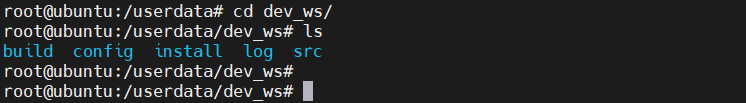
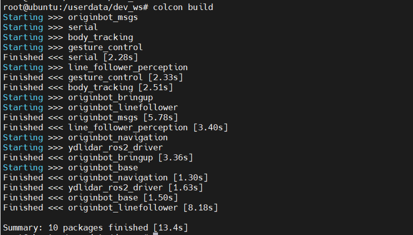

# **代码开发与编译方法**

OriginBot完全遵循ROS2的开发方法，这里简要介绍功能包的常见操作，ROS2详细的开发原理，请参考[ROS2入门教程](https://book.guyuehome.com/){:target="_blank"}。


???+ hint
    操作环境及软硬件配置如下：
    

     - OriginBot机器人（Lite版/标准版/Pro版）
     - PC：Ubuntu (≥22.04) + ROS2 (≥humble)


## **工作空间**

在ROS机器人开发中，我们针对机器人某些功能进行代码开发时，各种编写的代码、参数、脚本等文件，都需要放置在某一个文件夹里进行管理，这个文件夹在ROS系统中就叫做**工作空间**。


OriginBot的官方镜像中，已经创建好了工作空间，位于/userdata文件夹下，名为dev_ws，叫做工作空间的根目录，其中包含四个子文件夹：



- **src，代码空间**，未来编写的代码、脚本，都需要人为的放置到这里；
- **build，编译空间**，保存编译过程中产生的中间文件；
- **install，安装空间**，放置编译得到的可执行文件和脚本；
- **log，日志空间**，编译和运行过程中，保存各种警告、错误、信息等日志。
- **config，配置文件**，保存人体跟踪、手势识别应用的模型配置文件（非ROS2工作空间所需文件夹）。


这四个空间的文件夹，我们绝大部分操作都是在src中进行的，编译成功后，执行install中的编译结果。


## **功能包**

OriginBot机器人端的功能包都放置在/userdata/dev_ws工作空间下的src文件夹中，功能包结构如下：

- originbot_base：机器人底盘驱动
- originbot_driver：机器人设备驱动
    - serial_ros2：串口驱动包
    - ydlidar_ros2_driver：EAI X3雷达驱动包
    - kruisee_lidar：氪见KRJ10雷达驱动包
- originbot_msgs： OriginBot自定义通信接口
- originbot_bringup：机器人启动相关的脚本和文件
- originbot_linefollower：机器人视觉巡线功能包
- originbot_navigation：机器人建图与导航相关的脚本和配置文件
- originbot_example：机器人实现ROS官方经典案例功能包
- originbot_audio：机器人语音相关功能包
- originbot_deeplearning：机器人深度学习功能
    - body_tracking：机器人人体跟随功能包
    - gesture_control：机器人手势控制功能包
    - line_follower_perception：机器人AI视觉巡线功能包
    - play_football：机器人AI视觉踢球射门功能包
    - parking_search：机器人AI视觉车位寻找功能包


## **编译代码**

修改功能包中的代码或者配置文件后，需要使用如下命令编译工作空间，如果有缺少的依赖，或者代码有错误，编译过程中会有报错，否则编译过程应该不会出现任何错误：

```bash
cd /userdata/dev_ws/
colcon build
```




## **设置环境变量**

编译成功后，为了让系统能够找到我们的功能包和可执行文件，还需要设置环境变量：

```bash
source /userdata/dev_ws/install/local_setup.bash # 仅在当前终端生效
echo " source /userdata/dev_ws/install/local_setup.bash" >> ~/.bashrc # 所有终端均生效，只用运行一次
```


???+ hint
    OriginBot的官方镜像中，已经在.bashrc配置文件中设置好了如上环境变量，无须再次配置。


[](https://www.guyuehome.com/){:target="_blank"}

