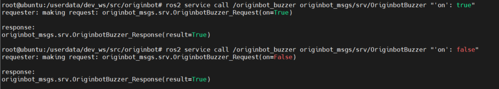
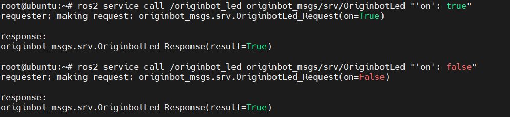
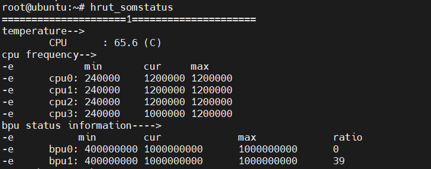

# **机器人参数动态监控**

启动机器人后，OriginBot提供多种参数可动态检测或修改。


???+ hint
    操作环境及软硬件配置如下：
    

     - OriginBot机器人（Lite版/标准版/Pro 版）
     - PC：Ubuntu (≥22.04) + ROS2 (≥humble)


<iframe
  src="//player.bilibili.com/player.html?aid=516658213&bvid=BV1eg411a7A9&cid=866149913&page=15&autoplay=0"
  scrolling="no"
  border="0"
  width="800px"
  height="460px"
  frameborder="no"
  framespacing="0"
  allowfullscreen="true"
>
</iframe>


## **查看机器人状态**

通过如下指令，可以看到机器人的状态信息，机器人端的发布频率为10Hz。

```bash
ros2 topic echo /originbot_status
```

| 状态                | 描述               | 典型值                      |
| ------------------- | ------------------ | --------------------------- |
| **battery_voltage** | 电池电量，单位：V  | 9.0~12.8                    |
| **buzzer_on**       | 控制板上蜂鸣器状态 | true：打开<br />false：关闭 |
| **led_on**          | 控制板上LED状态    | true：打开<br />false：关闭 |

{.img-fluid tag=1 title="查看机器人状态"}


## **控制板载蜂鸣器**

通过以下指令，可以通过服务调用的方式，打开或者关闭控制器端的蜂鸣器：

```bash
ros2 service call /originbot_buzzer originbot_msgs/srv/OriginbotBuzzer "'on': true"     ## 打开蜂鸣器
ros2 service call /originbot_buzzer originbot_msgs/srv/OriginbotBuzzer "'on': false"    ## 关闭蜂鸣器
```

{.img-fluid tag=1 title="控制板载蜂鸣器"}


## **控制板载LED灯**

通过以下指令，可以通过服务调用的方式，打开或者关闭控制器端的LED灯：

```bash
ros2 service call /originbot_led originbot_msgs/srv/OriginbotLed "'on': true"      ## 打开LED
ros2 service call /originbot_led originbot_msgs/srv/OriginbotLed "'on': false"     ## 关闭LED
```

{.img-fluid tag=1 title="控制板载LED灯"}


## **查看CPU/BPU的信息**

通过以下指令，可以查看OriginBot的核心处理器的信息，比如每个核的频率、温度等：

```bash
hrut_somstatus
```

{.img-fluid tag=1 title="查看CPU/BPU的信息"}


## **设置电机PID参数**

通过以下指令，可以通过服务调用的方式，分别设置OriginBot控制器中左右电机的PID参数，设置后会立刻生效：

```bash
ros2 service call /originbot_left_pid originbot_msgs/srv/OriginbotPID "{'p': 10, 'i': 0, 'd': 0.1}"
ros2 service call /originbot_right_pid originbot_msgs/srv/OriginbotPID "{'p': 10, 'i': 0, 'd': 0.1}"
```

{.img-fluid tag=1 title="设置电机PID参数"}


在启动机器人的终端中，也可以看到成功设置PID参数的日志提示：

{.img-fluid tag=1 title="设置电机PID参数"}


[](https://www.guyuehome.com/){:target="_blank"}

