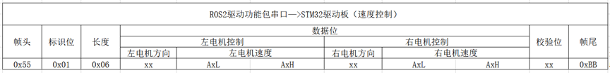
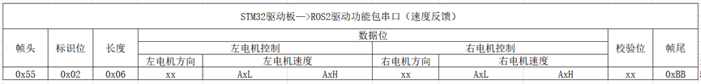
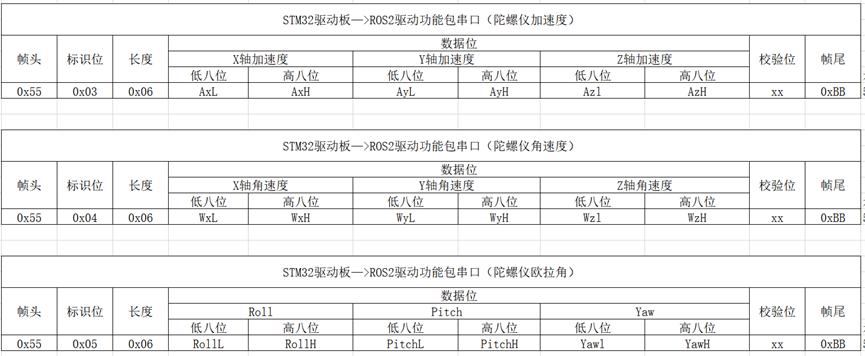
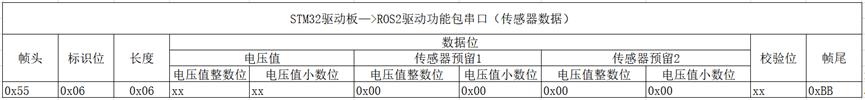
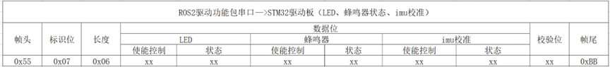
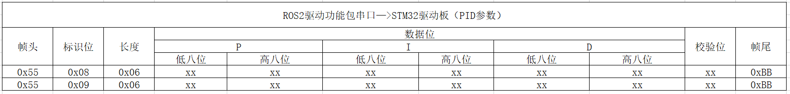

# **控制器通信协议说明**

???+ hint
    操作环境及软硬件配置如下：
    
     - OriginBot机器人（Lite版/标准版/Pro 版）

     - PC：Ubuntu (≥22.04) + ROS2 (≥humble)


## **速度控制**


### **主要功能**

上位机的驱动功能节点向控制器发送电机速度控制数据，控制器驱动电机执行。


### **协议格式**

{.img-fluid tag=1 title="速度控制"}


- **帧头**：0x55，作为数据起始的标识，自定义0x55。

- **标识位**：标识当前组数据是什么，0x01代表是速度控制指令。

- **长度**：0x06，数据位共有6个字节数据，所以为0x06。

- **数据位**：负责左电机速度控制和右电机速度控制。方向有0x00和0xFF两种模式，0x00速度值为负，0xFF速度值为正，当速度为0.00的情况下，方向值取0xFF。速度单位为mm/s（8位）。

- **校验位**：用于校验检测数据在传输的过程中是否出现数据错误。校验位数据计算公式如下：
  
  ```
  校验位数值 = 数据位所有数据相加 & 0xFF
  ```

- **帧尾**：0xBB，帧尾作为数据终止的标识，自定义0xBB。

### **通信示例**

例如：上位机发送速度指令，左侧电机速度5mm/s，右电机速度-3mm/s

协议内容为：**0x55 0x01 0x06 0xFF 0x05 0x00 0x00 0x03 0x00 0x07 0xBB**

其中：0xFF 0x05 0x00对应5mm/s，0x00 0x03 0x00对应-3mm/s。

校验位为：**（0xFF + 0x05 + 0x00 + 0x00 + 0x03 + 0x00） & 0xFF = 0x07**


## **速度反馈**

### **主要功能**

控制器向上位机周期发送电机速度数据，上位机可根据该速度计算里程计数据。


### **协议格式**

{.img-fluid tag=1 title="速度反馈"}

- **标识位**：0x02标识速度反馈指令。
  
  

## **陀螺仪数据反馈**

### **主要功能**

控制器向上位机周期发送陀螺仪数据，上位机可根据该数据发布IMU话题消息。


### **协议格式**

{.img-fluid tag=1 title="陀螺仪数据反馈"}


陀螺仪数据较多，这里分为三组分别传输。通过标识位来区分当前数据是什么。校验位的计算依旧是使用数据位各个数据相加 & 0xFF。

原始数据换算参考维特官方协议：[点击跳转](https://wit-motion.yuque.com/books/share/29a9c291-ebf5-4f6f-83e3-4093832dce78/locehn){:target="_blank"}


**加速度计算方式为：**

```
ax=((AxH<<8)|AxL)/32768*16g(g 为重力加速度，可取 9.8m/s2) 

ay=((AyH<<8)|AyL)/32768*16g(g 为重力加速度，可取 9.8m/s2)

az=((AzH<<8)|AzL)/32768*16g(g 为重力加速度，可取 9.8m/s2)
```

**角速度计算方式为：**

```
wx=((wxH<<8)|wxL)/32768*2000(°/s) 

wy=((wyH<<8)|wyL)/32768*2000(°/s) 

wz=((wzH<<8)|wzL)/32768*2000(°/s) 
```

**欧拉角计算方式为：**

```
滚转角（x 轴）Roll=((RollH<<8)|RollL)/32768*180(°) 

俯仰角（y 轴）Pitch=((PitchH<<8)|PitchL)/32768*180(°) 

偏航角（z 轴）Yaw=((YawH<<8)|YawL)/32768*180(°)
```


说明：数据是按照16进制方式发送的，不是ASCII码。每个数据分低字节和高字节依次传送，二者组合成一个有符号的short 类型的数据。例如 X 轴加速度数据 Ax，其中 AxL 为低字节，AxH 为高字节。

转换方法如下：假设Data为实际的数据，DataH为其高字节部分，DataL为其低字节部分，那么：Data=((short)DataH<<8)|DataL。这里一定要注意 DataH 需要先强制转换为一个有符号的 short 类型的数据以后再移位，并且 Data 的数据类型也是有符号的short 类型，这样才能表示出负数。 

欧拉角和四元数提供任意一个即可，若无法提供则一定要确保加速度和角速度的精度，欧拉角或者四元数将在ROS2功能包进行解算。


## **传感器数据反馈**

### **主要功能**

控制器向上位机周期反馈电压等数据，上位机可根据该信息执行对应的功能。


### **协议格式**

{.img-fluid tag=1 title="传感器数据反馈"}

电压值分整数和小数两部分发送，电压值=整数部分+小数部分/100，单位为V。

预留两个传感器数据位，没有使用时数据为0x00，校验计算同上。


## **控制器资源控制**

### **主要功能**

上位机发送指令到控制器，控制LED、蜂鸣器、IMU校准等。


### **协议格式**

{.img-fluid tag=1 title="控制器资源控制"}

LED、蜂鸣器、imu校准指令的使能控制字段和状态字段可设置为零和非零值，校验计算同上。

使能控制字段非零时，状态字段的设置才能生效。LED、蜂鸣器和imu校准采用独立的使能控制和状态字段控制。

- LED状态字段为零，则关闭LED；为非零，则打开LED。

- 蜂鸣器状态字段为零，则关闭蜂鸣器；为非零，则打开蜂鸣器。

- imu校准状态字段为零，则无动作；为非零，则执行一次imu校准。
  
  

## **PID参数调整**

### **主要功能**

上位机向控制器发送PID参数，控制器动态调整电机控制效果。其中标识位0x08、0x09分别对应左右两个电机的PID设置。


### **协议格式**

{.img-fluid tag=1 title="PID参数调整"}

PID参数作为外置预留，驱动板内置一组出厂标定好的PID参数。

由于PID的数值较小，实际参数 = 数据字段/1000，校验计算同上。


[](https://www.guyuehome.com/){:target="_blank"}
