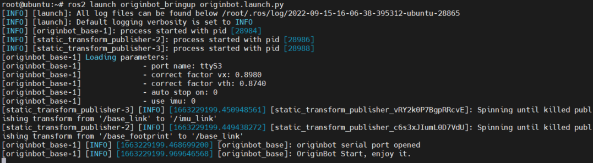
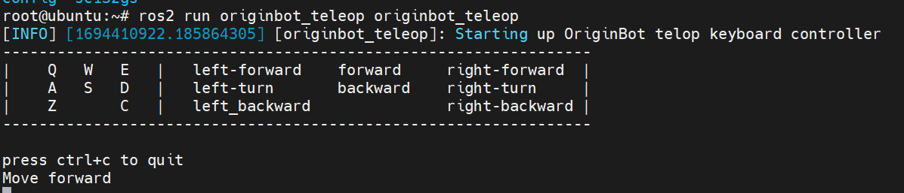
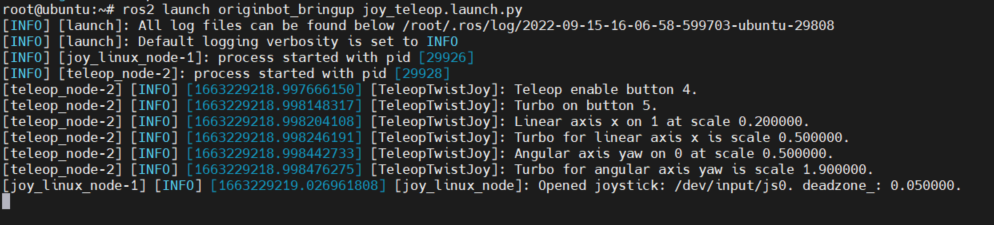
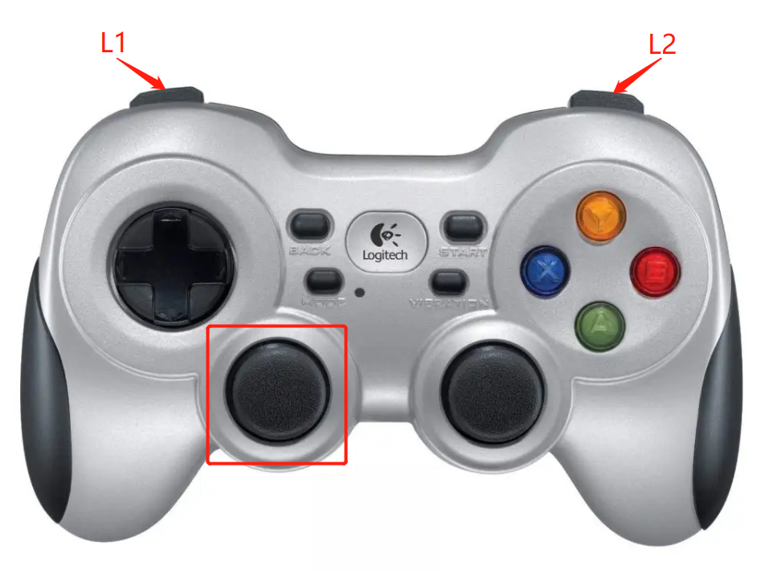
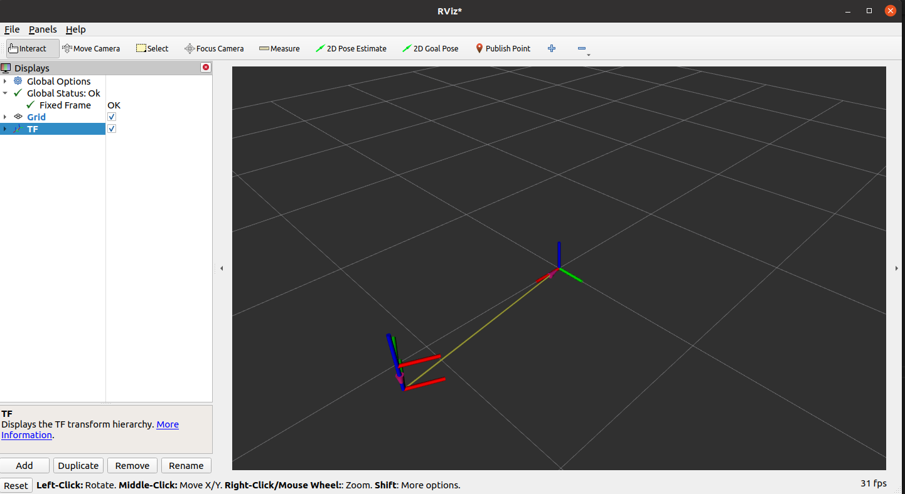
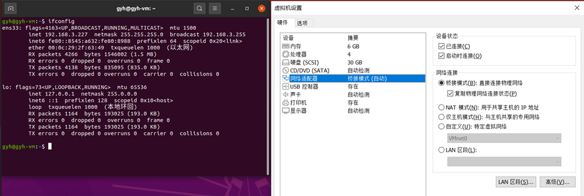

# **机器人遥控与可视化**

基于ROS2的分布式特性，OriginBot很容易实现远程遥控运动。

???+ hint
    操作环境及软硬件配置如下：

     - OriginBot机器人（Lite版/标准版/Pro版）
     - PC：Ubuntu (≥22.04) + ROS2 (≥humble)
     - 键盘
     - 手柄（可选）


<iframe
  src="//player.bilibili.com/player.html?aid=516658213&bvid=BV1eg411a7A9&cid=866092965&page=11&autoplay=0"
  scrolling="no"
  border="0"
  width="800px"
  height="460px"
  frameborder="no"
  framespacing="0"
  allowfullscreen="true"
>
</iframe>

## **键盘遥控**

在PC端通过SSH连接OriginBot。

{.img-fluid tag=1 title="登录机器人"}


连接成功后，在第一个终端里，启动机器人底盘驱动：

```bash
ros2 launch originbot_bringup originbot.launch.py
```

{.img-fluid tag=1 title="启动底盘"}


然后连接第二个终端，启动键盘控制节点：

```bash
ros2 run teleop_twist_keyboard teleop_twist_keyboard
```

{.img-fluid tag=1 title="键盘控制节点"}

???+ hint
    1. 键盘控制节点也可以在同一网络环境下的PC端运行。
    2. 如果机器人启动自动停车功能，松开按键后0.5秒，机器人会自动停车；如果关闭自动停车功能，松开按键后，机器人不会自动停止，必须要点击“k”才能控制停车。自动停车功能的参数配置位于originbot.launch.py中，详见[底盘配置参数](../manual/originbot_bringup.md#_4)说明。

此外，在OriginBot上，它具备一套用C++实现的自动开启自动停车的按键控制功能，代码放置在 originbot/originbot_example/originbot_teleop 

启动如下：

```bash
ros2 run originbot_teleop originbot_teleop
```
{.img-fluid tag=1 title="键盘控制节点"}

## **手柄遥控**

### **手柄连接**
- 有线手柄；将手柄的usb接口插入OriginBot上RDK X3的USB接口
- 无线手柄；将手柄的无线接收器插入OriginBot上RDK X3USB接口


连接完成后，在OriginBot端，使用如下命令确认系统是否成功识别：

```bash
ls /dev/input/
```

{.img-fluid tag=2 title="手柄设备号"}


如识别到“js0”设备，则说明手柄识别成功。


OriginBot官方镜像中已经安装手柄的驱动，如无法识别，请重新安装以下功能包后重启尝试：
​    

```bash
sudo apt install ros-$ROS_DISTRO-teleop-twist-joy        # 安装手柄的驱动包
sudo apt install ros-$ROS_DISTRO-joy-linux               # 安装手柄的驱动包
sudo modprobe -a joydev                           # 加载驱动
sudo apt install joystick                         # 安装测试工具
jstest /dev/input/js0                             # 测试命令
```


### **遥控运动**

SSH连接OriginBot成功后，在第一个终端里，启动机器人底盘驱动：

```bash
ros2 launch originbot_bringup originbot.launch.py
```

{.img-fluid tag=2 title="启动底盘"}


然后连接第二个终端，运行手柄控制节点：

```bash
ros2 launch originbot_bringup joy_teleop.launch.py
```

{.img-fluid tag=2 title="启动手柄节点"}


启动成功后，就可以使用手柄控制OriginBot运动啦：

- 常速运行：按住L1，拨动手柄左侧摇杆，控制机器人运动
- 快速运行：按住R1，拨动手柄左侧摇杆，控制机器人运动





???+ hint
    手柄控制节点也可以在同一网络环境下的PC端运行，此时需要将手柄的接收器连接到PC端，并安装好对应的驱动功能包，以上在RDK X3中对手柄的操作，在PC端同样适用。


## **机器人可视化显示**

启动OriginBot后，在PC端打开Rviz即可查看机器人的实时位姿：

```bash
ros2 launch originbot_viz display_robot_tf.launch.py
```


即可看到机器人在里程计坐标系下的位姿变化：
{.img-fluid tag=3 title="机器人坐标可视化"}


???+ hint
    确保在PC端已经安装好Ubuntu+ROS2系统，并且完成[originbot_desktop](https://gitee.com/guyuehome/originbot_desktop){:target="_blank"}代码仓库的下载和编译。另外，还可以使用“ros2 run rviz2 rviz2”单独启动Rivz2，手动配置Fixed Frame选择**odom**（里程计坐标系），并且通过“Add”按键添加**TF显示**，也可以达到类似的效果。


此处PC端如果使用虚拟机运行Ubuntu系统，为确保机器人与Ubuntu系统处于同一局域网中，需要将虚拟机的网络设置为**桥接模式**：

{.img-fluid tag=3 title="虚拟机网络配置"}


[](https://www.guyuehome.com/){:target="_blank"}

