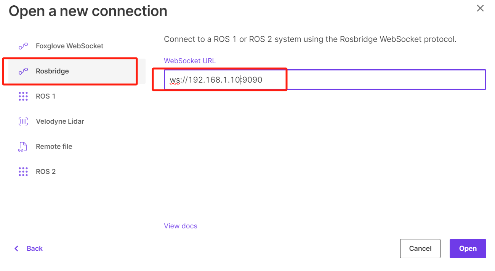

# **WebViz可视化**

Webviz是一个基于Web的可视化工具，意味着您可以通过浏览器/APP访问它，而不需要安装额外的软件。这对于远程访问和团队协作非常方便。

Foxglove是一个开源的工具包，包括线上和线下版。旨在简化机器人系统的开发和调试。它提供了一系列用于构建机器人应用程序的功能。

本节将介绍如何使用Foxglove进行数据查看，以及话题通信。

???+ hint
    操作环境及软硬件配置如下：

     - OriginBot机器人（Lite版/标准版/Pro 版）
     - PC：Ubuntu (≥22.04) / Windows (>=10)

## **软件安装**

此处建议使用APP版本，无需登录账户也可使用,点击该[下载链接](https://foxglove.dev/download){:target="_blank"}即可跳转至下载页面。

{.img-fluid tag=1 title="下载foxglove"}

按照指引完成下载即可。

## **环境搭建**

实现OriginBot与Foxglove的连接需要在OriginBot上实现ROS环境的搭建。

```bash
#安装rosbridge
sudo apt install ros-$ROS_DISTRO-rosbridge-suite
```

完成安装后，即可运行以下命令开启OriginBot端远程服务。

```bash
source /opt/ros/$ROS_DISTRO/setup.bash
ros2 launch rosbridge_server rosbridge_websocket_launch.xml
```

{.img-fluid tag=1 title="originbot启动远程服务"}

同时新开一个终端，用ifconfig记录下当前的ip地址，并启动相机发布图像信息，用于验证效果。

```bash
ifconfig
ros2 launch originbot_bringup camera.launch.py
```

## **Foxglove界面可视化**

安装完Foxglove后，点击软件即可看到如下界面。

{.img-fluid tag=1 title="启动foxglove"}

此处点击打开连接，输入ip地址，即可完成连接。

{.img-fluid tag=1 title="foxglove连接originbot1"}

连接成功后，便可以各种使用Foxglove啦，在左上角的+，可以使用软件的各种插件协助你开发。

{.img-fluid tag=1 title="foxglove连接originbot2"}

选择其中的图像，即可看到我们一开始在OriginBot上打开的图像信息，并选择不同的话题进行图像显示。

{.img-fluid tag=1 title="图像可视化"}

## **Foxglove发布话题**

除了用于显示话题及信息，你还可以用Foxglove发布话题信息，如常见的cmd_vel等。

点击+，选择发布，即可看到如下界面，在此处可以设置你要发布的话题、格式以及内容，这些内容是与originbot同步的。

{.img-fluid tag=1 title="话题发布"}

此外，还有一些便携的组件可供使用。

{.img-fluid tag=1 title="远程操作"}

## **参考链接**

官网API文档：[https://docs.foxglove.dev/docs/introduction](https://docs.foxglove.dev/docs/introduction
){:target="_blank"}

foxglove开源仓库：[https://github.com/foxglove/ros-foxglove-bridge](https://github.com/foxglove/ros-foxglove-bridge){:target="_blank"}


[](https://www.guyuehome.com/){:target="_blank"}

