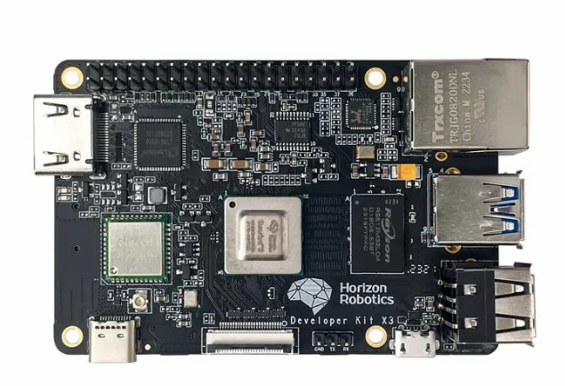
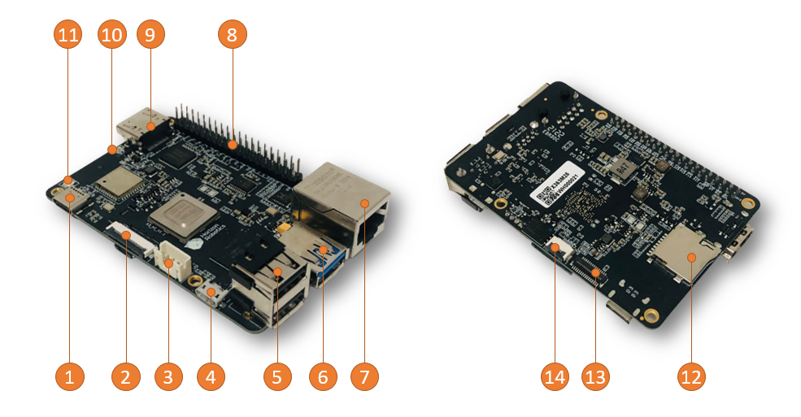
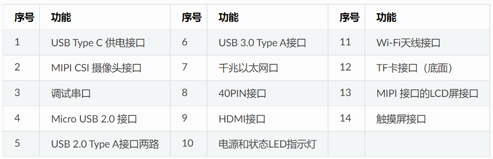
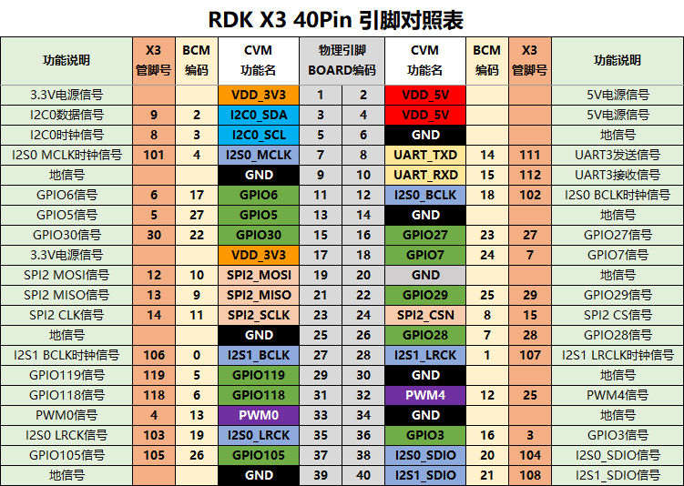
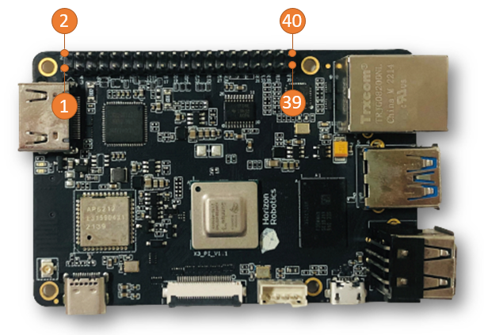

# **接口说明**

## **机器人控制器**

{.img-fluid tag=1 title="机器人控制器"}

## **RDK X5**

D-Robotics RDKTM X5 搭载Sunrise 5 智能计算芯片，可提供高达10 Tops的算力，是一款面向智能计算与机器人应用的全能开发套件，接口丰富，极致易用，支持Transfomer、RWKV、Occupancy、Stereo Perception 等多种复杂模型和最新算法，加速智能化应用快速落地。

{.img-fluid tag=2 title="RDK X5"}

### **板卡参数**

| | RDK X5 |
| ---------- | ------------------------------------------------------------------------------------------------------------------------------------------------------------------------------------------------------------------------------------------------------------------------------------------------------------------------------------------------------------------------------------------------------------------------------------- |
| CPU | 八核 Cortex® A55 |
| BPU | 10TOPS |
| GPU | 32 GFlops |
| 内存 | 4GB/8GB内存 |
| 存储 | NA, supports external Micro SD card Peripheral |
| Sensor接口 | 2x4-lane MIPI CSI |
| 视频编码 | 1x4K60 (H.265/H.264) |
| 音频 | 1x3.5mm耳机孔, 支持输出/输入 |
| 显示接口 | 1xHDMI Type-A, 最高支持1080p60 1x MIPI DSI 4 Lane |
| USB Host | 4x USB 3.0 HOST (TYPE A) 1xUSB 2.0 Device (TYPE C) |
| USB Device | 1x微型接口 (Micro USB) |
| 网络接口 | 1xRJ45千兆网口, 支持PoE供电 1x双频Wi-Fi 6 支持5.4 |
| CAN接口 | 1x CAN F |
| IO接口 | 28 GPIOs (最大可扩展支持5xUART, 8xPWM, 3xI2C, 2xSPI, 1xI2S) |
| 电源输入 | 5V/5A |
| 系统支持 | RDK OS V3.X (Ubuntu 22.04) |
| 开发环境 | RDK Studio, NodeHub |
| 功能支持 | LLM, 2D/3D Detection, Stereo Depth, Stereo Occupancy, Image Classification etc. SLAM, VSLAM, VIO, Navigation, Language interaction, Grasping etc. |                                                                                           |

### **板载接口**

{.img-fluid tag=2 title="RDK X5"}

### **板卡尺寸**

{.img-fluid tag=2 title="RDK X5"}

## **RDK X3（旭日X3派）**

RDK X3是一款面向生态开发者的机器人开发板，接口兼容树莓派，具有5Tops的端侧推理算力，以及4核ARM A53的处理能力。

{.img-fluid tag=2 title="RDK X3"}

### **板卡参数**

|            | RDK X3                                                                                                                                                                                                                                                                                                                                                                                                                                |
| ---------- | ------------------------------------------------------------------------------------------------------------------------------------------------------------------------------------------------------------------------------------------------------------------------------------------------------------------------------------------------------------------------------------------------------------------------------------- |
| CPU        | Quad-core ARM® Cortex® A53@1.5G                                                                                                                                                                                                                                                                                                                                                                                                       |
| BPU        | Dual-core Bernoulli Arch, ~5Tops                                                                                                                                                                                                                                                                                                                                                                                                      |
| 内存         | 2GB/4GB LPDDR4 RAM                                                                                                                                                                                                                                                                                                                                                                                                                    |
| 存储         | 16G/32G/64G eMMC or Micro SD                                                                                                                                                                                                                                                                                                                                                                                                          |
| 多媒体        | H.265 (HEVC) Encoding and Decoding         Main profile, L5.1 4K@60fps                                      H.264 Encoding and Decoding                      Baseline/Main/High profiles, L5.1 4k@60fps.                JPEG Encoding and Decoding                       16Mpixels                                                                        CBR, VBR, AVBR, FixQp and QpMap bitrate control |
| Sensor接口   | MIPI CSI 2lane x 2                                                                                                                                                                                                                                                                                                                                                                                                                    |
| USB Host   | USB Type-A 3.0 x1USB Type-A 2.0 x2                                                                                                                                                                                                                                                                                                                                                                                                    |
| USB Device | Micro USB 2.0 x1                                                                                                                                                                                                                                                                                                                                                                                                                      |
| Debug串口    | 1 x UART，Debug串口                                                                                                                                                                                                                                                                                                                                                                                                                      |
| 显示接口       | 1 x HDMI 1.4 (up to 1080p60 )                                                                                                                                                                                                                                                                                                                                                                                                         |
| 无线网络接口     | Wi-Fi/Bluetooth二合一模块Wi-Fi 2.4GHz、Bluetooth 4.1                                                                                                                                                                                                                                                                                                                                                                                        |
| 有线网络接口     | RJ45接口                                                                                                                                                                                                                                                                                                                                                                                                                                |
| 40PIN接口    | GPIO&I2C&UART&SPI&I2S&PWM                                                                                                                                                                                                                                                                                                                                                                                                             |
| 电源输入       | 5V 3A                                                                                                                                                                                                                                                                                                                                                                                                                                 |
| 系统支持       | Ubuntu 20.04                                                                                                                                                                                                                                                                                                                                                                                                                          |

### **接口说明**

#### 板载接口

{.img-fluid tag=1}

#### 扩展接口

{.img-fluid tag=1}

{.img-fluid tag=1}

???+ Attention
    引脚的序号从靠近HDMI板卡内测开始算起，是引脚1，然后依次蛇形计数，分别是1、2、3、4、5，一直到39和40。

{:target="_blank"}
