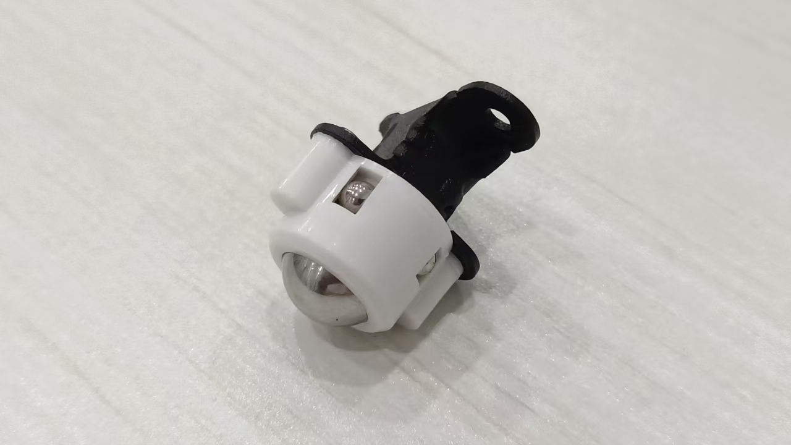
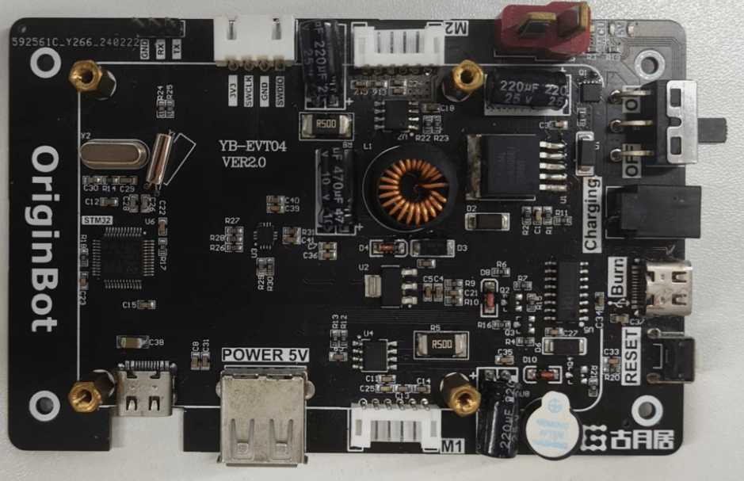
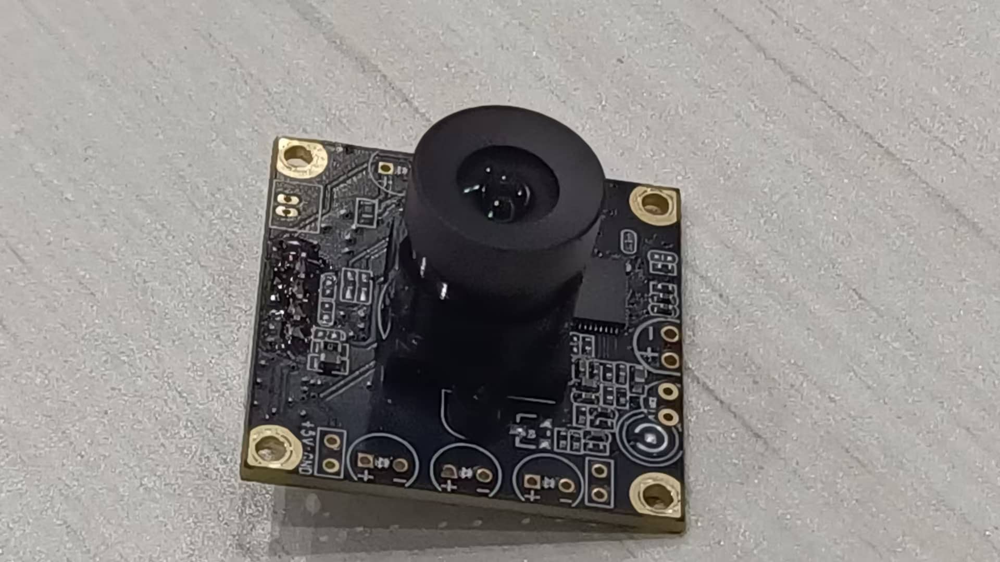
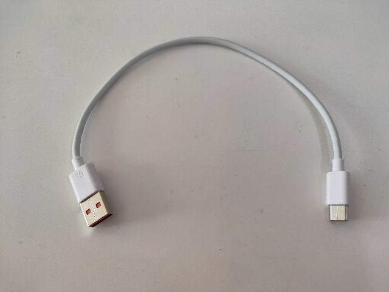
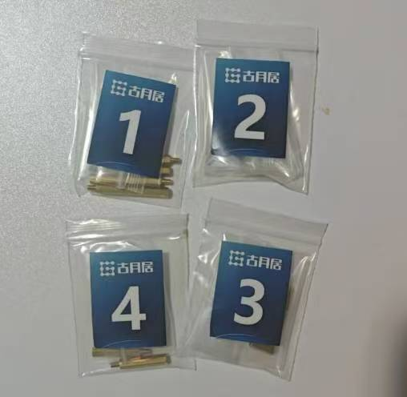
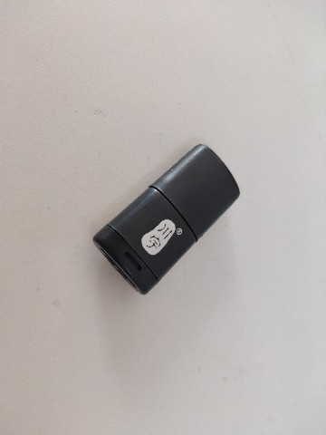
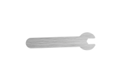

# **套件清单**

## **底盘及其配件**

| 序号 | 名称           | 数量 | 图片                                                         | 规格参数                                      |
| ---- | -------------- | ---- | ------------------------------------------------------------ | --------------------------------------------- |
| 1    | 差速小车底盘   | 1个  | {.img-fluid tag=1 title="差速小车底盘"} | 含编码器TT电机*2： 6V，350RPM 金属输出轴 |
| 2    | 摄像头固定支架 | 1套  | {.img-fluid tag=1 title="摄像头固定支架"} |                                               |
| 3    | 橡胶轮胎       | 2个  | {.img-fluid tag=1 title="橡胶轮胎"} |                                               |
| 4    | 万向轮及3D支架 | 1个  | {.img-fluid tag=1 title="万向轮及3D支架"} |                                               |

## **控制器及其配件**

| 序号 | 名称                       | 数量 | 图片                                                         | 规格参数                     |
| ---- | -------------------------- | ---- | ------------------------------------------------------------ | ---------------------------- |
| 1    | 运动控制板                 | 1块  | {.img-fluid tag=2 title="运动控制板"} | STM32F1                      |
| 2    | Type-C供电转接板           | 1个  | {.img-fluid tag=2 title="Type-C供电转接板"} | Type-C to Type-C 5V，4A |
| 3    | 动力电池 （含魔术贴） | 1块  | {.img-fluid tag=2 title="动力电池"} | 12.6V，3000mah               |

## **处理器及其配件**

| 序号 | 名称                       | 数量 | 图片                                                         | 规格参数                                                     |
| ---- | -------------------------- | ---- | ------------------------------------------------------------ | ------------------------------------------------------------ |
| 1    | RDK X3 (旭日X3派)    | 1套（标准版/Lite版）  | {.img-fluid tag=3 title="RDK X3"} | CPU：ARM Cortex-A53，4\*Core，1.5GHZ BPU：Bernoulli Arch, 2*Core，up to1.0G，5Tops 内存：4GB LPDDR4 RAM |
| 2    | RDK X5     | 1套（Pro版）  | {.img-fluid tag=3 title="RDK X5"} | CPU：ARM Cortex-A55，8\*Core，1.5GHZ GPU：32flops，10Tops 内存：8GB LPDDR4 RAM |
| 3    | 散热片                       | 1个  | {.img-fluid tag=3 title="散热片"}                                              ||
| 4    |  串口模块(含数据线)     | 1个  | {.img-fluid tag=3 title="串口模块"} |   |
| 5    | TF卡 | 1张  | {.img-fluid tag=3 title="TF卡"} | SanDisk 32GB （塑料/纸盒包装随机发货，规格相同）        |

## **传感器及其配件**

| 序号 | 名称                                                         | 数量 | 图片                                                         | 规格参数                                                     |
| ---- | ------------------------------------------------------------ | ---- | ------------------------------------------------------------ | ------------------------------------------------------------ | 
| 1    | USB 摄像头                                                       | 1个  | {.img-fluid tag=4 title="摄像头"} | 720P                                         |                  |
| 2    | 激光雷达 （标准版附带）      | 1个  | {.img-fluid tag=4 title="激光雷达"} | VP100L  测距频率: 3000HZ 扫描频率：60Hz 扫描角度：0~360° |                                                             |

## **其他配件**

| 序号 | 名称                                                    | 数量 | 图片                                                         | 规格参数                                                |
| ---- | ------------------------------------------------------- | ---- | ------------------------------------------------------------ | ------------------------------------------------------- |
| 1    | 充电器                                                  | 1个  | {.img-fluid tag=5 title="充电器"} | 12.6V，美规，800MA                                      |
| 2    | 课程兑换卡                                              | 1张  | {.img-fluid tag=5 title="课程兑换卡"} | 古月学院课程兑换码                                      |
| 3    | 车牌编号贴纸                                            | 2个  | {.img-fluid tag=5 title="车牌编号贴纸"} |                                                         |                                                       |
| 4    | TypeC数据线                                             | 1条  | {.img-fluid tag=5 title="TypeC数据线"} | USB to Type-C 30cm                                      |
| 5    | 串口通信线                                              | 1条  | {.img-fluid tag=5 title="串口通信线"} | 10cm                                                    |
| 6    | 螺丝、铜柱                                              | 若干 | {.img-fluid tag=5 title="螺丝、铜柱"} |                                                         |
| 7    | 读卡器                                                  | 1个  | {.img-fluid tag=5 title="读卡器"} |                                                         |
| 8    | 螺丝刀                                                  | 1个  | {.img-fluid tag=5 title="螺丝刀"} |                                                         |
| 9   | 扳手                                                    | 1套  | {.img-fluid tag=5 title="扳手"} | Lite版：1把 标准版：2把 |
| 10   | 说明书                                                  | 1份  | {.img-fluid tag=5 title="说明书"} |                                                         |

{:target="_blank"}