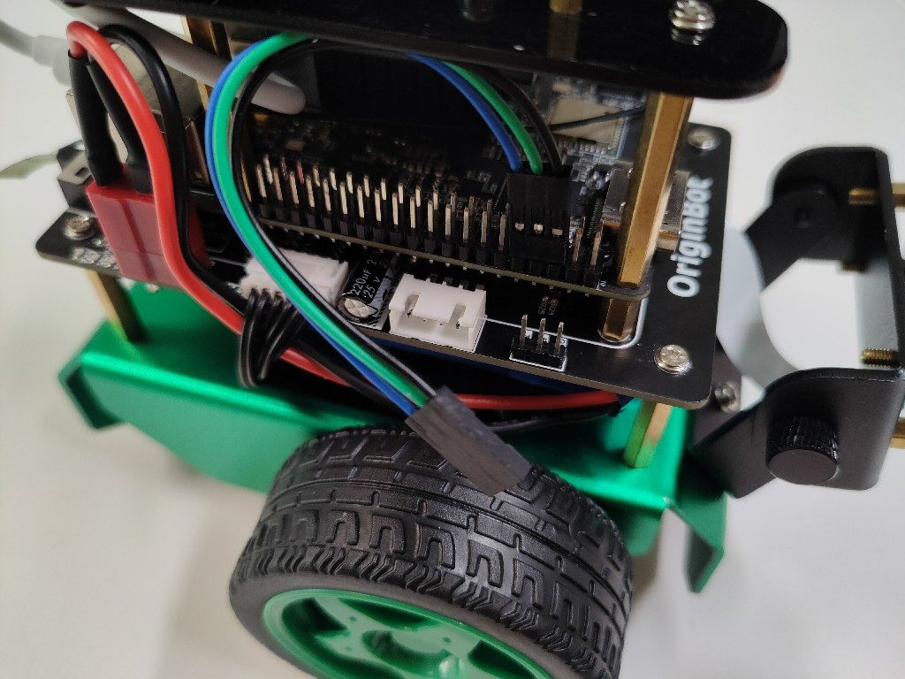
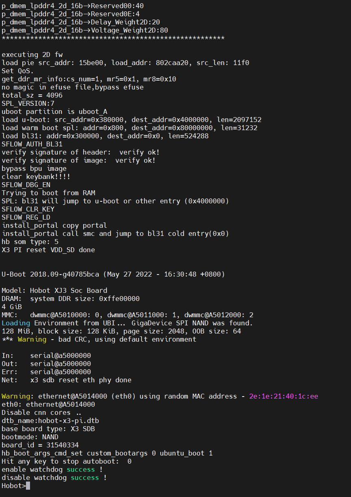
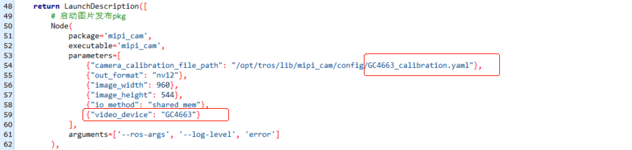

# **常见问题**

## <font color="green">**机器人硬件相关**</font>

### **OriginBot从哪里购买**

OriginBot智能机器人开源套件唯一销售平台：古月学院→[套件购买链接](https://class.guyuehome.com/p/t_pc/goods_pc_detail/goods_detail/SPU_ENT_16652164516Tu5oIXjFa3Vo?fromH5=true){:target="_blank"}


### **电池接口较紧，不好插入**

为保障系统供电稳定，满足总电源瞬时高功率输出，OriginBot在电源接口的选型上采用了T型接口。该接口全新状态下连接较紧，请大家在安装的时候使用巧劲发力，谨慎操作。


### **如何安装处理器的散热片**

撕掉散热片背面蓝色塑料片，白色的是导热贴，尽量让RDK X3（旭日X3派）上的核心SoC处于导热贴的正中间，然后按压粘贴即可。

{.img-fluid tag=1}


### **套件配套的课程卡如何使用**

刮开套件中配套的课程兑换卡，找到兑换码。登录“古月居”微信公众号，菜单栏中点击“古月学院”，进入后点击底部“我的”，然后点击兑换中心，输入兑换码确认后即可兑换成功，在“我的课程”中就可以学习兑换成功的课程。

{.img-fluid tag=1}


### **蜂鸣器一直作响**

如果在使用OriginBot的过程中，发现蜂鸣器一直作响，不用担心，这是控制器默认的电池保护程序，当电压低于9.6V时，蜂鸣器就会一直作响，请及时关机充电。

另外在烧写控制固件时，如使用PC通过固件下载口给控制器供电，烧写固件后的电压也会低于9.6V，根据电池保护程序，蜂鸣器也会作响，重新连接电池后，即可恢复正常。


### **机器人上电后雷达一直旋转**

由于激光雷达自身的特性，上电后就会一直旋转，如果暂时使用不到，可以把雷达的USB线先拔掉，使用时再连接。


### **机器人的SD卡插在什么位置**

SD卡烧写镜像后，插在机器人前端、RDK X3（旭日X3派）板卡背面的卡槽中。

{.img-fluid tag=1}


### **机器人可以边充电边使用么**

不可以，机器人控制器上的充电电路是按照关机状态设计的，所以充电时，请关闭机器人电源开关，带充电完毕后，拔掉充电头，再进行使用。


### **如何确认机器人充电结束**

请使用套件配套的充电器充电，充电器插头上有LED显示灯，红灯为正在充电中，绿灯为充电完毕。完整充满电的时长预计在**3小时**左右。


### **机器电机运动不正常**

通过键盘控制机器人前后左右运行时，如果发现机器人某一侧电机不转，或者时转时不转，请通过以下方式检查：
（1）检查机器人电机接线是否正确且牢固，包括电机端和驱动板端；

（2）机器人是差速运动，原地转弯时，如果速度过慢，内侧轮子有可能是不转的，这是正常现象；

（3）如果机器人在向前运动的过程中，某一侧轮子不转，或者时转时不转，请先参考[控制器固件安装](../guide/firmware_install.md){:target="_blank"}重新烧录固件后，再进行尝试；

如果问题依然存在，请联系小助手进行售后支持。


### **控制器板卡单独销售么**

OriginBot控制器板卡暂时没有单独销售，但是原理图和PCB均开源，开发者可以自己投板制作。


### **Lite版可以升级为标准版么**

官方没有提供差价升级服务，但是相关的元器件、模型、软件均开源，开发者可自行制作升级。


### **机器人失控怎么办**

在二次开发过程中，如果ROS应用开发不当，可能会导致机器人失控，比如一直运动不停止等情况，此时可以拿起机器人，按一下控制器板卡上的复位键“RESET”，机器人底层运动功能即可复位，然后尽快关闭上位机的ROS应用节点。


### **相机排线的金手指方向**

如下图所示，金手指朝向PCB一侧，X3派上也一样。

{.img-fluid tag=1}


## <font color="green">**镜像/固件烧写与启动**</font>

### **控制器固件烧写失败**

通过“Burning”口给扩展板下载固件时，如遇到烧写失败，请检查以下问题：

（1）需要断开扩展板与旭日派的串口连接，否则将无法连接下载；

{.img-fluid tag=1}

（2）检查FlyMcu软件中的配置：

- 固件文件选择正确；
- 下载固件的端口正确；
- 左下角复位选项选择正确；

{.img-fluid tag=1}


### **上电启动无法进入登录界面**

烧写SD卡镜像后，启动旭日派时：

1. 如果串口界面中不断输出uboot信息，无法进入ubuntu系统的登录界面，可能是因为板卡供电不足，请检查RDK X3（旭日X3派）的电源输入，确保使用控制器板卡通过typec转接板供电，或使用外接5V 2A以上电源对RDK X3（旭日X3派）的typec口供电。
2. 如果如下图所示，停在uboot界面，说明板卡已经启动，但并没有加载sd卡镜像。请确认已经将SD卡正确的插入RDK X3（旭日X3派）的卡槽中，并且在启动过程中没有任何键盘输入。

{.img-fluid tag=1}


### **串口软件中找不到串口设备**

连接好串口模块后，如果在串口软件的设备选择下拉框中没有找到设备，请右键在“我的电脑”中，打开“设备管理器”，确认系统是否已经安装串口模块的驱动。

如果显示如下，说明串口模块驱动未安装，[点击此处](https://www.originbot.org/material/common_software.md){:target="_blank"}下载串口驱动，解压后双击其中的dpinst64.exe进行安装，驱动安装完成后，再重新尝试通信。

{.img-fluid tag=1}


### **串口软件里无法输入字符**

连接好串口后，启动OriginBot，可以在串口通信软件中看到输出的日志信息和登录提示，但是无法输入字符：

{.img-fluid tag=1}


（1）请检查串口线的连接，有输出信息说明串口的RX连接正确，有可能是TX和GND接反了。

{.img-fluid tag=1}

（2）确认使用的串口通信软件是否有远程交互功能，不能使用串口通信助手，而应该使用串口远程终端连接软件，如MobaXterm、TeraTerm等。


### **RDK X3有没有用户手册**

RDK X3（旭日X3派）的基本使用可以参考[RDK X3用户手册](https://developer.d-robotics.cc/rdk_doc/RDK){:target="_blank"}。


### **从哪下载FlyMcu软件**

请参考[常用软件下载](../material/common_software.md){:target="_blank"}页面。


### **从哪下载SD卡镜像烧写软件**

请参考[常用软件下载](../material/common_software.md){:target="_blank"}页面。


### **从哪下载串口驱动**

请参考[常用软件下载](../material/common_software.md){:target="_blank"}页面。


### **如何在线调试固件代码**

需要使用stlink仿真器，连接控制器端的SWD接口，参考[源码调试与下载](../guide/firmware_install.md#_4){:target="_blank"}进行操作。


### **HDMI连接显示器没有图像**

OriginBot系统镜像采用Ubuntu 20.04 Server版本，本身不带有系统桌面，所有通过HDMI连接显示器后，之后显示默认的地瓜logo信息，是正常现象。

{.img-fluid tag=1}


### **SD卡的空间不足**

OriginBot套件中配套的SD卡是32GB，正常使用情况下空间完全可以满足，如果发现空间和32GB不符，请确认：

（1）为了减少系统镜像文件的大小，SD卡系统镜像中的空闲空间已经被压缩，烧写完成后，请参考[扩展SD卡空间](../guide/image_install.md#4-sd)进行操作；

（2）SD卡镜像中的文件格式是EXT4，在windows中无法完全读取，会导致看到的磁盘空间只有几百兆，是正常现象，可以安装相应的软件读取，或者在Ubuntu系统下读取。

### **SD卡无法读写**

部分SD卡在操作后会出现分区表损坏等情况，造成无法读写SD卡的情况，此时需要进行格式化的操作才可以，具体步骤如下：
（1）在桌面上的“此电脑”图标上右键，管理，磁盘管理，选择SD卡所对应的磁盘。
（2）删除SD卡磁盘上的所有分区，在分区对应的位置右键，即可看到删除选项。
（3）新建分区，在删除完毕的未分配部分右键，新建简单卷，后续直接全部下一步，确认即可。
（4）最后在文件管理中能正确看到SD卡的分区并可以进行读写，即为正常。


## <font color="green">**基础功能使用**</font>

### **手柄连接后无法显示设备号**

由于不同品牌手柄的底层驱动可能不同，部分手柄连接到RDK X3（旭日X3派）中无法驱动。如果使用“ls /dev/input/”命令后，无法看到以“js+数字”标记的设备，则说明该手柄无法被RDK X3（旭日X3派）的Ubuntu系统驱动。

目前已经测试通过的手柄型号有：

- [罗技 F710](https://item.jd.com/10023101913682.html){:target="_blank"}

（待补充更多型号）

如遇到无法驱动的情况，可以将手柄插到PC端，通过ROS2分布式通信的方式，控制机器人运动。


### **相机启动失败**

OriginBot采用MIPI相机作为视觉传感器，连接线缆为软质排线，两侧接口容易连接不到位。

{.img-fluid tag=1}

如果相机启动失败，请通过以下方式进行问题排查：

（1）重新连接两侧排线，注意接口保持平整，并且插入到接口底部，确认连接无误后，再重新尝试，注意排线不能热插拔，需要关机后再操作；

（2）连接好排线后，使用图中的命令进行查看，如果相机未连接，请重复上一步操作，或者更换排线操作；

{.img-fluid tag=1}

（3）确认是否有其他程序已经占用相机使用权，如果有，请关闭其他程序后再重新尝试；


### **PC端的上位机代码如何编译**

请参考[下载/编译PC端功能包](../guide/pc_config.md#3-pc){:target="_blank"}的步骤操作。


### **VSCode无法连接机器人**

请排查以下可能存在的问题：

（1）运行VSCode的PC机是否和机器人处于同一个局域网下，即连接了同一个路由器；

（2）PC机和机器人之间是否可以通过“ping+对方的IP地址”连接成功；

（3）通过VSCode连接机器人时填写的IP地址、用户名、密码、命令行字符等是否有误。


### **VSCode在Ubuntu下如何安装**

请参考[安装VSCode](../manual/ide_setup.md#1-vscode){:target="_blank"}进行操作。


### **机器人可以连接USB相机么**

可以，具体使用方法可以参考地瓜机器人开发平台使用手册：[USB图像采集](https://developer.d-robotics.cc/rdk_doc/Basic_Application/Image/usb_camera){:target="_blank"}


### **机器人的IP地址会发生变化**

（1）有线网络：OriginBot镜像中已经设置静态IP地址，为192.168.1.10，使用时参考[SSH远程登录](../guide/image_install.md#6-ssh){:target="_blank"}的视频说明进行配置；

（2）无线网络：如果连接的路由器开启了DHCP（动态主机配置协议），机器人每次连接后的IP地址可能会发生变化，如果需要固定IP，请上网搜索“Linux 无线网络 静态IP设置”，参考配置。


## <font color="green">**ROS2与TogetheROS**</font>

### **ROS2与TogetheROS软链接**

系统镜像已经完成常用ROS2功能包的安装，如有新安装的ROS2包，安装后需要完成和tros的软链接，才能使用；

```bash
cd /opt/tros 
## 使用/opt/tros目录下的create_soft_link.py创建ROS package至TogetheROS的软链接 
python3 create_soft_link.py --foxy /opt/ros/foxy/ --tros /opt/tros 
```


### **系统更新覆盖配置文件**

如果手动使用upgrade更新系统，有可能会更新tros系统，致使原有镜像中相机相关的配置被覆盖，可使用如下方法恢复：

- 确认“/opt/tros/share/websocket/launch/hobot_websocket.launch.py”路径中的相机型号和标定文件是“GC4663”，如果不是，请修改：

  {.img-fluid tag=1}

- 确认“/opt/tros/share/mipi_cam/launch/mipi_cam.launch.py”路径中的相机型号和标定文件是“GC4663”，如果不是，请修改：

  {.img-fluid tag=1}


### **ROS2密钥获取失败或无反应**

由于ROS官方软件源在国内经常访问失败，ROS/ROS2安装或更新时经常遇到密钥获取失败、下载速度慢等问题，可以参考下文使用国内的软件源安装或更新。

[《遇到ROS下载或更新不顺畅？不如试试国内的华为云镜像！》](https://mp.weixin.qq.com/s/cI9HhFs7ai6eQsUuhdb69A){:target="_blank"}


### **PC端如何安装ROS2**

请参考[ROS2系统安装](../guide/pc_config.md#2-ros2){:target="_blank"}步骤操作


### **OriginBot代码PC上无法编译**

[OriginBot代码仓库](https://gitee.com/guyuehome/originbot){:target="_blank"}中的部分功能包需要调用RDK X3（旭日X3派）中的软件资源，所以在PC端无法完整编译通过，如有需要，可以将需要使用的文件或者单独的功能包拷贝到PC端编译使用。


### **TogetheROS开源么**

开源，可以参考[地瓜机器人平台的用户手册](https://developer.d-robotics.cc/rdk_doc/RDK){:target="_blank"}。


### **ROS1和ROS2可以并存么**

可以，只需要通过环境变量的设置调用需要使用的ROS版本即可。


## <font color="green">**应用功能**</font>

### **Rviz上位机无法可视化信息**

在运行应用功能时，上位机Rviz中无法显示TF、地图等可视化信息，请检查确认：

（1）机器人和PC机是否处于同一局域网环境下，双方可以通过IP地址互相ping通；

（2）如果使用虚拟机运行Ubuntu系统，请确认虚拟机的网络配置已设置为桥接模式；

{.img-fluid tag=1}

（3）测试是否能通信

ros2提供了网络检查CLI（命令行接口）工具，multicast ，我们可以使用multicast执行对两个ros2终端进行测试。

首先在电脑端我们启动接收组播指令

```bash 
ros2 multicast receive
```

在 OriginBot 上，我们发送一个组播，
```bash
ros2 multicast send
```
如果收到消息就可以多机通信

当电脑端和 OriginBot 的 ROS_DOMAIN_ID 相同时 (默认都为0)，就可以通过话题等互相通信。

参考链接：
[不设置主从机，看ROS2如何进行多机通信](https://blog.csdn.net/qq_27865227/article/details/120257395)

###  **导航应用在Rviz看不到信息**

运行OriginBot导航应用后，在启动的Rviz中看不到地图和机器人的信息。

{.img-fluid tag=1}

此时请使用Ctrl+C关闭PC端的Rviz上位机，以及机器人端的导航功能，然后先运行PC端的Rviz上位机指令，再启动机器人端的导航功能，此时Rviz中就可以显示地图和TF信息了。

如果还未显示，可继续重复该操作2~3次。


### **相机图像传输卡顿严重**

ROS2 Foxy默认使用的是fastdds，在图像传输的场景下，会受到限制，此时我们可以切换为cyclonedds。

注意在发送图像的节点和接收图像的节点，均需要配置DDS为cyclonedds，请参考[启动ROS相机驱动](../manual/camera_visualization.md#ros_1)与[查看可视化图像](../manual/camera_visualization.md#_6)部分的内容，在启动节点前，通过以下命令切换当前终端使用的DDS：

```bash
export RMW_IMPLEMENTATION=rmw_cyclonedds_cpp
export CYCLONEDDS_URI='<CycloneDDS><Domain><General><NetworkInterfaceAddress>wlan0</NetworkInterfaceAddress></General></Domain></CycloneDDS>'
```


[](https://www.guyuehome.com/){:target="_blank"}

