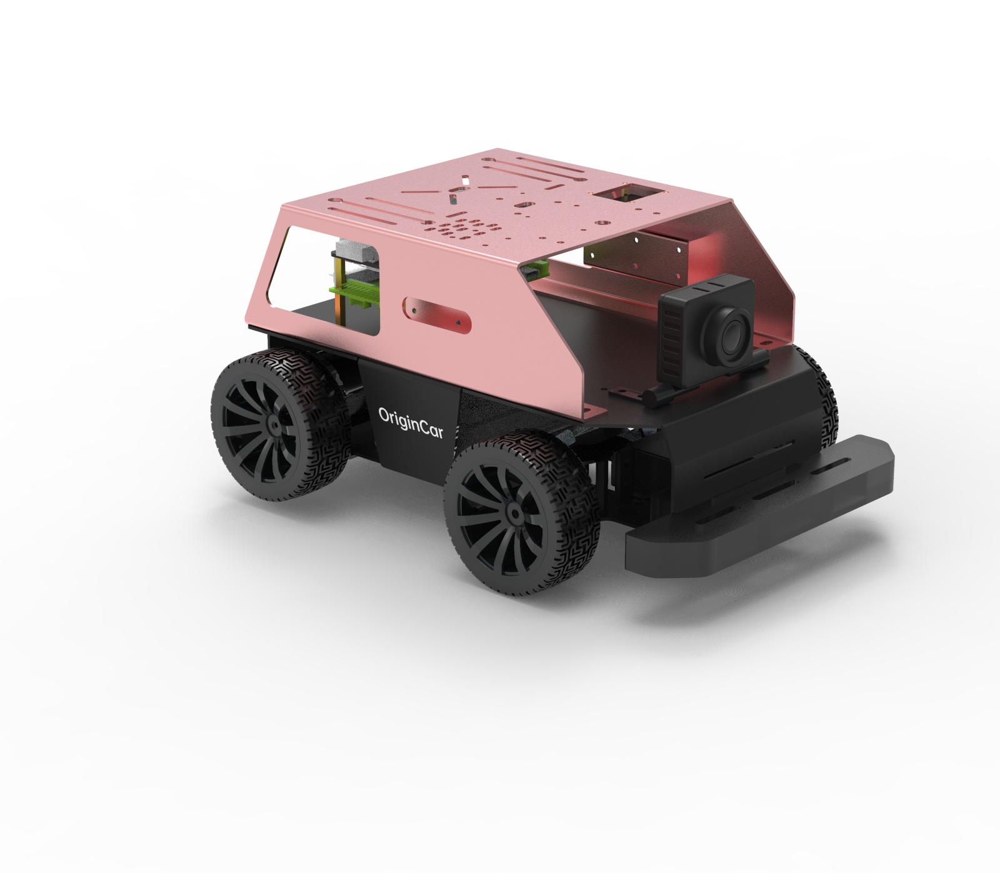
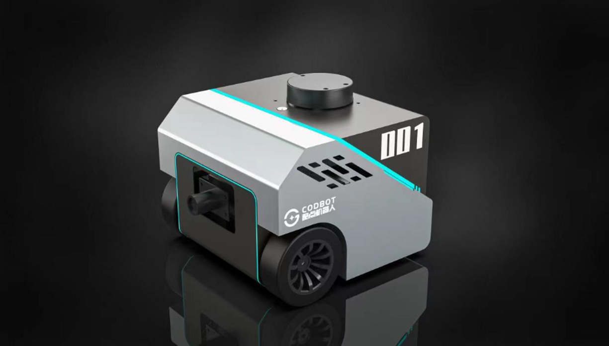

# **其他套件**

OriginBot是一个全开源的机器人项目，由此衍生出更多兼容的机器人开发套件，欢迎大家关注。

???+ note
    在OriginBot项目的维护过程中，并不会完全主动适配以下套件，请参考各套件的厂家获取更多信息。如果大家有其他推荐的机器人套件，也欢迎[联系我们](https://gitee.com/guyuehome/originbot/issues){:target="_blank"}加入以下列表。

## **OriginCar智能机器人套件**

OriginCar是一款智能机器人，更是一个因热爱而生的机器人产品其“猛男粉”的外形蕴含了无数智能机器人开发者深藏内心对机器人开发的热爱。0rigincar搭载了地瓜机器人开发套件 -- RDK X3 5Tops强劲算力支持多种AI算法，兼容ROS/ROS2生态中众多应用功能，是OriginBot智能机器人系列中的新成员，旨在让更多开发者探索深藏于心的热爱。

| 机器人套件              | 链接                                                         |
| ----------------------- | ------------------------------------------------------------ |
| OriginCar智能机器人 | [古月居](https://class.guyuehome.com/p/t_pc/goods_pc_detail/goods_detail/SPU_ENT_1704447493cct8eIV0r8888){:target="_blank"}、[淘宝](https://item.taobao.com/item.htm?abbucket=12&id=762739997220&ns=1&spm=a21n57.1.0.0.48d5523cCQtk8u&skuId=5255676373835){:target="_blank"} |

## **CODBOT-X3 Pro（酷点机器人）**

酷点机器人 CODBOT-X3 Pro 是Originbot官方合作伙伴开发的商业款智能型ROS机器人，该智能机器人采用合金材质底盘，同时能完美衔接Originbot开源社区上所有资源，包括：源码、课程、项目案例等。让每一位参与者更轻松、更便捷的享受ROS机器人开发的乐趣。

| 机器人套件              | 链接                                                         |
| ----------------------- | ------------------------------------------------------------ |
| CODBOT X3 Pro智能机器人 | [淘宝](https://item.taobao.com/item.htm?spm=a1z10.3-c.w4002-23828770722.13.47621b95qlSaQQ&id=721599510087){:target="_blank"}、[京东](https://item.jd.com/10077036007439.html){:target="_blank"} |

{:target="_blank"}

